# Hive,Spark,Sqoop

|                                |                            |
| ------------------------------ | -------------------------- |
| 时间格式配置成YYYY-MM-DD格式， | 这是Hive默认支持的时间格式 |
|                                |                            |
|                                |                            |


## 一.数仓分层理论

### 1.分层

| 层                          | 作用                                                         |
| --------------------------- | ------------------------------------------------------------ |
| ODS(Operation Data Store)   | 原始数据层，存放原始数据                                     |
| DWD(Data Warehouse Detail)  | 对ods层进行数据清洗，保存业务真实性                          |
| DWS(Data Warehouse Service) | 按天进行轻度汇总，一行信息代表一个主题对象一天的汇总，一个用户一天订单次数 |
| DWT(Data Warehouse Topic)   | 数据进行累计汇总，一行信息代表一个主题对象的累积行为，一个用户从注册那天进行的订单次数 |
| ADS(Application Data Store) | 为各种统计报表提供数据                                       |
| DIM                         | 数据维度层，主要对业务员实施的描述                           |

### 2.命名规范

|        | ods_表名 |
| ------ | -------- |
| ODS层  | ods_表名 |
| DIM层  | dim_表名 |
| DWD层  | dwd_表名 |
| DWS层  | dws_表名 |
| DWT层  | dwt_表名 |
| ADS层  | ads_表名 |
| 临时表 | tmp_表名 |

### 3.表字段类型

| 类型                                                         |
| ------------------------------------------------------------ |
| Ø  金额类型为decimal(16, 2)，表示：16位有效数字，其中小数部分2位 |
| Ø  字符串(名字，描述信息等)类型为string                      |
| Ø  主键外键类型为string                                      |
| Ø  时间戳类型为bigint                                        |
| Ø  数量类型为bigint                                          |

## 二.数仓建模理论

### 1.范式理论

#### 1.函数依赖

##### 1.完全函数依赖

```
定义：设X,Y是关系R的两个属性集合，X’是X的真子集，存在X→Y，但对每一个X’都有X’!→Y，则称Y完全函数依赖于X。
理解：在一张表中，若 X → Y，且对于 X 的任何一个真子集（假如属性组 X 包含超过一个属性的话），X ' → Y 不成立，那么我们称 Y 对于 X 完全函数依赖。
举例：在成绩表SG中，成绩完全函数依赖于（学号，CID（课程号））
```

##### 2.部分函数依赖

```
定义：设X,Y是关系R的两个属性集合，存在X→Y，若X’是X的真子集，存在X’→Y，则称Y部分函数依赖于X。
说明：假如 Y 函数依赖于 X，但同时 Y 并不完全函数依赖于 X，那么我们就称 Y 部分函数依赖于 X
举例：学生表ST中（学号，姓名）->性别，但是存在学号->性别，所以称性别部分依赖于（学号，姓名）
```

##### 3.传递函数依赖

```
定义：设X,Y,Z是关系R中互不相同的属性集合，存在X→Y(Y !→X),Y→Z，则称Z传递函数依赖于X。
说明：假如 Z 函数依赖于 Y，且 Y 函数依赖于 X （严格来说还有一个X 不包含于Y，且 Y 不函数依赖于Z的前提条件），那么我们就称 Z 传递函数依赖于 X
举例：关系S1（学号，系名，系主任），学号 → 系名，系名 → 系主任，并且系名 ！→ 学号，所以学号 → 系主任为传递函数依赖。
```

#### 2.三范式

##### 1.一范式

```
定义：符合1NF的关系中的每个属性都不可再分
说明：在一列中不能插入两个及以上不同属性的值
举例：如果将教师表的姓名与性别放在同一列就不符合1NF，当然这在建表的时候就不会成功。
```

##### 2.二范式

```
定义：在1NF的基础上，非码属性必须完全依赖于候选码（在1NF基础上消除非主属性对主码的部分函数依赖）。
说明：第二范式（2NF）是在第一范式（1NF）的基础上建立起来的，即满足第二范式（2NF）必须先满足第一范式（1NF）。第二范式（2NF）要求数据库表中的每个实例或记录必须可以被唯一地区分。选取一个能区分每个实体的属性或属性组，作为实体的唯一标识。即要有主键

举例：如果在成绩表SG中添加一列姓名变成下面这样，SG表的主键是学号加CID(课程号)，（学号）->姓名，所以姓名部分函数依赖于（学号，CID(课程号)），不符合2NF
```

##### 3.三范式

```
定义：在1NF基础上，任何非主属性不依赖于其它非主属性（在2NF基础上消除传递依赖）
说明：第三范式（3NF）是第二范式（2NF）的一个子集，即满足第三范式（3NF）必须满足第二范式（2NF）。简而言之，第三范式（3NF）要求一个关系中不包含已在其它关系已包含的非主关键字信息。

举例：如果在课程表SC中添加一列老师姓名，变成如下，存在
CID(课程号)->TID(授课老师ID),TID(授课老师ID)->教师姓名，TID(授课老师ID)！->CID(课程号)，所以教师姓名传递函数依赖于CID(课程号)，不满足3NF，但是满足2NF,主键是CID
```

### 2.维度建模

#### 1.维度表

* 意义

```
一般是对事实的描述信息。每一张维表对应现实世界中的一个对象或者概念。 例如：用户、商品、日期、地区等
```

* 特征

```
维表的范围很宽（具有多个属性、列比较多）
跟事实表相比，行数相对较小：通常< 10万条
内容相对固定：编码表
```

#### 2.事实表

* 意义

```
事实表中的每行数据代表一个业务事件（下单、支付、退款、评价等）。“事实”这个术语表示的是业务事件的度量值（可统计次数、个数、金额等）
```

##### a.**事务型事实表**

```
以每个事务或事件为单位，例如一个销售订单记录，一笔支付记录等，作为事实表里的一行数据。一旦事务被提交，事实表数据被插入，数据就不再进行更改，其更新方式为增量更新。
```

##### b.**周期型快照事实表**

```
周期型快照事实表中不会保留所有数据，只保留固定时间间隔的数据，例如每天或者每月的销售额，或每月的账户余额等。
例如购物车，有加减商品，随时都有可能变化，但是我们更关心每天结束时这里面有多少商品，方便我们后期统计分析

```

##### c.**累积型快照事实表**

```
累计快照事实表用于跟踪业务事实的变化。例如，数据仓库中可能需要累积或者存储订单从下订单开始，到订单商品被打包、运输、和签收的各个业务阶段的时间点数据来跟踪订单声明周期的进展情况。当这个业务过程进行时，事实表的记录也要不断更新。
```

| **订单id** | **用户id** | **下单时间** | **打包时间** | **发货时间** | **签收时间** | **订单金额** |
| ---------- | ---------- | ------------ | ------------ | ------------ | ------------ | ------------ |
|            |            | 3-8          | 3-8          | 3-9          | 3-10         |              |

#### 3.建模模型

##### a.星型

```
标准的星型维度只有一层
```

##### b.雪花

```
比较类似关系型数据库的3NF建模，但又无法完全遵照
```

##### c.星座

```
星座区别于前面2个是事实表的数量。星座基于多个事实表
```

##### d.选择模型

```
星型还是雪花，取决于性能优先，还是灵活更优先。目前实际企业开发中，不会绝对选择一种，根据情况灵活组合，甚至并存（一层维度和多层维度都保存）。
但更倾向于维度更少的星型模型。尤其是Hadoop体系，减少Join就是减少Shuffle，性能差距很大。（关系型数据可以依靠强大的主键索引）
```

#### 4.ODS


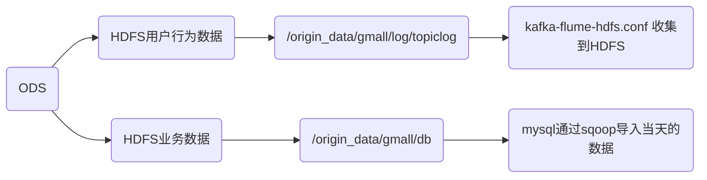

##### 1.业务数据处理意义

```
（1）保持数据原貌不做任何修改，起到备份数据的作用。
（2）数据采用Snappy压缩，减少磁盘存储空间。
（3）创建外部表。在企业开发中，除了自己用的临时表，创建内部表外，绝大多数场景都是创建外部表。
（4）创建分区表，防止后续的全表扫描，在企业开发中大量使用分区表。
```

#### 5.DIM


##### 1.建模步骤

```
DIM层DWD层需构建维度模型，一般采用星型模型，呈现的状态一般为星座模型(由于多个事实表)。
维度建模一般按照以下四个步骤：
见上图
```

* 选择业务

```
挑选我们感兴趣的业务线，比如下单业务，支付业务，退款业务，物流业务，一条业务线对应一张事实表
```

* 声明粒度

```
定义：	
	定义事实表中的一行数据表示什么，应该尽可能选择最小粒度，以此来应各种各样的需求。
例如：
	典型的粒度声明如下：
	订单事实表中一行数据表示的是一个订单中的一个商品项。
	支付事实表中一行数据表示的是一个支付记录。

```

* 确认维度

```
定义：
	描述业务是事实，主要表示的是“谁，何处，何时”等信息。
确认原则：
	后续需求中是否要分析相关维度的指标。例如，需要统计，什么时间下的订单多，哪个地区下的订单多，哪个用户下的订单多。需要确定的维度就包括：时间维度、地区维度、用户维度
```

* 确认事实

```
定义：
	指的是业务中的度量值（次数、个数、件数、金额，可以进行累加），例如订单金额、下单次数等
```

#### 6.DWD

##### 1.宽表

```
宽表从字面意义上讲就是字段比较多的数据库表。 通常是指业务主题相关的指标、维度、属性关联在一起的一张数据库表
（１）需要建哪些宽表：以维度为基准。
（２）宽表里面的字段：是站在不同维度的角度去看事实表，重点关注事实表聚合后的度量值。

```

##### 2.事实表和维度表关联

```
DWD层，以业务过程为建模驱动，基于每个具体业务过程的特点，构建最细粒度的明细层事实表。事实表可做适当的宽表化处理
```

|                | **时间** | **用户** | **地区** | **商品** | **优惠券** | **活动** | **度量值**                      |
| -------------- | -------- | -------- | -------- | -------- | ---------- | -------- | ------------------------------- |
| **订单**       | √        | √        | √        |          |            |          | 运费/优惠金额/原始金额/最终金额 |
| **订单详情**   | √        | √        | √        | √        | √          | √        | 件数/优惠金额/原始金额/最终金额 |
| **支付**       | √        | √        | √        |          |            |          | 支付金额                        |
| **加购**       | √        | √        |          | √        |            |          | 件数/金额                       |
| **收藏**       | √        | √        |          | √        |            |          | 次数                            |
| **评价**       | √        | √        |          | √        |            |          | 次数                            |
| **退单**       | √        | √        | √        | √        |            |          | 件数/金额                       |
| **退款**       | √        | √        | √        | √        |            |          | 件数/金额                       |
| **优惠券领用** | √        | √        |          |          | √          |          | 次数                            |

#### 7.DWS&DWT

```
DWS层和DWT层统称宽表层
```

##### 1.如何避免重复计算

```
1）问题引出：
	两个需求，统计每个省份订单的个数、统计每个省份订单的总金额
2）避免(join group by)重复计算
	设计一张地区宽表，其主键为地区ID，字段包含为：下单次数、下单金额、支付次数、支付金额等。上述所有指标都统一进行计算，并将结果保存在该宽表中，这样就能有效避免数据的重复计算
```

##### 2.DWS&DWT区别

```
DWS和DWT层的区别：
	DWS层存放的所有主题对象当天的汇总行为，例如每个地区当天的下单次数，下单金额等，
	DWT层存放的是所有主题对象的累积行为，例如每个地区最近７天（１５天、３０天、６０天）的下单次数、下单金额等
```

## 三.数仓搭建

### 1.ODS

| 业务     | 日期           |
| -------- | -------------- |
| 行为数据 | 14，15，16     |
| 业务数据 | 14，15，16，17 |
|          |                |

#### 同步理论

```
数据同步策略的类型包括：全量同步、增量同步、新增及变化同步、特殊情况
全量表：存储完整的数据。
增量表：存储新增加的数据。
新增及变化表：存储新增加的数据和变化的数据。
特殊表：只需要存储一次。

```


#### 1.行为表ods_log

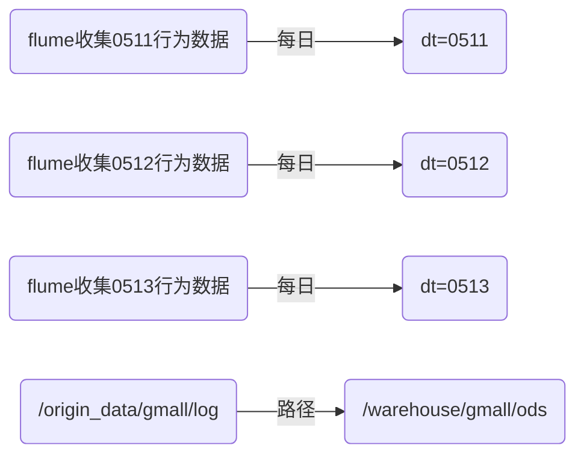

* 创建hive分区表

```sql
drop table if exists ods_log;
CREATE EXTERNAL TABLE ods_log (`line` string)
PARTITIONED BY (`dt` string) -- 按照时间创建分区
LOCATION '/warehouse/gmall/ods/ods_log'  -- 指定数据在hdfs上的存储位置

load data inpath '/origin_data/gmall/log/topic_log/2020-06-14' into table ods_log partition(dt='2020-06-14');
```

#### 2.业务表

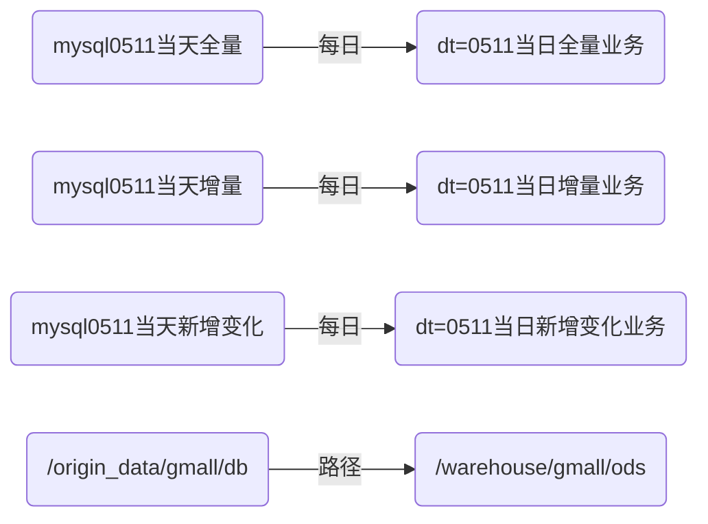

* 建表语句参考目录文件 .sql

* 首次同步脚本，每日同步脚本,<mark>ODS都是全量的同步</mark>

```mermaid
graph LR
E(/origin_data/$APP/db/$1/$do_date)--写入-->B(hdfs)
C(查询所有)--target-->E
A(mysql)--sqoop首次全量-->C
D(mysql)--sqoop每日全量-->F(where.create_time,operate_time)
F--target-->G(/origin_data/$APP/db/$1/$do_date)
G-->B
H(HDFS)--首次全量,日期-->M(/origin_data/$APP/db/order_info/$do_date)
M--分区-->J(partition'dt='$do_date'')
J-->I(ods)
H--每日全量,日期--分区-->L(partition'dt='$do_date'')
L-->K(ods)
```


### 2.DIM

| 解释                                                         |
| ------------------------------------------------------------ |
| 1.每日全量表放在ods的分区中，所有分区的数据也就是mysql中全部数据 |
|                                                              |
|                                                              |


#### 1.商品维度表(全量)

* 建表语句

  ```sql
  .建表语句
  DROP TABLE IF EXISTS dim_sku_info;
  CREATE EXTERNAL TABLE dim_sku_info (
      `id` STRING COMMENT '商品id',
      `price` DECIMAL(16,2) COMMENT '商品价格',
      `sku_name` STRING COMMENT '商品名称',
      `sku_desc` STRING COMMENT '商品描述',
      `weight` DECIMAL(16,2) COMMENT '重量',
      `is_sale` BOOLEAN COMMENT '是否在售',
      `spu_id` STRING COMMENT 'spu编号',
      `spu_name` STRING COMMENT 'spu名称',
      `category3_id` STRING COMMENT '三级分类id',
      `category3_name` STRING COMMENT '三级分类名称',
      `category2_id` STRING COMMENT '二级分类id',
      `category2_name` STRING COMMENT '二级分类名称',
      `category1_id` STRING COMMENT '一级分类id',
      `category1_name` STRING COMMENT '一级分类名称',
      `tm_id` STRING COMMENT '品牌id',
      `tm_name` STRING COMMENT '品牌名称',
      `sku_attr_values` ARRAY<STRUCT<attr_id:STRING,value_id:STRING,attr_name:STRING,value_name:STRING>> COMMENT '平台属性',
      `sku_sale_attr_values` ARRAY<STRUCT<sale_attr_id:STRING,sale_attr_value_id:STRING,sale_attr_name:STRING,sale_attr_value_name:STRING>> COMMENT '销售属性',
      `create_time` STRING COMMENT '创建时间'
  ) COMMENT '商品维度表'
  PARTITIONED BY (`dt` STRING)
  STORED AS ORC
  LOCATION '/warehouse/gmall/dim/dim_sku_info/'
  TBLPROPERTIES ("orc.compress"="snappy");
  
  ```

* 首次导入数据

```sql
with
    sku as (
        select
       id,price,sku_name,sku_desc,weight,is_sale,spu_id,category3_id,tm_id,create_time
        from ods_sku_info
        where dt=='2021-06-14'

    ),
    spu as (
        select id, spu_name, category3_id, tm_id
        from ods_spu_info
        where dt=='2021-06-14'
    ),
    c3 as
        (
            select id,name,category2_id
            from ods_base_category3
            where dt='2021-06-14'
        ),
    c2 as
        (
            select id,name,category1_id
            from ods_base_category2
            where dt='2021-06-14'
        ),
    c1 as
        (
            select  id,name
            from ods_base_category1
            where dt='2021-06-14'
        ),
    tm as
        (
            select id,tm_name
            from ods_base_trademark
            where dt='2021-06-14'
        ),
    attr as (
        select sku_id,
               collect_list(named_struct('attr_id',attr_id,'value_id',value_id,'attr_name',attr_name,'value_name',value_name)) attrs
        from ods_sku_attr_value
        where dt='2021-06-14'
        group by sku_id
    ),
    sale_attr as (
        select  sku_id,
                collect_set(named_struct('sale_attr_id',sale_attr_id,'sale_attr_value_id',sale_attr_value_id,'sale_attr_name',sale_attr_name,'sale_attr_value_name',sale_attr_value_name)) sale_attrs
        from ods_sku_sale_attr_value
        where dt='2021-06-14'
        group by sku_id

    )
insert overwrite table dim_sku_info partition(dt='2021-06-14')
select     sku.id,sku.price,
           sku.sku_name,sku.sku_desc,
           sku.weight,sku.is_sale,
           sku.spu_id,spu.spu_name,
           sku.category3_id,c3.name,
           c3.category2_id,c2.name,
           c2.category1_id,
           c1.name,sku.tm_id,
           tm.tm_name,attr.attrs,
           sale_attr.sale_attrs,sku.create_time
from sku
         left join spu on sku.spu_id=spu.id
         left join c3 on sku.category3_id=c3.id
         left join c2 on c3.category2_id=c2.id
         left join c1 on c2.category1_id=c1.id
         left join tm on sku.tm_id=tm.id
         left join attr on sku.id=attr.sku_id
         left join sale_attr on sku.id=sale_attr.sku_id;

```

* array<struct>

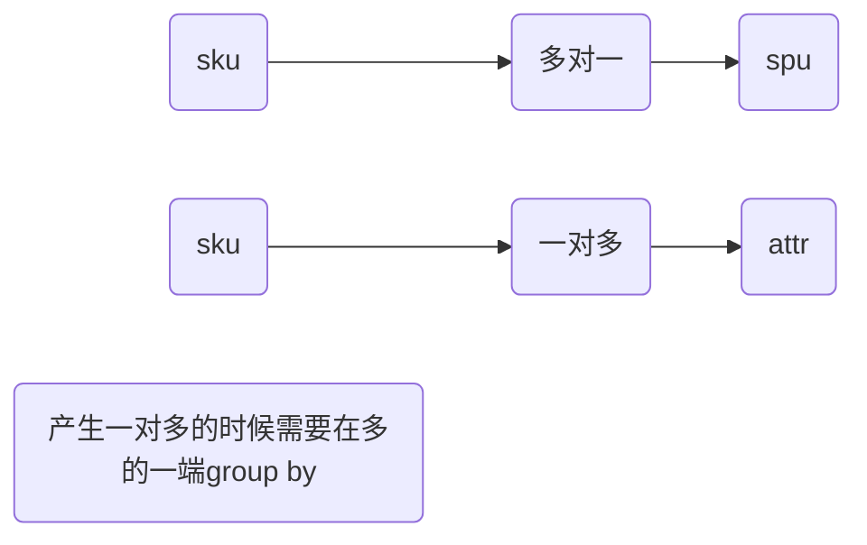


* result

```
[{"sale_attr_id":"1","sale_attr_value_id":"1","sale_attr_name":"颜色","sale_attr_value_name":"陶瓷黑"},{"sale_attr_id":"2","sale_attr_value_id":"3","sale_attr_name":"版本","sale_attr_value_name":"8G+128G"}]
```

#### 2.优惠券维度表(全量)

* 建表语句

```sql
DROP TABLE IF EXISTS dim_coupon_info;
CREATE EXTERNAL TABLE dim_coupon_info(
                                         `id` STRING COMMENT '购物券编号',
                                         `coupon_name` STRING COMMENT '购物券名称',
                                         `coupon_type` STRING COMMENT '购物券类型 1 现金券 2 折扣券 3 满减券 4 满件打折券',
                                         `condition_amount` DECIMAL(16,2) COMMENT '满额数',
                                         `condition_num` BIGINT COMMENT '满件数',
                                         `activity_id` STRING COMMENT '活动编号',
                                         `benefit_amount` DECIMAL(16,2) COMMENT '减金额',
                                         `benefit_discount` DECIMAL(16,2) COMMENT '折扣',
                                         `create_time` STRING COMMENT '创建时间',
                                         `range_type` STRING COMMENT '范围类型 1、商品 2、品类 3、品牌',
                                         `limit_num` BIGINT COMMENT '最多领取次数',
                                         `taken_count` BIGINT COMMENT '已领取次数',
                                         `start_time` STRING COMMENT '可以领取的开始日期',
                                         `end_time` STRING COMMENT '可以领取的结束日期',
                                         `operate_time` STRING COMMENT '修改时间',
                                         `expire_time` STRING COMMENT '过期时间'
) COMMENT '优惠券维度表'
    PARTITIONED BY (`dt` STRING)
    STORED AS ORC
    LOCATION '/warehouse/gmall_test/dim/dim_coupon_info/'
    TBLPROPERTIES ("orc.compress"="snappy");

```

* 首次导入

```sql
insert overwrite table dim_coupon_info partition(dt='2021-06-14')
select
    id,coupon_name,coupon_type,condition_amount,
    condition_num,activity_id,benefit_amount,
    benefit_discount,create_time,range_type,
    limit_num,taken_count,start_time,
    end_time,operate_time,expire_time
from ods_coupon_info
where dt='2021-06-14';
```

#### 3.活动维度表(全量)

* 建表

```sql
DROP TABLE IF EXISTS dim_activity_rule_info;
CREATE EXTERNAL TABLE dim_activity_rule_info(
    `activity_rule_id` STRING COMMENT '活动规则ID',
    `activity_id` STRING COMMENT '活动ID',
    `activity_name` STRING  COMMENT '活动名称',
    `activity_type` STRING  COMMENT '活动类型',
    `start_time` STRING  COMMENT '开始时间',
    `end_time` STRING  COMMENT '结束时间',
    `create_time` STRING  COMMENT '创建时间',
    `condition_amount` DECIMAL(16,2) COMMENT '满减金额',
    `condition_num` BIGINT COMMENT '满减件数',
    `benefit_amount` DECIMAL(16,2) COMMENT '优惠金额',
    `benefit_discount` DECIMAL(16,2) COMMENT '优惠折扣',
    `benefit_level` STRING COMMENT '优惠级别'
) COMMENT '活动信息表'
PARTITIONED BY (`dt` STRING)
STORED AS ORC
LOCATION '/warehouse/gmall_test/dim/dim_activity_rule_info/'
TBLPROPERTIES ("orc.compress"="snappy");

```

* 首次导入

```sql
insert overwrite table dim_activity_rule_info partition(dt='2021-06-14')
select
    ar.id,ar.activity_id,ai.activity_name,
    ar.activity_type,ai.start_time,ai.end_time,
    ai.create_time,ar.condition_amount,ar.condition_num,
    ar.benefit_amount,ar.benefit_discount, ar.benefit_level
from
(
    select
        id,activity_id,activity_type,condition_amount,
        condition_num,benefit_amount,benefit_discount,benefit_level
    from ods_activity_rule
    where dt='2021-06-14'
)ar
left join
(
    select
        id,activity_name,start_time,end_time,create_time
    from ods_activity_info
    where dt='2021-06-14'
)ai
on ar.activity_id=ai.id;

```

#### 4.地区维度表(特殊)

* 创建表

```sql
DROP TABLE IF EXISTS dim_base_province;
CREATE EXTERNAL TABLE dim_base_province (
    `id` STRING COMMENT 'id',
    `province_name` STRING COMMENT '省市名称',
    `area_code` STRING COMMENT '地区编码',
    `iso_code` STRING COMMENT 'ISO-3166编码，供可视化使用',
    `iso_3166_2` STRING COMMENT 'IOS-3166-2编码，供可视化使用',
    `region_id` STRING COMMENT '地区id',
    `region_name` STRING COMMENT '地区名称'
) COMMENT '地区维度表'
STORED AS ORC
LOCATION '/warehouse/gmall_test/dim/dim_base_province/'
TBLPROPERTIES ("orc.compress"="snappy");

```

* 首次即每日

```sql
insert overwrite table dim_base_province
select
    bp.id,
    bp.name,
    bp.area_code,
    bp.iso_code,
    bp.iso_3166_2,
    bp.region_id,
    br.region_name
from ods_base_province bp
         join ods_base_region br on bp.region_id = br.id;
```

#### 5.时间维度表(特舒)

* 创建表

```
DROP TABLE IF EXISTS dim_date_info;
CREATE EXTERNAL TABLE dim_date_info(
    `date_id` STRING COMMENT '日',
    `week_id` STRING COMMENT '周ID',
    `week_day` STRING COMMENT '周几',
    `day` STRING COMMENT '每月的第几天',
    `month` STRING COMMENT '第几月',
    `quarter` STRING COMMENT '第几季度',
    `year` STRING COMMENT '年',
    `is_workday` STRING COMMENT '是否是工作日',
    `holiday_id` STRING COMMENT '节假日'
) COMMENT '时间维度表'
STORED AS ORC
LOCATION '/warehouse/gmall_test/dim/dim_date_info/'
TBLPROPERTIES ("orc.compress"="snappy");

```

* 创建临时表

```
DROP TABLE IF EXISTS tmp_dim_date_info;
CREATE EXTERNAL TABLE tmp_dim_date_info (
    `date_id` STRING COMMENT '日',
    `week_id` STRING COMMENT '周ID',
    `week_day` STRING COMMENT '周几',
    `day` STRING COMMENT '每月的第几天',
    `month` STRING COMMENT '第几月',
    `quarter` STRING COMMENT '第几季度',
    `year` STRING COMMENT '年',
    `is_workday` STRING COMMENT '是否是工作日',
    `holiday_id` STRING COMMENT '节假日'
) COMMENT '时间维度表'
ROW FORMAT DELIMITED FIELDS TERMINATED BY '\t'
LOCATION '/warehouse/gmall_test/tmp/tmp_dim_date_info/';

```

* data_info.txt上传到/warehouse/gmall_test/tmp/tmp_dim_date_info/
* 从临时表到正式表

```
insert overwrite table dim_date_info select * from tmp_dim_date_info;
```

#### 6.用户维度表(拉链表)

* 拉链表

```
记录每条信息的生命周期，一旦一条记录生命周期结束，就重新开始一条新的记录，并把当前日期放入生效开始日期；当前信息至今有效，在生效结束日期中放入极大值（9999-99-99）

```

* 使用拉链的场景

```
数据会发生变化，但是发生变化频率并不高的维度；比如用户表做每日全量效率低下
```

* 建表

```
DROP TABLE IF EXISTS dim_user_info;
CREATE EXTERNAL TABLE dim_user_info(
   `id` STRING COMMENT '用户id',`login_name` STRING COMMENT '用户名称',
   `nick_name` STRING COMMENT '用户昵称',`name` STRING COMMENT '用户姓名',
   `phone_num` STRING COMMENT '手机号码', `email` STRING COMMENT '邮箱',
   `user_level` STRING COMMENT '用户等级',`birthday` STRING COMMENT '生日',
   `gender` STRING COMMENT '性别',`create_time` STRING COMMENT '创建时间',
   `operate_time` STRING COMMENT '操作时间',`start_date` STRING COMMENT '开始日期',
   `end_date` STRING COMMENT '结束日期'
) COMMENT '用户表'
    PARTITIONED BY (`dt` STRING)
    STORED AS ORC
    LOCATION '/warehouse/gmall_test/dim/dim_user_info/'
    TBLPROPERTIES ("orc.compress"="snappy");

```

* 第一次初始化将截止到初始化当日的全部历史用户导入一次性导入到拉链表中。拉链表分区9999-99-99

```
insert overwrite table dim_user_info partition (dt = '9999-99-99')
select id,
       login_name,
       nick_name,
       md5(name),
       md5(phone_num),
       md5(email),
       user_level,
       birthday,
       gender,
       create_time,
       operate_time,
       '2021-06-14',
       '9999-99-99'
from ods_user_info
where dt = '2021-06-14';
```

* 每日


```
with
tmp as
(
    select
        old.id old_id,
        old.login_name old_login_name,
        old.nick_name old_nick_name,
        old.name old_name,
        old.phone_num old_phone_num,
        old.email old_email,
        old.user_level old_user_level,
        old.birthday old_birthday,
        old.gender old_gender,
        old.create_time old_create_time,
        old.operate_time old_operate_time,
        old.start_date old_start_date,
        old.end_date old_end_date,
        new.id new_id,
        new.login_name new_login_name,
        new.nick_name new_nick_name,
        new.name new_name,
        new.phone_num new_phone_num,
        new.email new_email,
        new.user_level new_user_level,
        new.birthday new_birthday,
        new.gender new_gender,
        new.create_time new_create_time,
        new.operate_time new_operate_time,
        new.start_date new_start_date,
        new.end_date new_end_date
    from
    (
        select
            id,
            login_name,
            nick_name,
            name,
            phone_num,
            email,
            user_level,
            birthday,
            gender,
            create_time,
            operate_time,
            start_date,
            end_date
        from dim_user_info
        where dt='9999-99-99'
    )old
    full outer join
    (
        select
            id,
            login_name,
            nick_name,
            md5(nick_name) nick_name,
            md5(name) name,
            md5(phone_num) phone_num,
            email,
            user_level,
            birthday,
            gender,
            create_time,
            operate_time,
            '2020-06-15' start_date,
            '9999-99-99' end_date
        from ods_user_info
        where dt='2021-06-15'
    )new
    on old.id=new.id
)
insert overwrite table dim_user_info partition(dt)
select
    nvl(new_id,old_id),
    nvl(new_login_name,old_login_name),
    nvl(new_nick_name,old_nick_name),
    nvl(new_name,old_name),
    nvl(new_phone_num,old_phone_num),
    nvl(new_email,old_email),
    nvl(new_user_level,old_user_level),
    nvl(new_birthday,old_birthday),
    nvl(new_gender,old_gender),
    nvl(new_create_time,old_create_time),
    nvl(new_operate_time,old_operate_time),
    nvl(new_start_date,old_start_date),
    nvl(new_end_date,old_end_date),
    nvl(new_end_date,old_end_date) dt
from tmp
union all
select
    old_id,
    old_login_name,
    old_nick_name,
    old_name,
    old_phone_num,
    old_email,
    old_user_level,
    old_birthday,
    old_gender,
    old_create_time,
    old_operate_time,
    old_start_date,
    cast(date_add('2021-06-15',-1) as string),
    cast(date_add('2021-06-15',-1) as string) dt
from tmp
where new_id is not null and old_id is not null;

```

### 3.DWD

| idea命令                                             | 作用               |
| ---------------------------------------------------- | ------------------ |
| set hive.exec.dynamic.partition.mode=nonstrict；     | 实现动态分区       |
| set hive.spark.client.server.connect.timeout=900000; | 超时时间设置15分钟 |
|                                                      |                    |


```
1）对用户行为数据解析。
	页面埋点日志common,action,display,age,err,ts
	启动日志字段common,start,err
2）对业务数据采用维度模型重新建模。
```

##### 1.启动日志表

```
启动日志表中每行数据对应一个启动记录，一个启动记录应该包含日志中的公共信息和启动信息。先将所有包含start字段的日志过滤出来，然后使用get_json_object函数解析每个字段。
```

* 建表

```sql
DROP TABLE IF EXISTS dwd_start_log;
CREATE EXTERNAL TABLE dwd_start_log(
    `area_code` STRING COMMENT '地区编码',
    `brand` STRING COMMENT '手机品牌',
    `channel` STRING COMMENT '渠道',
    `is_new` STRING COMMENT '是否首次启动',
    `model` STRING COMMENT '手机型号',
    `mid_id` STRING COMMENT '设备id',
    `os` STRING COMMENT '操作系统',
    `user_id` STRING COMMENT '会员id',
    `version_code` STRING COMMENT 'app版本号',
    `entry` STRING COMMENT 'icon手机图标 notice 通知 install 安装后启动',
    `loading_time` BIGINT COMMENT '启动加载时间',
    `open_ad_id` STRING COMMENT '广告页ID ',
    `open_ad_ms` BIGINT COMMENT '广告总共播放时间',
    `open_ad_skip_ms` BIGINT COMMENT '用户跳过广告时点',
    `ts` BIGINT COMMENT '时间'
) COMMENT '启动日志表'
PARTITIONED BY (`dt` STRING)
STORED AS ORC
LOCATION '/warehouse/gmall_test/dwd/dwd_start_log'
TBLPROPERTIES ("orc.compress"="snappy");

```

* 插入数据

```
insert overwrite table dwd_start_log partition(dt='2021-06-14')
select
    get_json_object(line,'$.common.ar'),
    get_json_object(line,'$.common.ba'),
    get_json_object(line,'$.common.ch'),
    get_json_object(line,'$.common.is_new'),
    get_json_object(line,'$.common.md'),
    get_json_object(line,'$.common.mid'),
    get_json_object(line,'$.common.os'),
    get_json_object(line,'$.common.uid'),
    get_json_object(line,'$.common.vc'),
    get_json_object(line,'$.start.entry'),
    get_json_object(line,'$.start.loading_time'),
    get_json_object(line,'$.start.open_ad_id'),
    get_json_object(line,'$.start.open_ad_ms'),
    get_json_object(line,'$.start.open_ad_skip_ms'),
    get_json_object(line,'$.ts')
from ods_log
where dt='2021-06-14'
  and get_json_object(line,'$.start') is not null;

```

##### 2.页面日志表

```
页面日志表中每行数据对应一个页面访问记录，一个页面访问记录应该包含日志中的公共信息和页面信息。先将所有包含page字段的日志过滤出来
```

* 建表

```sql
DROP TABLE IF EXISTS dwd_page_log;
CREATE EXTERNAL TABLE dwd_page_log(
    `area_code` STRING COMMENT '地区编码',
    `brand` STRING COMMENT '手机品牌',
    `channel` STRING COMMENT '渠道',
    `is_new` STRING COMMENT '是否首次启动',
    `model` STRING COMMENT '手机型号',
    `mid_id` STRING COMMENT '设备id',
    `os` STRING COMMENT '操作系统',
    `user_id` STRING COMMENT '会员id',
    `version_code` STRING COMMENT 'app版本号',
    `during_time` BIGINT COMMENT '持续时间毫秒',
    `page_item` STRING COMMENT '目标id ',
    `page_item_type` STRING COMMENT '目标类型',
    `last_page_id` STRING COMMENT '上页类型',
    `page_id` STRING COMMENT '页面ID ',
    `source_type` STRING COMMENT '来源类型',
    `ts` bigint
) COMMENT '页面日志表'
PARTITIONED BY (`dt` STRING)
STORED AS ORC
LOCATION '/warehouse/gmall_test/dwd/dwd_page_log'
TBLPROPERTIES ("orc.compress"="snappy");

```

* 插入数据

```sql
insert overwrite table dwd_page_log partition(dt='2021-06-14')
select
    get_json_object(line,'$.common.ar'),
    get_json_object(line,'$.common.ba'),
    get_json_object(line,'$.common.ch'),
    get_json_object(line,'$.common.is_new'),
    get_json_object(line,'$.common.md'),
    get_json_object(line,'$.common.mid'),
    get_json_object(line,'$.common.os'),
    get_json_object(line,'$.common.uid'),
    get_json_object(line,'$.common.vc'),
    get_json_object(line,'$.page.during_time'),
    get_json_object(line,'$.page.item'),
    get_json_object(line,'$.page.item_type'),
    get_json_object(line,'$.page.last_page_id'),
    get_json_object(line,'$.page.page_id'),
    get_json_object(line,'$.page.source_type'),
    get_json_object(line,'$.ts')
from ods_log
where dt='2021-06-14'
and get_json_object(line,'$.page') is not null;

```

##### 3.动作日志表

```
动作日志表中每行数据对应用户的一个动作记录，一个动作记录应当包含公共信息、页面信息以及动作信息。先将包含action字段的日志过滤出来，然后通过UDTF函数，将action数组“炸开”（类似于explode函数的效果），然后使用get_json_object函数解析每个字段。
```

* 建表

```
DROP TABLE IF EXISTS dwd_action_log;
CREATE EXTERNAL TABLE dwd_action_log(
    `area_code` STRING COMMENT '地区编码',
    `brand` STRING COMMENT '手机品牌',
    `channel` STRING COMMENT '渠道',
    `is_new` STRING COMMENT '是否首次启动',
    `model` STRING COMMENT '手机型号',
    `mid_id` STRING COMMENT '设备id',
    `os` STRING COMMENT '操作系统',
    `user_id` STRING COMMENT '会员id',
    `version_code` STRING COMMENT 'app版本号',
    `during_time` BIGINT COMMENT '持续时间毫秒',
    `page_item` STRING COMMENT '目标id ',
    `page_item_type` STRING COMMENT '目标类型',
    `last_page_id` STRING COMMENT '上页类型',
    `page_id` STRING COMMENT '页面id ',
    `source_type` STRING COMMENT '来源类型',
    `action_id` STRING COMMENT '动作id',
    `item` STRING COMMENT '目标id ',
    `item_type` STRING COMMENT '目标类型',
    `ts` BIGINT COMMENT '时间'
) COMMENT '动作日志表'
PARTITIONED BY (`dt` STRING)
STORED AS ORC
LOCATION '/warehouse/gmall_test/dwd/dwd_action_log'
TBLPROPERTIES ("orc.compress"="snappy");

```

* 代码处理多个action

```java
<dependencies>
    <!--添加hive依赖-->
    <dependency>
        <groupId>org.apache.hive</groupId>
        <artifactId>hive-exec</artifactId>
        <version>3.1.2</version>
    </dependency>
</dependencies>
// 编码
package com.atguigu.hive.udtf;

import org.apache.hadoop.hive.ql.exec.UDFArgumentException;
import org.apache.hadoop.hive.ql.metadata.HiveException;
import org.apache.hadoop.hive.ql.udf.generic.GenericUDTF;
import org.apache.hadoop.hive.serde2.objectinspector.ObjectInspector;
import org.apache.hadoop.hive.serde2.objectinspector.ObjectInspectorFactory;
import org.apache.hadoop.hive.serde2.objectinspector.PrimitiveObjectInspector;
import org.apache.hadoop.hive.serde2.objectinspector.StructObjectInspector;
import org.apache.hadoop.hive.serde2.objectinspector.primitive.PrimitiveObjectInspectorFactory;
import org.json.JSONArray;

import java.util.ArrayList;
import java.util.List;

public class ExplodeJSONArray extends GenericUDTF {

    @Override
    public StructObjectInspector initialize(ObjectInspector[] argOIs) throws UDFArgumentException {

        // 1 参数合法性检查
        if (argOIs.length != 1) {
            throw new UDFArgumentException("explode_json_array 只需要一个参数");
        }

        // 2 第一个参数必须为string
        //判断参数是否为基础数据类型
        if (argOIs[0].getCategory() != ObjectInspector.Category.PRIMITIVE) {
            throw new UDFArgumentException("explode_json_array 只接受基础类型参数");
        }

        //将参数对象检查器强转为基础类型对象检查器
        PrimitiveObjectInspector argumentOI = (PrimitiveObjectInspector) argOIs[0];

        //判断参数是否为String类型
        if (argumentOI.getPrimitiveCategory() != PrimitiveObjectInspector.PrimitiveCategory.STRING) {
            throw new UDFArgumentException("explode_json_array 只接受string类型的参数");
        }

        // 3 定义返回值名称和类型
        List<String> fieldNames = new ArrayList<String>();
        List<ObjectInspector> fieldOIs = new ArrayList<ObjectInspector>();

        fieldNames.add("items");
        fieldOIs.add(PrimitiveObjectInspectorFactory.javaStringObjectInspector);

        return ObjectInspectorFactory.getStandardStructObjectInspector(fieldNames, fieldOIs);
    }

    public void process(Object[] objects) throws HiveException {

        // 1 获取传入的数据
        String jsonArray = objects[0].toString();

        // 2 将string转换为json数组
        JSONArray actions = new JSONArray(jsonArray);

        // 3 循环一次，取出数组中的一个json，并写出
        for (int i = 0; i < actions.length(); i++) {

            String[] result = new String[1];
            result[0] = actions.getString(i);
            forward(result);
        }
    }

    public void close() throws HiveException {

    }

}
```

* 上传

```
hadoop fs -mkdir -p /user/hive/jars
hadoop fs -put hivefunction-1.0-SNAPSHOT.jar /user/hive/jars

```

* 创建永久函数的并联

```
create function explode_json_array as 'HiveFunction' using jar 'hdfs://mycluster:8020/user/hive/jars/udtf-1.0-SNAPSHOT.jar';
```

* 插入数据

```
insert overwrite table dwd_action_log partition(dt='2021-06-14')
select
    get_json_object(line,'$.common.ar'),
    get_json_object(line,'$.common.ba'),
    get_json_object(line,'$.common.ch'),
    get_json_object(line,'$.common.is_new'),
    get_json_object(line,'$.common.md'),
    get_json_object(line,'$.common.mid'),
    get_json_object(line,'$.common.os'),
    get_json_object(line,'$.common.uid'),
    get_json_object(line,'$.common.vc'),
    get_json_object(line,'$.page.during_time'),
    get_json_object(line,'$.page.item'),
    get_json_object(line,'$.page.item_type'),
    get_json_object(line,'$.page.last_page_id'),
    get_json_object(line,'$.page.page_id'),
    get_json_object(line,'$.page.source_type'),
    get_json_object(action,'$.action_id'),
    get_json_object(action,'$.item'),
    get_json_object(action,'$.item_type'),
    get_json_object(action,'$.ts')
from ods_log lateral view explode_json_array(get_json_object(line,'$.actions')) tmp as action
where dt='2021-06-14'
  and get_json_object(line,'$.actions') is not null;
```

##### 4.曝光日志表

```
曝光日志表中每行数据对应一个曝光记录，一个曝光记录应当包含公共信息、页面信息以及曝光信息。先将包含display字段的日志过滤出来，然后通过UDTF函数，将display数组“炸开”（类似于explode函数的效果）
```

* 建表

```
DROP TABLE IF EXISTS dwd_display_log;
CREATE EXTERNAL TABLE dwd_display_log(
    `area_code` STRING COMMENT '地区编码',
    `brand` STRING COMMENT '手机品牌',
    `channel` STRING COMMENT '渠道',
    `is_new` STRING COMMENT '是否首次启动',
    `model` STRING COMMENT '手机型号',
    `mid_id` STRING COMMENT '设备id',
    `os` STRING COMMENT '操作系统',
    `user_id` STRING COMMENT '会员id',
    `version_code` STRING COMMENT 'app版本号',
    `during_time` BIGINT COMMENT 'app版本号',
    `page_item` STRING COMMENT '目标id ',
    `page_item_type` STRING COMMENT '目标类型',
    `last_page_id` STRING COMMENT '上页类型',
    `page_id` STRING COMMENT '页面ID ',
    `source_type` STRING COMMENT '来源类型',
    `ts` BIGINT COMMENT 'app版本号',
    `display_type` STRING COMMENT '曝光类型',
    `item` STRING COMMENT '曝光对象id ',
    `item_type` STRING COMMENT 'app版本号',
    `order` BIGINT COMMENT '曝光顺序',
    `pos_id` BIGINT COMMENT '曝光位置'
) COMMENT '曝光日志表'
PARTITIONED BY (`dt` STRING)
STORED AS ORC
LOCATION '/warehouse/gmall_test/dwd/dwd_display_log'
TBLPROPERTIES ("orc.compress"="snappy");

```

* 插入数据

```
insert overwrite table dwd_display_log partition(dt='2021-06-14')
select
    get_json_object(line,'$.common.ar'),
    get_json_object(line,'$.common.ba'),
    get_json_object(line,'$.common.ch'),
    get_json_object(line,'$.common.is_new'),
    get_json_object(line,'$.common.md'),
    get_json_object(line,'$.common.mid'),
    get_json_object(line,'$.common.os'),
    get_json_object(line,'$.common.uid'),
    get_json_object(line,'$.common.vc'),
    get_json_object(line,'$.page.during_time'),
    get_json_object(line,'$.page.item'),
    get_json_object(line,'$.page.item_type'),
    get_json_object(line,'$.page.last_page_id'),
    get_json_object(line,'$.page.page_id'),
    get_json_object(line,'$.page.source_type'),
    get_json_object(line,'$.ts'),
    get_json_object(display,'$.display_type'),
    get_json_object(display,'$.item'),
    get_json_object(display,'$.item_type'),
    get_json_object(display,'$.order'),
    get_json_object(display,'$.pos_id')
from ods_log lateral view explode_json_array(get_json_object(line,'$.displays')) tmp as display
where dt='2021-06-14'
and get_json_object(line,'$.displays') is not null;

```

##### 5.错误日志表

* 建表

```
DROP TABLE IF EXISTS dwd_error_log;
CREATE EXTERNAL TABLE dwd_error_log(
    `area_code` STRING COMMENT '地区编码',
    `brand` STRING COMMENT '手机品牌',
    `channel` STRING COMMENT '渠道',
    `is_new` STRING COMMENT '是否首次启动',
    `model` STRING COMMENT '手机型号',
    `mid_id` STRING COMMENT '设备id',
    `os` STRING COMMENT '操作系统',
    `user_id` STRING COMMENT '会员id',
    `version_code` STRING COMMENT 'app版本号',
    `page_item` STRING COMMENT '目标id ',
    `page_item_type` STRING COMMENT '目标类型',
    `last_page_id` STRING COMMENT '上页类型',
    `page_id` STRING COMMENT '页面ID ',
    `source_type` STRING COMMENT '来源类型',
    `entry` STRING COMMENT ' icon手机图标  notice 通知 install 安装后启动',
    `loading_time` STRING COMMENT '启动加载时间',
    `open_ad_id` STRING COMMENT '广告页ID ',
    `open_ad_ms` STRING COMMENT '广告总共播放时间',
    `open_ad_skip_ms` STRING COMMENT '用户跳过广告时点',
    `actions` STRING COMMENT '动作',
    `displays` STRING COMMENT '曝光',
    `ts` STRING COMMENT '时间',
    `error_code` STRING COMMENT '错误码',
    `msg` STRING COMMENT '错误信息'
) COMMENT '错误日志表'
PARTITIONED BY (`dt` STRING)
STORED AS ORC
LOCATION '/warehouse/gmall_test/dwd/dwd_error_log'
TBLPROPERTIES ("orc.compress"="snappy");

```

* 插入数据

```
insert overwrite table dwd_error_log partition(dt='2021-06-14')
select
    get_json_object(line,'$.common.ar'),
    get_json_object(line,'$.common.ba'),
    get_json_object(line,'$.common.ch'),
    get_json_object(line,'$.common.is_new'),
    get_json_object(line,'$.common.md'),
    get_json_object(line,'$.common.mid'),
    get_json_object(line,'$.common.os'),
    get_json_object(line,'$.common.uid'),
    get_json_object(line,'$.common.vc'),
    get_json_object(line,'$.page.item'),
    get_json_object(line,'$.page.item_type'),
    get_json_object(line,'$.page.last_page_id'),
    get_json_object(line,'$.page.page_id'),
    get_json_object(line,'$.page.source_type'),
    get_json_object(line,'$.start.entry'),
    get_json_object(line,'$.start.loading_time'),
    get_json_object(line,'$.start.open_ad_id'),
    get_json_object(line,'$.start.open_ad_ms'),
    get_json_object(line,'$.start.open_ad_skip_ms'),
    get_json_object(line,'$.actions'),
    get_json_object(line,'$.displays'),
    get_json_object(line,'$.ts'),
    get_json_object(line,'$.err.error_code'),
    get_json_object(line,'$.err.msg')
from ods_log
where dt='2021-06-14'
and get_json_object(line,'$.err') is not null;

```

#### 3.1事实表介绍

| 表             | 作用                                                         |
| -------------- | ------------------------------------------------------------ |
| 事务事实表     | 描述业务过程，跟踪控件或时间上某点的度量事件，保存的是最原子的数据； |
| 周期快照事实表 | 以一个周期为时间间隔，来记录事实，一般周期可以是每天、每周、每月、每年等； |
| 累积快照事实   |                                                              |

* 事务事实表

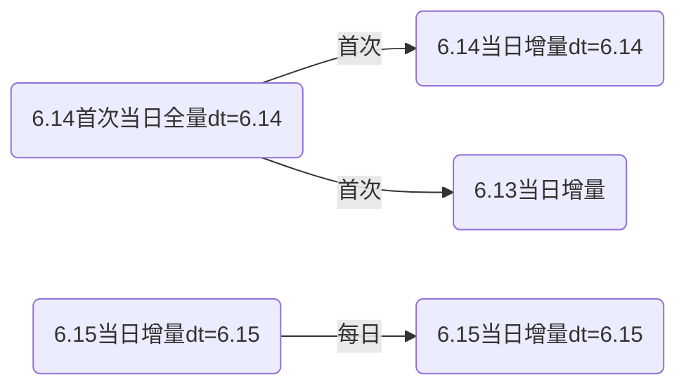

* 周期性周期快照事实表

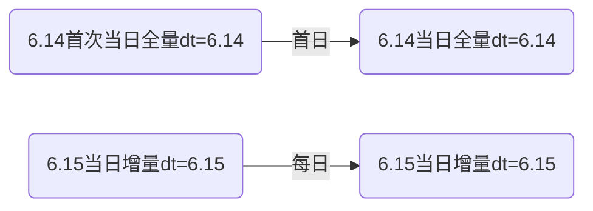

* 累积快照事实

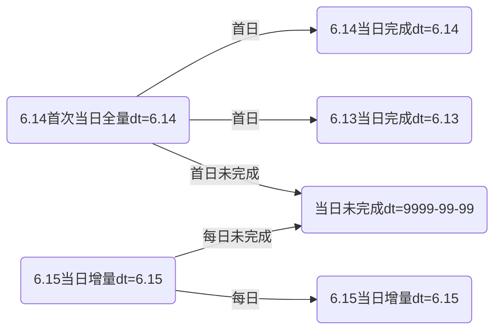


##### a.评价事实表(事务型事实表)

* 建表

```sql
DROP TABLE IF EXISTS dwd_comment_info;
CREATE EXTERNAL TABLE dwd_comment_info(
    `id` STRING COMMENT '编号',
    `user_id` STRING COMMENT '用户ID',
    `sku_id` STRING COMMENT '商品sku',
    `spu_id` STRING COMMENT '商品spu',
    `order_id` STRING COMMENT '订单ID',
    `appraise` STRING COMMENT '评价(好评、中评、差评、默认评价)',
    `create_time` STRING COMMENT '评价时间'
) COMMENT '评价事实表'
PARTITIONED BY (`dt` STRING)
STORED AS ORC
LOCATION '/warehouse/gmall_test/dwd/dwd_comment_info/'
TBLPROPERTIES ("orc.compress"="snappy");

```

* 首日插入数据

```sql
insert overwrite table dwd_comment_info partition (dt)
select
    id,
    user_id,
    sku_id,
    spu_id,
    order_id,
    appraise,
    create_time,
    date_format(create_time,'yyyy-MM-dd')
from ods_comment_info
where dt='2021-06-14';

```

* 每日插入数据

```sql
insert overwrite table dwd_comment_info partition(dt='2021-06-15')
select
    id,
    user_id,
    sku_id,
    spu_id,
    order_id,
    appraise,
    create_time
from ods_comment_info where dt='2021-06-15';

```

##### b.订单明细事实表(事务型事实表)

* 创建

```
DROP TABLE IF EXISTS dwd_order_detail;
CREATE EXTERNAL TABLE dwd_order_detail (
    `id` STRING COMMENT '订单编号',
    `order_id` STRING COMMENT '订单号',
    `user_id` STRING COMMENT '用户id',
    `sku_id` STRING COMMENT 'sku商品id',
    `province_id` STRING COMMENT '省份ID',
    `activity_id` STRING COMMENT '活动ID',
    `activity_rule_id` STRING COMMENT '活动规则ID',
    `coupon_id` STRING COMMENT '优惠券ID',
    `create_time` STRING COMMENT '创建时间',
    `source_type` STRING COMMENT '来源类型',
    `source_id` STRING COMMENT '来源编号',
    `sku_num` BIGINT COMMENT '商品数量',
    `original_amount` DECIMAL(16,2) COMMENT '原始价格',
    `split_activity_amount` DECIMAL(16,2) COMMENT '活动优惠分摊',
    `split_coupon_amount` DECIMAL(16,2) COMMENT '优惠券优惠分摊',
    `split_final_amount` DECIMAL(16,2) COMMENT '最终价格分摊'
) COMMENT '订单明细事实表表'
PARTITIONED BY (`dt` STRING)
STORED AS ORC
LOCATION '/warehouse/gmall_test/dwd/dwd_order_detail/'
TBLPROPERTIES ("orc.compress"="snappy");

```

* 首次插入数据

```sql
insert overwrite table dwd_order_detail partition(dt)
select
    od.id,
    od.order_id,
    oi.user_id,
    od.sku_id,
    oi.province_id,
    oda.activity_id,
    oda.activity_rule_id,
    odc.coupon_id,
    od.create_time,
    od.source_type,
    od.source_id,
    od.sku_num,
    od.order_price*od.sku_num,
    od.split_activity_amount,
    od.split_coupon_amount,
    od.split_final_amount,
    date_format(create_time,'yyyy-MM-dd')
from
(
    select
        *
    from ods_order_detail
    where dt='2021-06-14'
)od
left join
(
    select
        id,
        user_id,
        province_id
    from ods_order_info
    where dt='2021-06-14'
)oi
on od.order_id=oi.id
left join
(
    select
        order_detail_id,
        activity_id,
        activity_rule_id
    from ods_order_detail_activity
    where dt='2021-06-14'
)oda
on od.id=oda.order_detail_id
left join
(
    select
        order_detail_id,
        coupon_id
    from ods_order_detail_coupon
    where dt='2021-06-14'
)odc
on od.id=odc.order_detail_id;

```

* 每日插入数据

```sql
insert overwrite table dwd_order_detail partition(dt='2021-06-15')
select
    od.id,
    od.order_id,
    oi.user_id,
    od.sku_id,
    oi.province_id,
    oda.activity_id,
    oda.activity_rule_id,
    odc.coupon_id,
    od.create_time,
    od.source_type,
    od.source_id,
    od.sku_num,
    od.order_price*od.sku_num,
    od.split_activity_amount,
    od.split_coupon_amount,
    od.split_final_amount
from
(
    select
        *
    from ods_order_detail
    where dt='2021-06-15'
)od
left join
(
    select
        id,
        user_id,
        province_id
    from ods_order_info
    where dt='2021-06-15'
)oi
on od.order_id=oi.id
left join
(
    select
        order_detail_id,
        activity_id,
        activity_rule_id
    from ods_order_detail_activity
    where dt='2021-06-15'
)oda
on od.id=oda.order_detail_id
left join
(
    select
        order_detail_id,
        coupon_id
    from ods_order_detail_coupon
    where dt='2021-06-15'
)odc
on od.id=odc.order_detail_id;

```

##### c. 退单事实表(事务型事实表)

* 建表

```sql
DROP TABLE IF EXISTS dwd_order_refund_info;
CREATE EXTERNAL TABLE dwd_order_refund_info(
    `id` STRING COMMENT '编号',
    `user_id` STRING COMMENT '用户ID',
    `order_id` STRING COMMENT '订单ID',
    `sku_id` STRING COMMENT '商品ID',
    `province_id` STRING COMMENT '地区ID',
    `refund_type` STRING COMMENT '退单类型',
    `refund_num` BIGINT COMMENT '退单件数',
    `refund_amount` DECIMAL(16,2) COMMENT '退单金额',
    `refund_reason_type` STRING COMMENT '退单原因类型',
    `create_time` STRING COMMENT '退单时间'
) COMMENT '退单事实表'
PARTITIONED BY (`dt` STRING)
STORED AS ORC
LOCATION '/warehouse/gmall_test/dwd/dwd_order_refund_info/'
TBLPROPERTIES ("orc.compress"="snappy");

```

* 首次插入数据

```sql
insert overwrite table dwd_order_refund_info partition(dt)
select
    ri.id,
    ri.user_id,
    ri.order_id,
    ri.sku_id,
    oi.province_id,
    ri.refund_type,
    ri.refund_num,
    ri.refund_amount,
    ri.refund_reason_type,
    ri.create_time,
    date_format(ri.create_time,'yyyy-MM-dd')
from
(
    select * from ods_order_refund_info where dt='2021-06-14'
)ri
left join
(
    select id,province_id from ods_order_info where dt='2021-06-14'
)oi
on ri.order_id=oi.id;

```

* 每日插入数据

```sql
insert overwrite table dwd_order_refund_info partition(dt='2021-06-15')
select
    ri.id,
    ri.user_id,
    ri.order_id,
    ri.sku_id,
    oi.province_id,
    ri.refund_type,
    ri.refund_num,
    ri.refund_amount,
    ri.refund_reason_type,
    ri.create_time
from
(
    select * from ods_order_refund_info where dt='2021-06-15'
)ri
left join
(
    select id,province_id from ods_order_info where dt='2021-06-15'
)oi
on ri.order_id=oi.id;


```

##### d.加购事实表(周期型快照事实表，每日快照)

* 创建表

```sql
DROP TABLE IF EXISTS dwd_cart_info;
CREATE EXTERNAL TABLE dwd_cart_info(
    `id` STRING COMMENT '编号',
    `user_id` STRING COMMENT '用户ID',
    `sku_id` STRING COMMENT '商品ID',
    `source_type` STRING COMMENT '来源类型',
    `source_id` STRING COMMENT '来源编号',
    `cart_price` DECIMAL(16,2) COMMENT '加入购物车时的价格',
    `is_ordered` STRING COMMENT '是否已下单',
    `create_time` STRING COMMENT '创建时间',
    `operate_time` STRING COMMENT '修改时间',
    `order_time` STRING COMMENT '下单时间',
    `sku_num` BIGINT COMMENT '加购数量'
) COMMENT '加购事实表'
PARTITIONED BY (`dt` STRING)
STORED AS ORC
LOCATION '/warehouse/gmall_test/dwd/dwd_cart_info/'
TBLPROPERTIES ("orc.compress"="snappy");

```

* 首次插入数据

```sql
insert overwrite table dwd_cart_info partition(dt='2021-06-14')
select
    id,
    user_id,
    sku_id,
    source_type,
    source_id,
    cart_price,
    is_ordered,
    create_time,
    operate_time,
    order_time,
    sku_num
from ods_cart_info
where dt='2021-06-14';
```

* 每日插入

```sql
insert overwrite table dwd_cart_info partition(dt='2021-06-15')
select
    id,
    user_id,
    sku_id,
    source_type,
    source_id,
    cart_price,
    is_ordered,
    create_time,
    operate_time,
    order_time,
    sku_num
from ods_cart_info
where dt='2021-06-15';

```

##### e.收藏事实表(周期型快照事实表，每日快照)

* 创建表

```sql
DROP TABLE IF EXISTS dwd_favor_info;
CREATE EXTERNAL TABLE dwd_favor_info(
    `id` STRING COMMENT '编号',
    `user_id` STRING  COMMENT '用户id',
    `sku_id` STRING  COMMENT 'skuid',
    `spu_id` STRING  COMMENT 'spuid',
    `is_cancel` STRING  COMMENT '是否取消',
    `create_time` STRING  COMMENT '收藏时间',
    `cancel_time` STRING  COMMENT '取消时间'
) COMMENT '收藏事实表'
PARTITIONED BY (`dt` STRING)
STORED AS ORC
LOCATION '/warehouse/gmall_test/dwd/dwd_favor_info/'
TBLPROPERTIES ("orc.compress"="snappy");

```

* 首次插入

```sql
insert overwrite table dwd_favor_info partition(dt='2021-06-14')
select
    id,
    user_id,
    sku_id,
    spu_id,
    is_cancel,
    create_time,
    cancel_time
from ods_favor_info
where dt='2021-06-14';

```

* 每日插入

```sql
insert overwrite table dwd_favor_info partition(dt='2021-06-15')
select
    id,
    user_id,
    sku_id,
    spu_id,
    is_cancel,
    create_time,
    cancel_time
from ods_favor_info
where dt='2021-06-15';

```

##### f.优惠券领用事实表(累积型快照事实表)

* 创建表

```
DROP TABLE IF EXISTS dwd_coupon_use;
CREATE EXTERNAL TABLE dwd_coupon_use(
    `id` STRING COMMENT '编号',
    `coupon_id` STRING  COMMENT '优惠券ID',
    `user_id` STRING  COMMENT 'userid',
    `order_id` STRING  COMMENT '订单id',
    `coupon_status` STRING  COMMENT '优惠券状态',
    `get_time` STRING  COMMENT '领取时间',
    `using_time` STRING  COMMENT '使用时间(下单)',
    `used_time` STRING  COMMENT '使用时间(支付)',
    `expire_time` STRING COMMENT '过期时间'
) COMMENT '优惠券领用事实表'
PARTITIONED BY (`dt` STRING)
STORED AS ORC
LOCATION '/warehouse/gmall_test/dwd/dwd_coupon_use/'
TBLPROPERTIES ("orc.compress"="snappy");

```

* 首次插入

```
insert overwrite table dwd_coupon_use partition(dt)
select
    id,
    coupon_id,
    user_id,
    order_id,
    coupon_status,
    get_time,
    using_time,
    used_time,
    expire_time,
    coalesce(date_format(used_time,'yyyy-MM-dd'),date_format(expire_time,'yyyy-MM-dd'),'9999-99-99')
from ods_coupon_use
where dt='2020-06-14';

```

* 每日插入

```sql
insert overwrite table dwd_coupon_use partition(dt)
select
    nvl(new.id,old.id),
    nvl(new.coupon_id,old.coupon_id),
    nvl(new.user_id,old.user_id),
    nvl(new.order_id,old.order_id),
    nvl(new.coupon_status,old.coupon_status),
    nvl(new.get_time,old.get_time),
    nvl(new.using_time,old.using_time),
    nvl(new.used_time,old.used_time),
    nvl(new.expire_time,old.expire_time),
    coalesce(date_format(nvl(new.used_time,old.used_time),'yyyy-MM-dd'),date_format(nvl(new.expire_time,old.expire_time),'yyyy-MM-dd'),'9999-99-99')
from
    (
        select
            id,
            coupon_id,
            user_id,
            order_id,
            coupon_status,
            get_time,
            using_time,
            used_time,
            expire_time
        from dwd_coupon_use
        where dt='9999-99-99'
    )old
        full outer join
    (
        select
            id,
            coupon_id,
            user_id,
            order_id,
            coupon_status,
            get_time,
            using_time,
            used_time,
            expire_time
        from ods_coupon_use
        where dt='2021-06-15'
    )new
    on old.id=new.id;

```

##### g.支付事实表(累积型快照事实表)

* 创建表

```
DROP TABLE IF EXISTS dwd_payment_info;
CREATE EXTERNAL TABLE dwd_payment_info (
    `id` STRING COMMENT '编号',
    `order_id` STRING COMMENT '订单编号',
    `user_id` STRING COMMENT '用户编号',
    `province_id` STRING COMMENT '地区ID',
    `trade_no` STRING COMMENT '交易编号',
    `out_trade_no` STRING COMMENT '对外交易编号',
    `payment_type` STRING COMMENT '支付类型',
    `payment_amount` DECIMAL(16,2) COMMENT '支付金额',
    `payment_status` STRING COMMENT '支付状态',
    `create_time` STRING COMMENT '创建时间',--调用第三方支付接口的时间
    `callback_time` STRING COMMENT '完成时间'--支付完成时间，即支付成功回调时间
) COMMENT '支付事实表表'
PARTITIONED BY (`dt` STRING)
STORED AS ORC
LOCATION '/warehouse/gmall_test/dwd/dwd_payment_info/'
TBLPROPERTIES ("orc.compress"="snappy");

```

* 首次插入

```
insert overwrite table dwd_payment_info partition(dt)
select
    pi.id,
    pi.order_id,
    pi.user_id,
    oi.province_id,
    pi.trade_no,
    pi.out_trade_no,
    pi.payment_type,
    pi.payment_amount,
    pi.payment_status,
    pi.create_time,
    pi.callback_time,
    nvl(date_format(pi.callback_time,'yyyy-MM-dd'),'9999-99-99')
from
(
    select * from ods_payment_info where dt='2021-06-14'
)pi
left join
(
    select id,province_id from ods_order_info where dt='2021-06-14'
)oi
on pi.order_id=oi.id;

```

* 每日插入

```sql
insert overwrite table dwd_payment_info partition(dt)
select
    nvl(new.id,old.id),
    nvl(new.order_id,old.order_id),
    nvl(new.user_id,old.user_id),
    nvl(new.province_id,old.province_id),
    nvl(new.trade_no,old.trade_no),
    nvl(new.out_trade_no,old.out_trade_no),
    nvl(new.payment_type,old.payment_type),
    nvl(new.payment_amount,old.payment_amount),
    nvl(new.payment_status,old.payment_status),
    nvl(new.create_time,old.create_time),
    nvl(new.callback_time,old.callback_time),
    nvl(date_format(nvl(new.callback_time,old.callback_time),'yyyy-MM-dd'),'9999-99-99')
from
(
    select id,
       order_id,
       user_id,
       province_id,
       trade_no,
       out_trade_no,
       payment_type,
       payment_amount,
       payment_status,
       create_time,
       callback_time
    from dwd_payment_info
    where dt = '9999-99-99'
)old
full outer join
(
    select
        pi.id,
        pi.out_trade_no,
        pi.order_id,
        pi.user_id,
        oi.province_id,
        pi.payment_type,
        pi.trade_no,
        pi.payment_amount,
        pi.payment_status,
        pi.create_time,
        pi.callback_time
    from
    (
        select * from ods_payment_info where dt='2021-06-15'
    )pi
    left join
    (
        select id,province_id from ods_order_info where dt='2021-06-15'
    )oi
    on pi.order_id=oi.id
)new
on old.id=new.id;

```

##### h.退款事实表(累积型快照事实表)

* 创建表

```
DROP TABLE IF EXISTS dwd_refund_payment;
CREATE EXTERNAL TABLE dwd_refund_payment (
    `id` STRING COMMENT '编号',
    `user_id` STRING COMMENT '用户ID',
    `order_id` STRING COMMENT '订单编号',
    `sku_id` STRING COMMENT 'SKU编号',
    `province_id` STRING COMMENT '地区ID',
    `trade_no` STRING COMMENT '交易编号',
    `out_trade_no` STRING COMMENT '对外交易编号',
    `payment_type` STRING COMMENT '支付类型',
    `refund_amount` DECIMAL(16,2) COMMENT '退款金额',
    `refund_status` STRING COMMENT '退款状态',
    `create_time` STRING COMMENT '创建时间',--调用第三方支付接口的时间
    `callback_time` STRING COMMENT '回调时间'--支付接口回调时间，即支付成功时间
) COMMENT '退款事实表'
PARTITIONED BY (`dt` STRING)
STORED AS ORC
LOCATION '/warehouse/gmall_test/dwd/dwd_refund_payment/'
TBLPROPERTIES ("orc.compress"="snappy");

```

* 首次插入

```
insert overwrite table dwd_refund_payment partition(dt)
select
    rp.id,
    user_id,
    order_id,
    sku_id,
    province_id,
    trade_no,
    out_trade_no,
    payment_type,
    refund_amount,
    refund_status,
    create_time,
    callback_time,
    nvl(date_format(callback_time,'yyyy-MM-dd'),'9999-99-99')
from
(
    select
        id,
        out_trade_no,
        order_id,
        sku_id,
        payment_type,
        trade_no,
        refund_amount,
        refund_status,
        create_time,
        callback_time
    from ods_refund_payment
    where dt='2021-06-14'
)rp
left join
(
    select
        id,
        user_id,
        province_id
    from ods_order_info
    where dt='2021-06-14'
)oi
on rp.order_id=oi.id;

```

* 每日

```
insert overwrite table dwd_refund_payment partition(dt)
select
    nvl(new.id,old.id),
    nvl(new.user_id,old.user_id),
    nvl(new.order_id,old.order_id),
    nvl(new.sku_id,old.sku_id),
    nvl(new.province_id,old.province_id),
    nvl(new.trade_no,old.trade_no),
    nvl(new.out_trade_no,old.out_trade_no),
    nvl(new.payment_type,old.payment_type),
    nvl(new.refund_amount,old.refund_amount),
    nvl(new.refund_status,old.refund_status),
    nvl(new.create_time,old.create_time),
    nvl(new.callback_time,old.callback_time),
    nvl(date_format(nvl(new.callback_time,old.callback_time),'yyyy-MM-dd'),'9999-99-99')
from
(
    select
        id,
        user_id,
        order_id,
        sku_id,
        province_id,
        trade_no,
        out_trade_no,
        payment_type,
        refund_amount,
        refund_status,
        create_time,
        callback_time
    from dwd_refund_payment
    where dt='9999-99-99'
)old
full outer join
(
    select
        rp.id,
        user_id,
        order_id,
        sku_id,
        province_id,
        trade_no,
        out_trade_no,
        payment_type,
        refund_amount,
        refund_status,
        create_time,
        callback_time
    from
    (
        select
            id,
            out_trade_no,
            order_id,
            sku_id,
            payment_type,
            trade_no,
            refund_amount,
            refund_status,
            create_time,
            callback_time
        from ods_refund_payment
        where dt='2021-06-15'
    )rp
    left join
    (
        select
            id,
            user_id,
            province_id
        from ods_order_info
        where dt='2021-06-15'
    )oi
    on rp.order_id=oi.id
)new
on old.id=new.id;

```

##### i.订单事实表(累积型快照事实表)

* 创建表

```
DROP TABLE IF EXISTS dwd_order_info;
CREATE EXTERNAL TABLE dwd_order_info(
    `id` STRING COMMENT '编号',
    `order_status` STRING COMMENT '订单状态',
    `user_id` STRING COMMENT '用户ID',
    `province_id` STRING COMMENT '地区ID',
    `payment_way` STRING COMMENT '支付方式',
    `delivery_address` STRING COMMENT '邮寄地址',
    `out_trade_no` STRING COMMENT '对外交易编号',
    `tracking_no` STRING COMMENT '物流单号',
    `create_time` STRING COMMENT '创建时间(未支付状态)',
    `payment_time` STRING COMMENT '支付时间(已支付状态)',
    `cancel_time` STRING COMMENT '取消时间(已取消状态)',
    `finish_time` STRING COMMENT '完成时间(已完成状态)',
    `refund_time` STRING COMMENT '退款时间(退款中状态)',
    `refund_finish_time` STRING COMMENT '退款完成时间(退款完成状态)',
    `expire_time` STRING COMMENT '过期时间',
    `feight_fee` DECIMAL(16,2) COMMENT '运费',
    `feight_fee_reduce` DECIMAL(16,2) COMMENT '运费减免',
    `activity_reduce_amount` DECIMAL(16,2) COMMENT '活动减免',
    `coupon_reduce_amount` DECIMAL(16,2) COMMENT '优惠券减免',
    `original_amount` DECIMAL(16,2) COMMENT '订单原始价格',
    `final_amount` DECIMAL(16,2) COMMENT '订单最终价格'
) COMMENT '订单事实表'
PARTITIONED BY (`dt` STRING)
STORED AS ORC
LOCATION '/warehouse/gmall_test/dwd/dwd_order_info/'
TBLPROPERTIES ("orc.compress"="snappy");

```

* 首次插入

```
insert overwrite table dwd_order_info partition(dt)
select
    oi.id,
    oi.order_status,
    oi.user_id,
    oi.province_id,
    oi.payment_way,
    oi.delivery_address,
    oi.out_trade_no,
    oi.tracking_no,
    oi.create_time,
    times.ts['1002'] payment_time,
    times.ts['1003'] cancel_time,
    times.ts['1004'] finish_time,
    times.ts['1005'] refund_time,
    times.ts['1006'] refund_finish_time,
    oi.expire_time,
    feight_fee,
    feight_fee_reduce,
    activity_reduce_amount,
    coupon_reduce_amount,
    original_amount,
    final_amount,
    case
        when times.ts['1003'] is not null then date_format(times.ts['1003'],'yyyy-MM-dd')
        when times.ts['1004'] is not null and date_add(date_format(times.ts['1004'],'yyyy-MM-dd'),7)<='2021-06-14' and times.ts['1005'] is null then date_add(date_format(times.ts['1004'],'yyyy-MM-dd'),7)
        when times.ts['1006'] is not null then date_format(times.ts['1006'],'yyyy-MM-dd')
        when oi.expire_time is not null then date_format(oi.expire_time,'yyyy-MM-dd')
        else '9999-99-99'
    end
from
(
    select
        *
    from ods_order_info
    where dt='2021-06-14'
)oi
left join
(
    select
        order_id,
        str_to_map(concat_ws(',',collect_set(concat(order_status,'=',operate_time))),',','=') ts
    from ods_order_status_log
    where dt='2021-06-14'
    group by order_id
)times
on oi.id=times.order_id;

```

* 每日插入

```
insert overwrite table dwd_order_info partition(dt)
select
    nvl(new.id,old.id),
    nvl(new.order_status,old.order_status),
    nvl(new.user_id,old.user_id),
    nvl(new.province_id,old.province_id),
    nvl(new.payment_way,old.payment_way),
    nvl(new.delivery_address,old.delivery_address),
    nvl(new.out_trade_no,old.out_trade_no),
    nvl(new.tracking_no,old.tracking_no),
    nvl(new.create_time,old.create_time),
    nvl(new.payment_time,old.payment_time),
    nvl(new.cancel_time,old.cancel_time),
    nvl(new.finish_time,old.finish_time),
    nvl(new.refund_time,old.refund_time),
    nvl(new.refund_finish_time,old.refund_finish_time),
    nvl(new.expire_time,old.expire_time),
    nvl(new.feight_fee,old.feight_fee),
    nvl(new.feight_fee_reduce,old.feight_fee_reduce),
    nvl(new.activity_reduce_amount,old.activity_reduce_amount),
    nvl(new.coupon_reduce_amount,old.coupon_reduce_amount),
    nvl(new.original_amount,old.original_amount),
    nvl(new.final_amount,old.final_amount),
    case
        when new.cancel_time is not null then date_format(new.cancel_time,'yyyy-MM-dd')
        when new.finish_time is not null and date_add(date_format(new.finish_time,'yyyy-MM-dd'),7)='2021-06-15' and new.refund_time is null then '2021-06-15'
        when new.refund_finish_time is not null then date_format(new.refund_finish_time,'yyyy-MM-dd')
        when new.expire_time is not null then date_format(new.expire_time,'yyyy-MM-dd')
        else '9999-99-99'
    end
from
(
    select
        id,
        order_status,
        user_id,
        province_id,
        payment_way,
        delivery_address,
        out_trade_no,
        tracking_no,
        create_time,
        payment_time,
        cancel_time,
        finish_time,
        refund_time,
        refund_finish_time,
        expire_time,
        feight_fee,
        feight_fee_reduce,
        activity_reduce_amount,
        coupon_reduce_amount,
        original_amount,
        final_amount
    from dwd_order_info
    where dt='9999-99-99'
)old
full outer join
(
    select
        oi.id,
        oi.order_status,
        oi.user_id,
        oi.province_id,
        oi.payment_way,
        oi.delivery_address,
        oi.out_trade_no,
        oi.tracking_no,
        oi.create_time,
        times.ts['1002'] payment_time,
        times.ts['1003'] cancel_time,
        times.ts['1004'] finish_time,
        times.ts['1005'] refund_time,
        times.ts['1006'] refund_finish_time,
        oi.expire_time,
        feight_fee,
        feight_fee_reduce,
        activity_reduce_amount,
        coupon_reduce_amount,
        original_amount,
        final_amount
    from
    (
        select
            *
        from ods_order_info
        where dt='2021-06-15'
    )oi
    left join
    (
        select
            order_id,
            str_to_map(concat_ws(',',collect_set(concat(order_status,'=',operate_time))),',','=') ts
        from ods_order_status_log
        where dt='2021-06-15'
        group by order_id
    )times
    on oi.id=times.order_id
)new
on old.id=new.id;

```

## 4.DWS

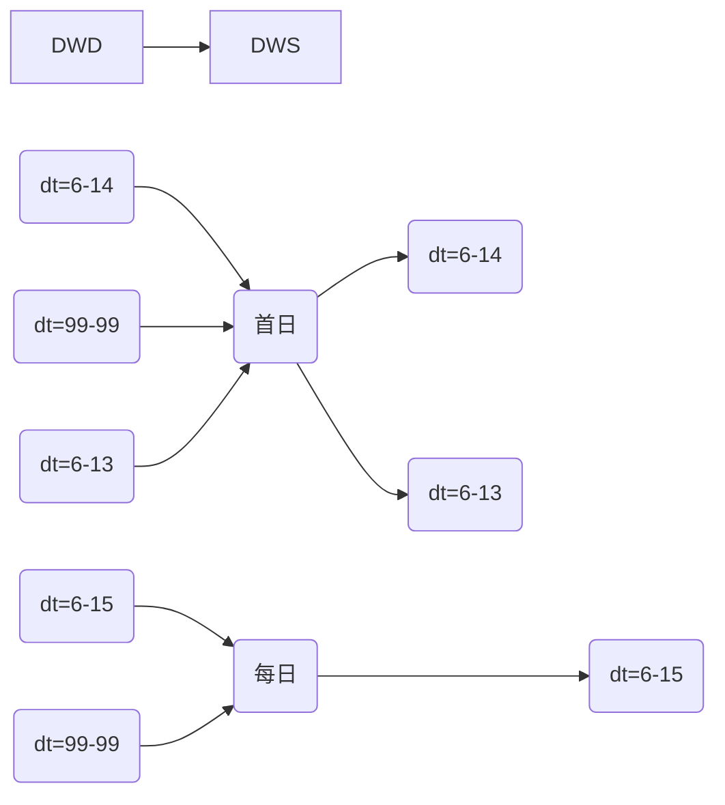


##  4.DWS/DWT层

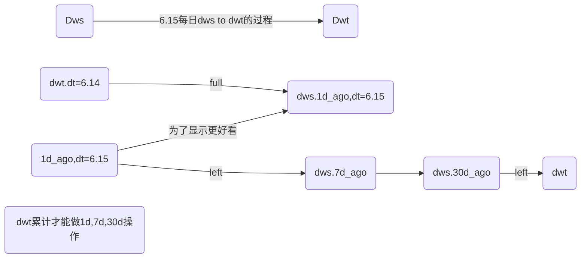


### 4.1 DWS/DWT思想

```sql
-- 1. dwd层和dws/dwt的区别？
     	DWD层建表时不要考虑用户的需求，而dws和dwd层，以用户需求为驱动，统计各个维度的相关指标；
    
-- 2. dws和dwt都是建宽表，建宽表的目的是优化查询,减少重复查询的步骤。

-- 3. 用户后续的需求是什么样的呢？
       主要是报表，体现的指标有个数、次数、金额等指标。
       '体现的方式'：维度 + 时间 + 指标
       '案例'：
           a、地区维度：北京地区今天的下单金额
           b、商品维度：1号商品今天下单数量

-- 4. 建宽表的思路：
        1. 一个维度作为一个宽表；
        2. 字段：以维度作为关键字 + 和该维度相关的所有事实表的度量值
    
-- 5. DWS和DWT的主要区别：
       1. dws的数据来源于DWD层，站在维度的角度，看事实表的度量值，统计每个主题当天的行为
       2. dwt的主要数据来源dws，站在维度的角度，看事实表的开始时间、结束时间、累积到现在的度量值，累积一段时间的度量值，
       统计每个主题累计行为，如统计最近7天的下单金额。

-- 6. 宽表是应对一些常用的需求，并不是所有的需求都会包含进来，如果一些特殊需求，可以去到dwd层获取数据
```

### 4.2 用户行为数据

#### 4.2.1 每日设备DWS层

- 建表语句

```sql
drop table if exists dws_uv_detail_daycount;
create external table dws_uv_detail_daycount
(
    `mid_id` string, 
    `brand` string, 
    `model` string, 
    `login_count` bigint COMMENT '活跃次数',
    `page_stats` array<struct<page_id:string,page_count:bigint>> COMMENT '页面访问统计'
)
partitioned by(dt string)
stored as parquet
location '/warehouse/gmall/dws/dws_uv_detail_daycount';
```

- 加载数据

```sql
with 
tmp_start_log as (
    select 
        mid_id , 
        brand , 
        model,
        count(*) login_count
    from dwd_start_log 
    where dt = '2020-06-25'
    group by mid_id,brand,model
),
tmp_page_log as (
    select 
            mid_id , 
            brand , 
            model,      
            collect_set(named_struct("page_id",page_id,"page_count",page_count)) page_stats
    from  (
            select 
                mid_id , 
                brand , 
                model,
                page_id,
                count(*) page_count     
            from dwd_page_log
            where dt ='2020-06-25'
            group by  mid_id ,brand,model,page_id
        )tmp
    group by  mid_id ,brand,model
)

insert overwrite table dws_uv_detail_daycount partition(dt='2020-06-25')

select 
        tmp_start_log.mid_id , 
        tmp_start_log.brand , 
        tmp_start_log.model,
        login_count,
        page_stats
from  tmp_start_log 
join tmp_page_log 
on tmp_start_log.mid_id = tmp_page_log.mid_id
and tmp_start_log.brand = tmp_page_log.brand
and tmp_start_log.model = tmp_page_log.model

```

#### 4.2.2 设备主题DWT层

- 建表语句

```sql
drop table if exists dwt_uv_topic;
create external table dwt_uv_topic
(
    `mid_id` string,
    `brand` string,
    `model` string,
    `login_date_first` string  comment '首次活跃时间',
    `login_date_last` string  comment '末次活跃时间',
    `login_day_count` bigint comment '当日活跃次数',
    `login_count` bigint comment '累积活跃天数'
)
stored as parquet
location '/warehouse/gmall/dwt/dwt_uv_topic';
```

- 插入数据

```sql
insert overwrite table dwt_uv_topic
select 
    nvl(old.mid_id,new.mid_id),
    nvl(old.brand,new.brand),
    nvl(old.model,new.model),
    if(old.login_date_first is null and new.login_count > 0 ,'2020-06-25',old.login_date_first),
    if(new.login_count > 0 ,'2020-06-25',old.login_date_last),
    nvl(new.login_count,0),
    nvl(old.login_count,0) + if(new.login_count> 0 , 1 ,0)
from dwt_uv_topic old 
full join (
    select 
        mid_id , 
        brand , 
        model, 
        login_count
    from dws_uv_detail_daycount
    where dt ='2020-06-25'
)new 
on old.mid_id = new.mid_id
```


### 4.3 业务数据

#### 4.3.1 会员行为

##### 4.3.1.1 会员DWS层

```sql
-- 1. 建表过程：
   '准备'：  事实表：订单、订单详情、优惠券领用、支付、退款、收藏、加购物车、评价
   '第一步'：找到和用户维度相关的所有事实表：订单、订单详情、优惠券领用、支付、退款、收藏、加购物车、评价
   '第二步': 找到这些事实表的所有度量值字段：
   '第三步'：维度主键 + 第二步获取的字段作为dws宽表的字段。
   -- 备注：理论上上述所有事实表都需要进行统计，但是在本案例中，只统计了订单、订单详情表、支付，加购物车四个事实表的数据。
-- 2. 数据的来源：来自于DWD层
-- 3. 表中的数据说明：
      1. 是分区表，每个分区为当天的数据
      2. 每一行数据代表一个用户当天的行为
-- 4. 根据建表字段，确定每个字段来自于哪张表中
-- 5. 数据存储格式：列式存储 + lzo压缩
```

- 建表语句

```sql
drop table if exists dws_user_action_daycount;
create external table dws_user_action_daycount
(   
    user_id string comment '用户 id',
    login_count bigint comment '登录次数',
    cart_count bigint comment '加入购物车次数',
    order_count bigint comment '下单次数',
    order_amount    decimal(16,2)  comment '下单金额',
    payment_count   bigint      comment '支付次数',
    payment_amount  decimal(16,2) comment '支付金额',
    order_detail_stats array<struct<sku_id:string,sku_num:bigint,order_count:bigint,order_amount:decimal(20,2)>> comment '下单明细统计'
) COMMENT '每日用户行为'
PARTITIONED BY (`dt` string)
stored as parquet
location '/warehouse/gmall/dws/dws_user_action_daycount/'
tblproperties ("parquet.compression"="lzo");
```

- 第一步：确定各个字段来自哪个表

```sql
user_id string comment '用户 id',--从dwd_start_log获取 
    login_count bigint comment '登录次数', --从dwd_start_log获取
    cart_count bigint comment '加入购物车次数',--dwd_action_log
    order_count bigint comment '下单次数',--dwd_fact_order_info 
    order_amount    decimal(16,2)  comment '下单金额',--dwd_fact_order_info 
    payment_count   bigint      comment '支付次数',--dwd_fact_order_info 
    payment_amount  decimal(16,2) comment '支付金额',--dwd_fact_order_info 
    order_detail_stats array<struct<sku_id:string,sku_num:bigint,order_count:bigint,order_amount:decimal(20,2)>> comm
	  -- dwd_fact_order_detail
	 说明：1. 加入购车的数据，需要去启动日志中获取，因为加购事实表是每天一个快照，不保留中间操作的过程，所以去到日志action
	      	获取，点击一次加购物车操作，记一次加入购物车的次数
	      2. 用户登录次数，从启动日志中获取，启动一次算作今天登录一次，但是要注意有些登录不是会员，所以需要过滤user_id为
	         null的数据；
```

- 第二步：确定dws一行数据代表什么意思？

```
用户行为表的一行数据代表：一个用户今天登陆次数、加购物车数量、下单数量、下单金额等数据
```

- 第三步：确定dwd层所有相关表的同步策略

```sql
   'dwd_start_log'：每日新增数据
   'dwd_action_log'：每日新增数据
   'dwd_fact_order_info'：事务型
   'dwd_fact_order_detail'：事务型
   'dwd_fact_payment_info':事务型
```

- 第四步：从各个表中获取对应的字段

```sql
 -- 1. 获取用户id和登录次数
	select 
		  user_id,
		  count(*) login_count
	from dwd_start_log
	where dt='2020-06-25'
	and user_id is not null 
	group by user_id
	---------------------------------------------
	-- 2. 获取加购物车的次数
	
		 select
			user_id,
			count(*) cart_count
		from dwd_action_log
		where dt='2020-06-25'
		and user_id is not null
		and action_id='cart_add'
		group by user_id		
	
  ------------------------------------------ 
   -- 3. 获取下单的次数和下单金额
		
	select
		user_id,
		count(*) order_count
	sum(final_total_amount)  order_amount
	from dwd_fact_order_info
	where dt = '2020-06-25'
	group by user_id
   
   ------------------------------------------------
   -- 4. 获取支付的金额和支付次数
  
	 select
		 user_id,
		 count(*) payment_count,
		 sum(payment_amount) payment_amount
	 from dwd_fact_payment_info
	 where dt = '2020-06-25'
	 group by user_id  
   
   ----------------------------------------------
   -- 5. 获取下单明细
	   select 
			user_id,
			collect_set(named_struct("sku_id",sku_id,"sku_num",sku_num,"order_count",order_count,"order_amount",order_amount))order_detail_stats
	   from (
		   select 
			  user_id,
			  sku_id,
			  sum(sku_num) sku_num,
			  count(*) order_count,
			  cast(sum(final_amount_d) as demical(20,2)) order_amount 
		   from dwd_fact_order_detail 
		   where dt = '2020-06-25'
		   group by user_id,sku_id
	   )tmp
	   group by user_id
```

- 第五步：组装以后插入数据

```sql
with 
    tmp_start_log as (
    select 
          user_id,
          count(*) login_count
    from dwd_start_log
    where dt='2020-06-25'
    and user_id is not null 
    group by user_id
    ),
    tmp_action_log as (
         select
            user_id,
            count(*) cart_count
        from dwd_action_log
        where dt='2020-06-25'
        and user_id is not null
        and action_id='cart_add'
        group by user_id        
    ),
    tmp_order_info as (
    
    select
        user_id,
        count(*) order_count,
        sum(final_total_amount)  order_amount
    from dwd_fact_order_info
    where dt = '2020-06-25'
    group by user_id
    ),
    tmp_payment_info as (
     select
         user_id,
         count(*) payment_count,
         sum(payment_amount) payment_amount
     from dwd_fact_payment_info
     where dt = '2020-06-25'
     group by user_id  
   ),
   tmp_order_detail as (
       select 
            user_id,
            collect_set(named_struct("sku_id",sku_id,"sku_num",sku_num,"order_count",order_count,"order_amount",order_amount)) order_detail_stats
       from (
           select 
              user_id,
              sku_id,
              sum(sku_num) sku_num,
              count(*) order_count,
              cast(sum(final_amount_d) as decimal(20,2)) order_amount 
           from dwd_fact_order_detail 
           where dt = '2020-06-25'
           group by user_id,sku_id
       )tmp
       group by user_id
    )
    
    insert overwrite table dws_user_action_daycount partition (dt='2020-06-25')
    select   
        tmp_start_log.user_id ,
        login_count ,
        nvl(cart_count,0) ,
        nvl(order_count,0) ,
        nvl(order_amount,0.0)   ,
        nvl(payment_count,0)  ,
        nvl(payment_amount,0.0) ,
        order_detail_stats       
    from  tmp_start_log 
    left join tmp_action_log on tmp_start_log.user_id = tmp_action_log.user_id
    left join tmp_order_info on tmp_start_log.user_id = tmp_order_info.user_id
    left join tmp_payment_info on tmp_start_log.user_id = tmp_payment_info.user_id
    left join tmp_order_detail on  tmp_start_log.user_id = tmp_order_detail.user_id
```


##### 4.3.1.2 会员DWT层

```sql
-- 1. 说明：
      1. dwt和dws层的字段基本是一一对应的。
      2. dws是当天的数据，dwt是累积数据，累积涉及到时间，比如累积7天，累积3天
-- 2. dwt和dws的维度字段，我们也可以直接放到表中，后续统计需求可以用到。

-- 3. dwt数据说明：
     1. 是维度全量表
     2. 数据源来自于dws层
     3. 不是分区表
 
-- 4. 如何维护dwt表，即如何向这个全量表中插入数据？
    1. dwt的数据每天都需要进行更新；
    2. 更新涉及到新数据和老数据
    3. 更新方式：
       a、取累积时间周期的数据；
       b、如果是累积字段，使用聚合函数求值
       c、如果非累积字段，使用判断语句求当天的数据
       d、然后新旧数据今天合并，由于旧数据不是分区数据
         那么累积数据直接使用新表累积值，而非累积字段，采用更新的方式
```

- 建表语句

```sql
drop table if exists dwt_user_topic;
create external table dwt_user_topic
(
    user_id string  comment '用户id',
    login_date_first string  comment '首次登录时间',
    login_date_last string  comment '末次登录时间',
    login_count bigint comment '累积登录天数',
    login_last_30d_count bigint comment '最近30日登录天数',
    order_date_first string  comment '首次下单时间',
    order_date_last string  comment '末次下单时间',
    order_count bigint comment '累积下单次数',
    order_amount decimal(16,2) comment '累积下单金额',
    order_last_30d_count bigint comment '最近30日下单次数',
    order_last_30d_amount bigint comment '最近30日下单金额',
    payment_date_first string  comment '首次支付时间',
    payment_date_last string  comment '末次支付时间',
    payment_count decimal(16,2) comment '累积支付次数',
    payment_amount decimal(16,2) comment '累积支付金额',
    payment_last_30d_count decimal(16,2) comment '最近30日支付次数',
    payment_last_30d_amount decimal(16,2) comment '最近30日支付金额'
 )COMMENT '用户主题宽表'
stored as parquet
location '/warehouse/gmall/dwt/dwt_user_topic/'
tblproperties ("parquet.compression"="lzo");
```

- 分析

```sql
	旧表：dwt前一天的数据
   新表：从dws层获取的累积30天的数据
    user_id string  comment '用户id', --
    login_date_first string  comment '首次登录时间',--如果旧表中有登录时间就使用旧表中的时间，否则使用当天时间
    login_date_last string  comment '末次登录时间',-- 如果新表中今天的登入次数大于0，那么末次登录时间使用今天时间，否则使用旧时间
    login_count bigint comment '累积登录天数', -- 如果新表中的登入次数大于0，那么旧表中数据 + 1 
    login_last_30d_count bigint comment '最近30日登录天数', -- 使用新表中累积计算数据，如果为null，则选择0
    order_date_first string  comment '首次下单时间',-- 如果旧表中首次下单时间为null且新表中下单次数大于0，那么使用今天时间，否则使用旧表数据
    order_date_last string  comment '末次下单时间',-- 如果新表的下单数据大于0，则使用当天时间，否则使用旧表数据
    order_count bigint comment '累积下单次数',-- 将旧表下单数据和新表下单次数直接相加
    order_amount decimal(16,2) comment '累积下单金额',--将旧表下单金额和新表下单金额相加
    order_last_30d_count bigint comment '最近30日下单次数',--直接使用新表数据，如果新表数据为null，则使用0
    order_last_30d_amount bigint comment '最近30日下单金额',--直接使用新表数据，如果新表数据为null，则使用0
    payment_date_first string  comment '首次支付时间',
    payment_date_last string  comment '末次支付时间',
    payment_count decimal(16,2) comment '累积支付次数',
    payment_amount decimal(16,2) comment '累积支付金额',
    payment_last_30d_count decimal(16,2) comment '最近30日支付次数',
    payment_last_30d_amount decimal(16,2) comment '最近30日支付金额'
```


- 装载数据

```sql
 insert overwrite table dwt_user_topic 
   select 
       nvl(old.user_id,new.user_id) ,
       nvl(old.login_date_first,'2020-06-25'),
       if(new.user_id is not null , '2020-06-25',old.login_date_last),
       nvl(old.login_count,0) + if(new.user_id is not null,1,0),
       nvl(new.login_last_30d_count,0),
       if(old.order_date_first is null and new.order_count > 0 , '2020-06-25',old.order_date_first),
       if(new.order_count > 0,'2020-06-25',old.order_date_first),
       nvl(old.order_count,0) + nvl(new.order_count,0),
       nvl(old.order_amount,0) + nvl(new.order_amount,0),
       nvl(new.order_last_30d_count,0),
       nvl(new.order_last_30d_amount,0),
       if(old.payment_date_first is null and new.payment_count > 0 ,'2020-06-25',old.payment_date_first),
       if(new.payment_count > 0 ,'2020-06-25',old.payment_date_last),
       nvl(old.payment_count,0) + nvl(new.payment_count,0),
       nvl(old.payment_amount,0) + nvl(new.payment_amount,0),
       nvl(new.payment_last_30d_count,0),
       nvl(new.payment_last_30d_amount,0)
   
   from  dwt_user_topic old
   full join (
       select 
           user_id,
           sum(if(dt='2020-06-25',login_count,0)) login_count,--当天登录次数
           sum(if(dt='2020-06-25',cart_count,0)) cart_count,--当天加入购物车次数
           sum(if(dt='2020-06-25',order_count,0)) order_count,--当天下单次数
           sum(if(dt='2020-06-25',order_amount,0.0)) order_amount,--当天下单金额
           sum(if(dt='2020-06-25',payment_count,0)) payment_count,--当天支付次数
           sum(if(dt='2020-06-25',payment_amount,0.0)) payment_amount,--当天支付金额
        
           sum(if(login_count > 0,1,0)) login_last_30d_count,--累积30天登录次数
           sum(order_count) order_last_30d_count,--最近30日下单次数
           sum(order_amount) order_last_30d_amount,--最近30日下单金额
           sum(payment_count) payment_last_30d_count,--最近30日下单次数
           sum(payment_amount) payment_last_30d_amount--最近30日下单金额
                     
       from dws_user_action_daycount 
       where dt > date_add(dt , -30)
       group by user_id
   )new
   on old.user_id = new.user_id
```


#### 4.3.2 商品行为

##### 4.3.2.1 商品DWS层

```sql
-- 解析：
    1. 表的字段如何创建
        '准备'：  事实表：订单、订单详情、优惠券领用、支付、退款、收藏、加购物车、评价
        '第一步'：找到和商品这个维度相关的所有事实表：订单详情、支付、退款、收藏、加购物车、评价
        '第二步'：获取上述事实表的并取其度量值
        '第三步'：将商品维度id + 第二步度量值的字段作为dws层的字段，创建商品行为的dws层表
        
    2. 如何向表中插入数据？
        '第一步'：根据dws层表的字段，确定每个字段来自于哪个表
        '第二步'：确定第一步中所有表的同步策略，确定表中存储的数据是什么及每行数据存储的是什么
        '第三步'：一个一个字段来获取最后进行合并

    3. 表保存什么数据
       
    4. 表中每行数据是什么

    5. 存储格式
       1. 分区表，每个分区保留当前最新的数据
       2. 列式存储 + lzo压缩
```

- 建表语句

```sql
drop table if exists dws_sku_action_daycount;
create external table dws_sku_action_daycount 
(   
    sku_id string comment 'sku_id',
    order_count bigint comment '被下单次数',
    order_num bigint comment '被下单件数',
    order_amount decimal(16,2) comment '被下单金额',
    payment_count bigint  comment '被支付次数',
    payment_num bigint comment '被支付件数',
    payment_amount decimal(16,2) comment '被支付金额',
    refund_count bigint  comment '被退款次数',
    refund_num bigint comment '被退款件数',
    refund_amount  decimal(16,2) comment '被退款金额',
    cart_count bigint comment '被加入购物车次数',
    favor_count bigint comment '被收藏次数',
    appraise_good_count bigint comment '好评数',
    appraise_mid_count bigint comment '中评数',
    appraise_bad_count bigint comment '差评数',
    appraise_default_count bigint comment '默认评价数'
) COMMENT '每日商品行为'
PARTITIONED BY (`dt` string)
stored as parquet
location '/warehouse/gmall/dws/dws_sku_action_daycount/'
tblproperties ("parquet.compression"="lzo");
```

- 分析过程

```sql

==================================================
   -- 1. 相关表：订单详情事实表
      2. 同步策略：事务型事实表，以订单的创建时间为分区数据
	  3. 保存的数据：一个分区保存当天所有的下单的信息
	  3. 相关字段如下：
   
    order_count bigint comment '被下单次数',
    order_num bigint comment '被下单件数',
    order_amount decimal(16,2) comment '被下单金额',
	
	select 
	   sku_id,
	   count(*) order_count,--被下单次数
	   sum(sku_num) order_num, --被下单件数
	   sum(original_amount_d) order_amount --被下单金额	
	from dwd_fact_order_detail
	where dt= '2020-06-25'
	group by sku_id
	-------------------------------------------------
   -- 1. 相关表：支付事实表
      2. 同步策略：事务型事实表，以订单支付时间为分区
	  3. 保存的数据：一个分区保存当天所有的支付信息
	  4. 相关字段如下：
	  5. 说明： 有一种情况，昨天晚上下单，但是今天才支付,那么下单的sku_id不在支付中，这样可能会导致数据丢失
	payment_count bigint  comment '被支付次数',
    payment_num bigint comment '被支付件数',
    payment_amount decimal(16,2) comment '被支付金额',
	
	select 	    
		sku_id,
		count(*) payment_count,
		sum(final_amount_d) payment_amount
		
	from dwd_fact_order_detail
	where dt='2020-06-25'
	and order_id in (
		select
				order_id
		from dwd_fact_payment_info
		where (dt='2020-06-25'
        or dt=date_add('2020-06-25',-1))
        and date_format(payment_time,'yyyy-MM-dd')='2020-06-25'
	)
	group by sku_id
	
	-------------------------------------------
	-- 1. 相关表：退款事实表
      2. 同步策略：事务型事实表，退款时间为分区
	  3. 保存的数据：一个分区保存当天所有退款的数据
	  4. 相关字段如下：
		refund_count bigint  comment '被退款次数',
		refund_num bigint comment '被退款件数',
		refund_amount  decimal(16,2) comment '被退款金额',
		
		select 
		      sku_id,
			  sum(refund_count) refund_num,
			  sum(refund_amount) refund_amount		  
		from  dwd_fact_order_refund_info 
		where dt = '2020-06-25'
		group by sku_id
		
  -----------------------------------------------
	-- 1. 相关表：加购车
      2. 同步策略：周期型快照事实表
	  3. 保存的数据：每天一个快照
	  4. 相关字段如下：
		    cart_count bigint comment '被加入购物车次数',

        select  
		    sku_id,
			count(*) cart_count	
		from dwd_fact_cart_info
		where create_time = '2020-06-25'
		group by sku_id

    -------------------------------------------
   -- 1. 相关表：收藏表
      2. 同步策略：周期型快照事实表
	  3. 保存的数据：每天一个快照
	  4. 相关字段如下：
		    favor_count bigint comment '被收藏次数',
			
			select
			sku_id,
			count(*) favor_count
			from dwd_fact_favor_info
			where create_time = '2020-06-25'
			group by sku_id
	
	
	-----------------------------------------------
     -- 1. 相关表：评价事实表
      2. 同步策略：事务型事实表，以订单支付时间为分区
	  3. 保存的数据：每个分区保留当天的评价数据
	  4. 相关字段如下：
	appraise_good_count bigint comment '好评数',
    appraise_mid_count bigint comment '中评数',
    appraise_bad_count bigint comment '差评数',
    appraise_default_count bigint comment '默认评价数'
	
	    select
		sku_id,
		sum(if(appraise='1201',1,0)) appraise_good_count,
		sum(if(appraise='1202',1,0)) appraise_mid_count,
		sum(if(appraise='1203',1,0)) appraise_bad_count,
		sum(if(appraise='1204',1,0)) appraise_default_count,
		from dwd_fact_comment_info 
		where dt = '2020-06-25'
		group by sku_id
```

- 插入数据

```sql
with 
tmp_order as
(
    select
        sku_id,
        count(*) order_count,
        sum(sku_num) order_num,
        sum(final_amount_d) order_amount
    from dwd_fact_order_detail
    where dt='2020-06-25'
    group by sku_id
),
tmp_payment as
(
    select
        sku_id,
        count(*) payment_count,
        sum(sku_num) payment_num,
        sum(final_amount_d) payment_amount
    from dwd_fact_order_detail
    where dt='2020-06-25'
    and order_id in
    (
        select
            id
        from dwd_fact_order_info
        where (dt='2020-06-25'
        or dt=date_add('2020-06-25',-1))
        and date_format(payment_time,'yyyy-MM-dd')='2020-06-25'
    )
    group by sku_id
),
tmp_refund as
(
    select
        sku_id,
        count(*) refund_count,
        sum(refund_num) refund_num,
        sum(refund_amount) refund_amount
    from dwd_fact_order_refund_info
    where dt='2020-06-25'
    group by sku_id
),
tmp_cart as
(
    select
        item sku_id,
        count(*) cart_count
    from dwd_action_log
    where dt='2020-06-25'
    and user_id is not null
    and action_id='cart_add'
    group by item 
),tmp_favor as
(
    select
        item sku_id,
        count(*) favor_count
    from dwd_action_log
    where dt='2020-06-25'
    and user_id is not null
    and action_id='favor_add'
    group by item 
),
tmp_appraise as
(
select
    sku_id,
    sum(if(appraise='1201',1,0)) appraise_good_count,
    sum(if(appraise='1202',1,0)) appraise_mid_count,
    sum(if(appraise='1203',1,0)) appraise_bad_count,
    sum(if(appraise='1204',1,0)) appraise_default_count
from dwd_fact_comment_info
where dt='2020-06-25'
group by sku_id
)

insert overwrite table dws_sku_action_daycount partition(dt='2020-06-25')
select
    sku_id,
    sum(order_count),
    sum(order_num),
    sum(order_amount),
    sum(payment_count),
    sum(payment_num),
    sum(payment_amount),
    sum(refund_count),
    sum(refund_num),
    sum(refund_amount),
    sum(cart_count),
    sum(favor_count),
    sum(appraise_good_count),
    sum(appraise_mid_count),
    sum(appraise_bad_count),
    sum(appraise_default_count)
from
(
    select
        sku_id,
        order_count,
        order_num,
        order_amount,
        0 payment_count,
        0 payment_num,
        0 payment_amount,
        0 refund_count,
        0 refund_num,
        0 refund_amount,
        0 cart_count,
        0 favor_count,
        0 appraise_good_count,
        0 appraise_mid_count,
        0 appraise_bad_count,
        0 appraise_default_count
    from tmp_order
    union all
    select
        sku_id,
        0 order_count,
        0 order_num,
        0 order_amount,
        payment_count,
        payment_num,
        payment_amount,
        0 refund_count,
        0 refund_num,
        0 refund_amount,
        0 cart_count,
        0 favor_count,
        0 appraise_good_count,
        0 appraise_mid_count,
        0 appraise_bad_count,
        0 appraise_default_count
    from tmp_payment
    union all
    select
        sku_id,
        0 order_count,
        0 order_num,
        0 order_amount,
        0 payment_count,
        0 payment_num,
        0 payment_amount,
        refund_count,
        refund_num,
        refund_amount,
        0 cart_count,
        0 favor_count,
        0 appraise_good_count,
        0 appraise_mid_count,
        0 appraise_bad_count,
        0 appraise_default_count        
    from tmp_refund
    union all
    select
        sku_id,
        0 order_count,
        0 order_num,
        0 order_amount,
        0 payment_count,
        0 payment_num,
        0 payment_amount,
        0 refund_count,
        0 refund_num,
        0 refund_amount,
        cart_count,
        0 favor_count,
        0 appraise_good_count,
        0 appraise_mid_count,
        0 appraise_bad_count,
        0 appraise_default_count
    from tmp_cart
    union all
    select
        sku_id,
        0 order_count,
        0 order_num,
        0 order_amount,
        0 payment_count,
        0 payment_num,
        0 payment_amount,
        0 refund_count,
        0 refund_num,
        0 refund_amount,
        0 cart_count,
        favor_count,
        0 appraise_good_count,
        0 appraise_mid_count,
        0 appraise_bad_count,
        0 appraise_default_count
    from tmp_favor
    union all
    select
        sku_id,
        0 order_count,
        0 order_num,
        0 order_amount,
        0 payment_count,
        0 payment_num,
        0 payment_amount,
        0 refund_count,
        0 refund_num,
        0 refund_amount,
        0 cart_count,
        0 favor_count,
        appraise_good_count,
        appraise_mid_count,
        appraise_bad_count,
        appraise_default_count
    from tmp_appraise
)tmp
group by sku_id;
```


##### 4.3.2.2 商品DWT层

- 建表语句

```sql
drop table if exists dwt_sku_topic;
create external table dwt_sku_topic
(
    sku_id string comment 'sku_id',
    spu_id string comment 'spu_id',
    order_last_30d_count bigint comment '最近30日被下单次数',
    order_last_30d_num bigint comment '最近30日被下单件数',
    order_last_30d_amount decimal(16,2)  comment '最近30日被下单金额',
    order_count bigint comment '累积被下单次数',
    order_num bigint comment '累积被下单件数',
    order_amount decimal(16,2) comment '累积被下单金额',
    payment_last_30d_count   bigint  comment '最近30日被支付次数',
    payment_last_30d_num bigint comment '最近30日被支付件数',
    payment_last_30d_amount  decimal(16,2) comment '最近30日被支付金额',
    payment_count   bigint  comment '累积被支付次数',
    payment_num bigint comment '累积被支付件数',
    payment_amount  decimal(16,2) comment '累积被支付金额',
    refund_last_30d_count bigint comment '最近三十日退款次数',
    refund_last_30d_num bigint comment '最近三十日退款件数',
    refund_last_30d_amount decimal(16,2) comment '最近三十日退款金额',
    refund_count bigint comment '累积退款次数',
    refund_num bigint comment '累积退款件数',
    refund_amount decimal(16,2) comment '累积退款金额',
    cart_last_30d_count bigint comment '最近30日被加入购物车次数',
    cart_count bigint comment '累积被加入购物车次数',
    favor_last_30d_count bigint comment '最近30日被收藏次数',
    favor_count bigint comment '累积被收藏次数',
    appraise_last_30d_good_count bigint comment '最近30日好评数',
    appraise_last_30d_mid_count bigint comment '最近30日中评数',
    appraise_last_30d_bad_count bigint comment '最近30日差评数',
    appraise_last_30d_default_count bigint comment '最近30日默认评价数',
    appraise_good_count bigint comment '累积好评数',
    appraise_mid_count bigint comment '累积中评数',
    appraise_bad_count bigint comment '累积差评数',
    appraise_default_count bigint comment '累积默认评价数'
 )COMMENT '商品主题宽表'
stored as parquet
location '/warehouse/gmall/dwt/dwt_sku_topic/'
tblproperties ("parquet.compression"="lzo");
```

- 插入数据

```sql
insert overwrite table dwt_sku_topic
select 
    nvl(new.sku_id,old.sku_id),
    sku_info.spu_id,
    nvl(new.order_count30,0),
    nvl(new.order_num30,0),
    nvl(new.order_amount30,0),
    nvl(old.order_count,0) + nvl(new.order_count,0),
    nvl(old.order_num,0) + nvl(new.order_num,0),
    nvl(old.order_amount,0) + nvl(new.order_amount,0),
    nvl(new.payment_count30,0),
    nvl(new.payment_num30,0),
    nvl(new.payment_amount30,0),
    nvl(old.payment_count,0) + nvl(new.payment_count,0),
    nvl(old.payment_num,0) + nvl(new.payment_count,0),
    nvl(old.payment_amount,0) + nvl(new.payment_count,0),
    nvl(new.refund_count30,0),
    nvl(new.refund_num30,0),
    nvl(new.refund_amount30,0),
    nvl(old.refund_count,0) + nvl(new.refund_count,0),
    nvl(old.refund_num,0) + nvl(new.refund_num,0),
    nvl(old.refund_amount,0) + nvl(new.refund_amount,0),
    nvl(new.cart_count30,0),
    nvl(old.cart_count,0) + nvl(new.cart_count,0),
    nvl(new.favor_count30,0),
    nvl(old.favor_count,0) + nvl(new.favor_count,0),
    nvl(new.appraise_good_count30,0),
    nvl(new.appraise_mid_count30,0),
    nvl(new.appraise_bad_count30,0),
    nvl(new.appraise_default_count30,0)  ,
    nvl(old.appraise_good_count,0) + nvl(new.appraise_good_count,0),
    nvl(old.appraise_mid_count,0) + nvl(new.appraise_mid_count,0),
    nvl(old.appraise_bad_count,0) + nvl(new.appraise_bad_count,0),
    nvl(old.appraise_default_count,0) + nvl(new.appraise_default_count,0) 
from 
dwt_sku_topic old
full outer join 
(
    select 
        sku_id,
        sum(if(dt='2020-06-25', order_count,0 )) order_count,
        sum(if(dt='2020-06-25',order_num ,0 ))  order_num, 
        sum(if(dt='2020-06-25',order_amount,0 )) order_amount ,
        sum(if(dt='2020-06-25',payment_count,0 )) payment_count,
        sum(if(dt='2020-06-25',payment_num,0 )) payment_num,
        sum(if(dt='2020-06-25',payment_amount,0 )) payment_amount,
        sum(if(dt='2020-06-25',refund_count,0 )) refund_count,
        sum(if(dt='2020-06-25',refund_num,0 )) refund_num,
        sum(if(dt='2020-06-25',refund_amount,0 )) refund_amount,  
        sum(if(dt='2020-06-25',cart_count,0 )) cart_count,
        sum(if(dt='2020-06-25',favor_count,0 )) favor_count,
        sum(if(dt='2020-06-25',appraise_good_count,0 )) appraise_good_count,  
        sum(if(dt='2020-06-25',appraise_mid_count,0 ) ) appraise_mid_count ,
        sum(if(dt='2020-06-25',appraise_bad_count,0 )) appraise_bad_count,  
        sum(if(dt='2020-06-25',appraise_default_count,0 )) appraise_default_count,
        sum(order_count) order_count30 ,
        sum(order_num) order_num30,
        sum(order_amount) order_amount30,
        sum(payment_count) payment_count30,
        sum(payment_num) payment_num30,
        sum(payment_amount) payment_amount30,
        sum(refund_count) refund_count30,
        sum(refund_num) refund_num30,
        sum(refund_amount) refund_amount30,
        sum(cart_count) cart_count30,
        sum(favor_count) favor_count30,
        sum(appraise_good_count) appraise_good_count30,
        sum(appraise_mid_count) appraise_mid_count30,
        sum(appraise_bad_count) appraise_bad_count30,
        sum(appraise_default_count) appraise_default_count30 
    from dws_sku_action_daycount
    where dt >= date_add ('2020-06-25', -30)
    group by sku_id    
)new 
on new.sku_id = old.sku_id
left join 
(select * from dwd_dim_sku_info where dt='2020-06-25') sku_info
on nvl(new.sku_id,old.sku_id)= sku_info.id;
```

#### 4.3.4 活动统计

##### 4.3.4.1 活动DWS层

- 建表

```sql
drop table if exists dwt_activity_topic;
create external table dwt_activity_topic(
    `id` string COMMENT '编号',
    `activity_name` string  COMMENT '活动名称',
    `activity_type` string  COMMENT '活动类型',
    `start_time` string  COMMENT '开始时间',
    `end_time` string  COMMENT '结束时间',
    `create_time` string  COMMENT '创建时间',
    `display_day_count` bigint COMMENT '当日曝光次数',
    `order_day_count` bigint COMMENT '当日下单次数',
    `order_day_amount` decimal(20,2) COMMENT '当日下单金额',
    `payment_day_count` bigint COMMENT '当日支付次数',
    `payment_day_amount` decimal(20,2) COMMENT '当日支付金额',
    `display_count` bigint COMMENT '累积曝光次数',
    `order_count` bigint COMMENT '累积下单次数',
    `order_amount` decimal(20,2) COMMENT '累积下单金额',
    `payment_count` bigint COMMENT '累积支付次数',
    `payment_amount` decimal(20,2) COMMENT '累积支付金额'
) COMMENT '活动主题宽表'
row format delimited fields terminated by '\t'
location '/warehouse/gmall/dwt/dwt_activity_topic/'
tblproperties ("parquet.compression"="lzo");
```

2. 插入数据

```sql
with
tmp_op as
(
    select
        activity_id,
        sum(if(date_format(create_time,'yyyy-MM-dd')='2020-06-25',1,0)) order_count,
        sum(if(date_format(create_time,'yyyy-MM-dd')='2020-06-25',final_total_amount,0)) order_amount,
        sum(if(date_format(payment_time,'yyyy-MM-dd')='2020-06-25',1,0)) payment_count,
        sum(if(date_format(payment_time,'yyyy-MM-dd')='2020-06-25',final_total_amount,0)) payment_amount
    from dwd_fact_order_info
    where (dt='2020-06-25' or dt=date_add('2020-06-25',-1))
    and activity_id is not null
    group by activity_id
),
tmp_display as
(
    select
        item activity_id,
        count(*) display_count
    from dwd_display_log
    where dt='2020-06-25'
    and item_type='activity_id'
    group by item
),
tmp_activity as
(
    select
        *
    from dwd_dim_activity_info
    where dt='2020-06-25'
)
insert overwrite table dws_activity_info_daycount partition(dt='2020-06-25')
select
    nvl(tmp_op.activity_id,tmp_display.activity_id),
    tmp_activity.activity_name,
    tmp_activity.activity_type,
    tmp_activity.start_time,
    tmp_activity.end_time,
    tmp_activity.create_time,
    tmp_display.display_count,
    tmp_op.order_count,
    tmp_op.order_amount,
    tmp_op.payment_count,
    tmp_op.payment_amount
from tmp_op
full outer join tmp_display on tmp_op.activity_id=tmp_display.activity_id
left join tmp_activity on nvl(tmp_op.activity_id,tmp_display.activity_id)=tmp_activity.id;
```


##### 4.3.4.2 活动DWT层

- 建表

```sql
drop table if exists dwt_activity_topic;
create external table dwt_activity_topic(
    `id` string COMMENT '编号',
    `activity_name` string  COMMENT '活动名称',
    `activity_type` string  COMMENT '活动类型',
    `start_time` string  COMMENT '开始时间',
    `end_time` string  COMMENT '结束时间',
    `create_time` string  COMMENT '创建时间',
    `display_day_count` bigint COMMENT '当日曝光次数',
    `order_day_count` bigint COMMENT '当日下单次数',
    `order_day_amount` decimal(20,2) COMMENT '当日下单金额',
    `payment_day_count` bigint COMMENT '当日支付次数',
    `payment_day_amount` decimal(20,2) COMMENT '当日支付金额',
    `display_count` bigint COMMENT '累积曝光次数',
    `order_count` bigint COMMENT '累积下单次数',
    `order_amount` decimal(20,2) COMMENT '累积下单金额',
    `payment_count` bigint COMMENT '累积支付次数',
    `payment_amount` decimal(20,2) COMMENT '累积支付金额'
) COMMENT '活动主题宽表'
row format delimited fields terminated by '\t'
location '/warehouse/gmall/dwt/dwt_activity_topic/'
tblproperties ("parquet.compression"="lzo");
```

- 插入数据

```sql
insert overwrite table dwt_activity_topic
select
    nvl(new.id,old.id),
    nvl(new.activity_name,old.activity_name),
    nvl(new.activity_type,old.activity_type),
    nvl(new.start_time,old.start_time),
    nvl(new.end_time,old.end_time),
    nvl(new.create_time,old.create_time),
    nvl(new.display_count,0),
    nvl(new.order_count,0),
    nvl(new.order_amount,0.0),
    nvl(new.payment_count,0),
    nvl(new.payment_amount,0.0),
    nvl(new.display_count,0)+nvl(old.display_count,0),
    nvl(new.order_count,0)+nvl(old.order_count,0),
    nvl(new.order_amount,0.0)+nvl(old.order_amount,0.0),
    nvl(new.payment_count,0)+nvl(old.payment_count,0),
    nvl(new.payment_amount,0.0)+nvl(old.payment_amount,0.0)
from
(
    select
        *
    from dwt_activity_topic
)old
full outer join
(
    select
        *
    from dws_activity_info_daycount
    where dt='2020-06-25'
)new
on old.id=new.id;
```

#### 4.3.5 地区统计

##### 4.3.5.1 地区DWS层

- 建表语句

```sql
drop table if exists dws_area_stats_daycount;
create external table dws_area_stats_daycount(
    `id` bigint COMMENT '编号',
    `province_name` string COMMENT '省份名称',
    `area_code` string COMMENT '地区编码',
    `iso_code` string COMMENT 'iso编码',
    `region_id` string COMMENT '地区ID',
    `region_name` string COMMENT '地区名称',
    `login_count` string COMMENT '活跃设备数',
    `order_count` bigint COMMENT '下单次数',
    `order_amount` decimal(20,2) COMMENT '下单金额',
    `payment_count` bigint COMMENT '支付次数',
    `payment_amount` decimal(20,2) COMMENT '支付金额'
) COMMENT '每日地区信息表'
PARTITIONED BY (`dt` string)
stored as parquet
location '/warehouse/gmall/dws/dws_area_stats_daycount/'
tblproperties ("parquet.compression"="lzo");
```

- 插入数据

```sql
with 
tmp_login as
(
    select
        area_code,
        count(*) login_count
    from dwd_start_log
    where dt='2020-06-25'
    group by area_code
),
tmp_op as
(
    select
        province_id,
        sum(if(date_format(create_time,'yyyy-MM-dd')='2020-06-25',1,0)) order_count,
        sum(if(date_format(create_time,'yyyy-MM-dd')='2020-06-25',final_total_amount,0)) order_amount,
        sum(if(date_format(payment_time,'yyyy-MM-dd')='2020-06-25',1,0)) payment_count,
        sum(if(date_format(payment_time,'yyyy-MM-dd')='2020-06-25',final_total_amount,0)) payment_amount
    from dwd_fact_order_info
    where (dt='2020-06-25' or dt=date_add('2020-06-25',-1))
    group by province_id
)
insert overwrite table dws_area_stats_daycount partition(dt='2020-06-25')
select
    pro.id,
    pro.province_name,
    pro.area_code,
    pro.iso_code,
    pro.region_id,
    pro.region_name,
    nvl(tmp_login.login_count,0),
    nvl(tmp_op.order_count,0),
    nvl(tmp_op.order_amount,0.0),
    nvl(tmp_op.payment_count,0),
    nvl(tmp_op.payment_amount,0.0)
from dwd_dim_base_province pro
left join tmp_login on pro.area_code=tmp_login.area_code
left join tmp_op on pro.id=tmp_op.province_id;
```


##### 4.3.5.2 地区DWT层

- 建表语句

```sql
drop table if exists dwt_area_topic;
create external table dwt_area_topic(
    `id` bigint COMMENT '编号',
    `province_name` string COMMENT '省份名称',
    `area_code` string COMMENT '地区编码',
    `iso_code` string COMMENT 'iso编码',
    `region_id` string COMMENT '地区ID',
    `region_name` string COMMENT '地区名称',
    `login_day_count` string COMMENT '当天活跃设备数',
    `login_last_30d_count` string COMMENT '最近30天活跃设备数',
    `order_day_count` bigint COMMENT '当天下单次数',
    `order_day_amount` decimal(16,2) COMMENT '当天下单金额',
    `order_last_30d_count` bigint COMMENT '最近30天下单次数',
    `order_last_30d_amount` decimal(16,2) COMMENT '最近30天下单金额',
    `payment_day_count` bigint COMMENT '当天支付次数',
    `payment_day_amount` decimal(16,2) COMMENT '当天支付金额',
    `payment_last_30d_count` bigint COMMENT '最近30天支付次数',
    `payment_last_30d_amount` decimal(16,2) COMMENT '最近30天支付金额'
) COMMENT '地区主题宽表'
row format delimited fields terminated by '\t'
location '/warehouse/gmall/dwt/dwt_area_topic/'
tblproperties ("parquet.compression"="lzo");
```

- 插入数据

```sql
insert overwrite table dwt_area_topic
select
    nvl(old.id,new.id),
    nvl(old.province_name,new.province_name),
    nvl(old.area_code,new.area_code),
    nvl(old.iso_code,new.iso_code),
    nvl(old.region_id,new.region_id),
    nvl(old.region_name,new.region_name),
    nvl(new.login_day_count,0),
    nvl(new.login_last_30d_count,0),
    nvl(new.order_day_count,0),
    nvl(new.order_day_amount,0.0),
    nvl(new.order_last_30d_count,0),
    nvl(new.order_last_30d_amount,0.0),
    nvl(new.payment_day_count,0),
    nvl(new.payment_day_amount,0.0),
    nvl(new.payment_last_30d_count,0),
    nvl(new.payment_last_30d_amount,0.0)
from 
(
    select
        *
    from dwt_area_topic
)old
full outer join
(
    select
        id,
        province_name,
        area_code,
        iso_code,
        region_id,
        region_name,
        sum(if(dt='2020-06-25',login_count,0)) login_day_count,
        sum(if(dt='2020-06-25',order_count,0)) order_day_count,
        sum(if(dt='2020-06-25',order_amount,0.0)) order_day_amount,
        sum(if(dt='2020-06-25',payment_count,0)) payment_day_count,
        sum(if(dt='2020-06-25',payment_amount,0.0)) payment_day_amount,
        sum(login_count) login_last_30d_count,
        sum(order_count) order_last_30d_count,
        sum(order_amount) order_last_30d_amount,
        sum(payment_count) payment_last_30d_count,
        sum(payment_amount) payment_last_30d_amount
    from dws_area_stats_daycount
    where dt>=date_add('2020-06-25',-30)
    group by id,province_name,area_code,iso_code,region_id,region_name
)new
on old.id=new.id;
```


### 4.4 脚本

#### 4.4.1 DWS脚本

1. 在/home/atguigu/bin目录下创建脚本dwd_to_dws.sh

```
[atguigu@hadoop102 bin]$ vim dwd_to_dws.sh
```

2. 脚本内容

```bash
#!/bin/bash

APP=gmall
hive=/opt/module/hive/bin/hive

# 如果是输入的日期按照取输入日期；如果没输入日期取当前时间的前一天
if [ -n "$1" ] ;then
    do_date=$1
else
    do_date=`date -d "-1 day" +%F`
fi

sql="
set mapreduce.job.queuename=hive;
with
tmp_start as
(
    select  
        mid_id,
        brand,
        model,
        count(*) login_count
    from ${APP}.dwd_start_log
    where dt='$do_date'
    group by mid_id,brand,model
),
tmp_page as
(
    select
        mid_id,
        brand,
        model,        
        collect_set(named_struct('page_id',page_id,'page_count',page_count)) page_stats
    from
    (
        select
            mid_id,
            brand,
            model,
            page_id,
            count(*) page_count
        from ${APP}.dwd_page_log
        where dt='$do_date'
        group by mid_id,brand,model,page_id
    )tmp
    group by mid_id,brand,model
)
insert overwrite table ${APP}.dws_uv_detail_daycount partition(dt='$do_date')
select
    nvl(tmp_start.mid_id,tmp_page.mid_id),
    nvl(tmp_start.brand,tmp_page.brand),
    nvl(tmp_start.model,tmp_page.model),
    tmp_start.login_count,
    tmp_page.page_stats
from tmp_start 
full outer join tmp_page
on tmp_start.mid_id=tmp_page.mid_id
and tmp_start.brand=tmp_page.brand
and tmp_start.model=tmp_page.model;


with
tmp_login as
(
    select
        user_id,
        count(*) login_count
    from ${APP}.dwd_start_log
    where dt='$do_date'
    and user_id is not null
    group by user_id
),
tmp_cart as
(
    select
        user_id,
        count(*) cart_count
    from ${APP}.dwd_action_log
    where dt='$do_date'
    and user_id is not null
    and action_id='cart_add'
    group by user_id
),tmp_order as
(
    select
        user_id,
        count(*) order_count,
        sum(final_total_amount) order_amount
    from ${APP}.dwd_fact_order_info
    where dt='$do_date'
    group by user_id
) ,
tmp_payment as
(
    select
        user_id,
        count(*) payment_count,
        sum(payment_amount) payment_amount
    from ${APP}.dwd_fact_payment_info
    where dt='$do_date'
    group by user_id
),
tmp_order_detail as
(
    select
        user_id,
        collect_set(named_struct('sku_id',sku_id,'sku_num',sku_num,'order_count',order_count,'order_amount',order_amount)) order_stats
    from
    (
        select
            user_id,
            sku_id,
            sum(sku_num) sku_num,
            count(*) order_count,
            cast(sum(final_amount_d) as decimal(20,2)) order_amount
        from ${APP}.dwd_fact_order_detail
        where dt='$do_date'
        group by user_id,sku_id
    )tmp
    group by user_id
)

insert overwrite table ${APP}.dws_user_action_daycount partition(dt='$do_date')
select
    tmp_login.user_id,
    login_count,
    nvl(cart_count,0),
    nvl(order_count,0),
    nvl(order_amount,0.0),
    nvl(payment_count,0),
    nvl(payment_amount,0.0),
    order_stats
from tmp_login
left outer join tmp_cart on tmp_login.user_id=tmp_cart.user_id
left outer join tmp_order on tmp_login.user_id=tmp_order.user_id
left outer join tmp_payment on tmp_login.user_id=tmp_payment.user_id
left outer join tmp_order_detail on tmp_login.user_id=tmp_order_detail.user_id;

with 
tmp_order as
(
    select
        sku_id,
        count(*) order_count,
        sum(sku_num) order_num,
        sum(final_amount_d) order_amount
    from ${APP}.dwd_fact_order_detail
    where dt='$do_date'
    group by sku_id
),
tmp_payment as
(
    select
        sku_id,
        count(*) payment_count,
        sum(sku_num) payment_num,
        sum(final_amount_d) payment_amount
    from ${APP}.dwd_fact_order_detail
    where dt='$do_date'
    and order_id in
    (
        select
            id
        from ${APP}.dwd_fact_order_info
        where (dt='$do_date'
        or dt=date_add('$do_date',-1))
        and date_format(payment_time,'yyyy-MM-dd')='$do_date'
    )
    group by sku_id
),
tmp_refund as
(
    select
        sku_id,
        count(*) refund_count,
        sum(refund_num) refund_num,
        sum(refund_amount) refund_amount
    from ${APP}.dwd_fact_order_refund_info
    where dt='$do_date'
    group by sku_id
),
tmp_cart as
(
    select
        item sku_id,
        count(*) cart_count
    from ${APP}.dwd_action_log
    where dt='$do_date'
    and user_id is not null
    and action_id='cart_add'
    group by item 
),tmp_favor as
(
    select
        item sku_id,
        count(*) favor_count
    from ${APP}.dwd_action_log
    where dt='$do_date'
    and user_id is not null
    and action_id='favor_add'
    group by item 
),
tmp_appraise as
(
select
    sku_id,
    sum(if(appraise='1201',1,0)) appraise_good_count,
    sum(if(appraise='1202',1,0)) appraise_mid_count,
    sum(if(appraise='1203',1,0)) appraise_bad_count,
    sum(if(appraise='1204',1,0)) appraise_default_count
from ${APP}.dwd_fact_comment_info
where dt='$do_date'
group by sku_id
)

insert overwrite table ${APP}.dws_sku_action_daycount partition(dt='$do_date')
select
    sku_id,
    sum(order_count),
    sum(order_num),
    sum(order_amount),
    sum(payment_count),
    sum(payment_num),
    sum(payment_amount),
    sum(refund_count),
    sum(refund_num),
    sum(refund_amount),
    sum(cart_count),
    sum(favor_count),
    sum(appraise_good_count),
    sum(appraise_mid_count),
    sum(appraise_bad_count),
    sum(appraise_default_count)
from
(
    select
        sku_id,
        order_count,
        order_num,
        order_amount,
        0 payment_count,
        0 payment_num,
        0 payment_amount,
        0 refund_count,
        0 refund_num,
        0 refund_amount,
        0 cart_count,
        0 favor_count,
        0 appraise_good_count,
        0 appraise_mid_count,
        0 appraise_bad_count,
        0 appraise_default_count
    from tmp_order
    union all
    select
        sku_id,
        0 order_count,
        0 order_num,
        0 order_amount,
        payment_count,
        payment_num,
        payment_amount,
        0 refund_count,
        0 refund_num,
        0 refund_amount,
        0 cart_count,
        0 favor_count,
        0 appraise_good_count,
        0 appraise_mid_count,
        0 appraise_bad_count,
        0 appraise_default_count
    from tmp_payment
    union all
    select
        sku_id,
        0 order_count,
        0 order_num,
        0 order_amount,
        0 payment_count,
        0 payment_num,
        0 payment_amount,
        refund_count,
        refund_num,
        refund_amount,
        0 cart_count,
        0 favor_count,
        0 appraise_good_count,
        0 appraise_mid_count,
        0 appraise_bad_count,
        0 appraise_default_count        
    from tmp_refund
    union all
    select
        sku_id,
        0 order_count,
        0 order_num,
        0 order_amount,
        0 payment_count,
        0 payment_num,
        0 payment_amount,
        0 refund_count,
        0 refund_num,
        0 refund_amount,
        cart_count,
        0 favor_count,
        0 appraise_good_count,
        0 appraise_mid_count,
        0 appraise_bad_count,
        0 appraise_default_count
    from tmp_cart
    union all
    select
        sku_id,
        0 order_count,
        0 order_num,
        0 order_amount,
        0 payment_count,
        0 payment_num,
        0 payment_amount,
        0 refund_count,
        0 refund_num,
        0 refund_amount,
        0 cart_count,
        favor_count,
        0 appraise_good_count,
        0 appraise_mid_count,
        0 appraise_bad_count,
        0 appraise_default_count
    from tmp_favor
    union all
    select
        sku_id,
        0 order_count,
        0 order_num,
        0 order_amount,
        0 payment_count,
        0 payment_num,
        0 payment_amount,
        0 refund_count,
        0 refund_num,
        0 refund_amount,
        0 cart_count,
        0 favor_count,
        appraise_good_count,
        appraise_mid_count,
        appraise_bad_count,
        appraise_default_count
    from tmp_appraise
)tmp
group by sku_id;

with 
tmp_login as
(
    select
        area_code,
        count(*) login_count
    from ${APP}.dwd_start_log
    where dt='$do_date'
    group by area_code
),
tmp_op as
(
    select
        province_id,
        sum(if(date_format(create_time,'yyyy-MM-dd')='$do_date',1,0)) order_count,
        sum(if(date_format(create_time,'yyyy-MM-dd')='$do_date',final_total_amount,0)) order_amount,
        sum(if(date_format(payment_time,'yyyy-MM-dd')='$do_date',1,0)) payment_count,
        sum(if(date_format(payment_time,'yyyy-MM-dd')='$do_date',final_total_amount,0)) payment_amount
    from ${APP}.dwd_fact_order_info
    where (dt='$do_date' or dt=date_add('$do_date',-1))
    group by province_id
)
insert overwrite table ${APP}.dws_area_stats_daycount partition(dt='$do_date')
select
    pro.id,
    pro.province_name,
    pro.area_code,
    pro.iso_code,
    pro.region_id,
    pro.region_name,
    nvl(tmp_login.login_count,0),
    nvl(tmp_op.order_count,0),
    nvl(tmp_op.order_amount,0.0),
    nvl(tmp_op.payment_count,0),
    nvl(tmp_op.payment_amount,0.0)
from ${APP}.dwd_dim_base_province pro
left join tmp_login on pro.area_code=tmp_login.area_code
left join tmp_op on pro.id=tmp_op.province_id;


with
tmp_op as
(
    select
        activity_id,
        sum(if(date_format(create_time,'yyyy-MM-dd')='$do_date',1,0)) order_count,
        sum(if(date_format(create_time,'yyyy-MM-dd')='$do_date',final_total_amount,0)) order_amount,
        sum(if(date_format(payment_time,'yyyy-MM-dd')='$do_date',1,0)) payment_count,
        sum(if(date_format(payment_time,'yyyy-MM-dd')='$do_date',final_total_amount,0)) payment_amount
    from ${APP}.dwd_fact_order_info
    where (dt='$do_date' or dt=date_add('$do_date',-1))
    and activity_id is not null
    group by activity_id
),
tmp_display as
(
    select
        item activity_id,
        count(*) display_count
    from ${APP}.dwd_display_log
    where dt='$do_date'
    and item_type='activity_id'
    group by item
),
tmp_activity as
(
    select
        *
    from ${APP}.dwd_dim_activity_info
    where dt='$do_date'
)
insert overwrite table ${APP}.dws_activity_info_daycount partition(dt='$do_date')
select
    nvl(tmp_op.activity_id,tmp_display.activity_id),
    tmp_activity.activity_name,
    tmp_activity.activity_type,
    tmp_activity.start_time,
    tmp_activity.end_time,
    tmp_activity.create_time,
    tmp_display.display_count,
    tmp_op.order_count,
    tmp_op.order_amount,
    tmp_op.payment_count,
    tmp_op.payment_amount
from tmp_op
full outer join tmp_display on tmp_op.activity_id=tmp_display.activity_id
left join tmp_activity on nvl(tmp_op.activity_id,tmp_display.activity_id)=tmp_activity.id;
"

$hive -e "$sql"
```

#### 4.4.2 DWT脚本

1. 在/home/atguigu/bin目录下创建脚本dws_to_dwt.sh

```
[atguigu@hadoop102 bin]$ vim dws_to_dwt.sh
```

2. 脚本内容

```bash
#!/bin/bash

APP=gmall
hive=/opt/module/hive/bin/hive

# 如果是输入的日期按照取输入日期；如果没输入日期取当前时间的前一天
if [ -n "$1" ] ;then
    do_date=$1
else 
    do_date=`date -d "-1 day" +%F`
fi

sql="
set mapreduce.job.queuename=hive;
insert overwrite table ${APP}.dwt_uv_topic
select
    nvl(new.mid_id,old.mid_id),
    nvl(new.model,old.model),
    nvl(new.brand,old.brand),
    if(old.mid_id is null,'$do_date',old.login_date_first),
    if(new.mid_id is not null,'$do_date',old.login_date_last),
    if(new.mid_id is not null, new.login_count,0),
    nvl(old.login_count,0)+if(new.login_count>0,1,0)
from
(
    select
        *
    from ${APP}.dwt_uv_topic
)old
full outer join
(
    select
        *
    from ${APP}.dws_uv_detail_daycount
    where dt='$do_date'
)new
on old.mid_id=new.mid_id;

insert overwrite table ${APP}.dwt_user_topic
select
    nvl(new.user_id,old.user_id),
    if(old.login_date_first is null and new.login_count>0,'$do_date',old.login_date_first),
    if(new.login_count>0,'$do_date',old.login_date_last),
    nvl(old.login_count,0)+if(new.login_count>0,1,0),
    nvl(new.login_last_30d_count,0),
    if(old.order_date_first is null and new.order_count>0,'$do_date',old.order_date_first),
    if(new.order_count>0,'$do_date',old.order_date_last),
    nvl(old.order_count,0)+nvl(new.order_count,0),
    nvl(old.order_amount,0)+nvl(new.order_amount,0),
    nvl(new.order_last_30d_count,0),
    nvl(new.order_last_30d_amount,0),
    if(old.payment_date_first is null and new.payment_count>0,'$do_date',old.payment_date_first),
    if(new.payment_count>0,'$do_date',old.payment_date_last),
    nvl(old.payment_count,0)+nvl(new.payment_count,0),
    nvl(old.payment_amount,0)+nvl(new.payment_amount,0),
    nvl(new.payment_last_30d_count,0),
    nvl(new.payment_last_30d_amount,0)
from
${APP}.dwt_user_topic old
full outer join
(
    select
        user_id,
        sum(if(dt='$do_date',login_count,0)) login_count,
        sum(if(dt='$do_date',order_count,0)) order_count,
        sum(if(dt='$do_date',order_amount,0)) order_amount,
        sum(if(dt='$do_date',payment_count,0)) payment_count,
        sum(if(dt='$do_date',payment_amount,0)) payment_amount,
        sum(if(login_count>0,1,0)) login_last_30d_count,
        sum(order_count) order_last_30d_count,
        sum(order_amount) order_last_30d_amount,
        sum(payment_count) payment_last_30d_count,
        sum(payment_amount) payment_last_30d_amount
    from ${APP}.dws_user_action_daycount
    where dt>=date_add( '$do_date',-30)
    group by user_id
)new
on old.user_id=new.user_id;

insert overwrite table ${APP}.dwt_sku_topic
select 
    nvl(new.sku_id,old.sku_id),
    sku_info.spu_id,
    nvl(new.order_count30,0),
    nvl(new.order_num30,0),
    nvl(new.order_amount30,0),
    nvl(old.order_count,0) + nvl(new.order_count,0),
    nvl(old.order_num,0) + nvl(new.order_num,0),
    nvl(old.order_amount,0) + nvl(new.order_amount,0),
    nvl(new.payment_count30,0),
    nvl(new.payment_num30,0),
    nvl(new.payment_amount30,0),
    nvl(old.payment_count,0) + nvl(new.payment_count,0),
    nvl(old.payment_num,0) + nvl(new.payment_count,0),
    nvl(old.payment_amount,0) + nvl(new.payment_count,0),
    nvl(new.refund_count30,0),
    nvl(new.refund_num30,0),
    nvl(new.refund_amount30,0),
    nvl(old.refund_count,0) + nvl(new.refund_count,0),
    nvl(old.refund_num,0) + nvl(new.refund_num,0),
    nvl(old.refund_amount,0) + nvl(new.refund_amount,0),
    nvl(new.cart_count30,0),
    nvl(old.cart_count,0) + nvl(new.cart_count,0),
    nvl(new.favor_count30,0),
    nvl(old.favor_count,0) + nvl(new.favor_count,0),
    nvl(new.appraise_good_count30,0),
    nvl(new.appraise_mid_count30,0),
    nvl(new.appraise_bad_count30,0),
    nvl(new.appraise_default_count30,0)  ,
    nvl(old.appraise_good_count,0) + nvl(new.appraise_good_count,0),
    nvl(old.appraise_mid_count,0) + nvl(new.appraise_mid_count,0),
    nvl(old.appraise_bad_count,0) + nvl(new.appraise_bad_count,0),
    nvl(old.appraise_default_count,0) + nvl(new.appraise_default_count,0) 
from 
(
    select
        sku_id,
        spu_id,
        order_last_30d_count,
        order_last_30d_num,
        order_last_30d_amount,
        order_count,
        order_num,
        order_amount  ,
        payment_last_30d_count,
        payment_last_30d_num,
        payment_last_30d_amount,
        payment_count,
        payment_num,
        payment_amount,
        refund_last_30d_count,
        refund_last_30d_num,
        refund_last_30d_amount,
        refund_count,
        refund_num,
        refund_amount,
        cart_last_30d_count,
        cart_count,
        favor_last_30d_count,
        favor_count,
        appraise_last_30d_good_count,
        appraise_last_30d_mid_count,
        appraise_last_30d_bad_count,
        appraise_last_30d_default_count,
        appraise_good_count,
        appraise_mid_count,
        appraise_bad_count,
        appraise_default_count 
    from ${APP}.dwt_sku_topic
)old
full outer join 
(
    select 
        sku_id,
        sum(if(dt='$do_date', order_count,0 )) order_count,
        sum(if(dt='$do_date',order_num ,0 ))  order_num, 
        sum(if(dt='$do_date',order_amount,0 )) order_amount ,
        sum(if(dt='$do_date',payment_count,0 )) payment_count,
        sum(if(dt='$do_date',payment_num,0 )) payment_num,
        sum(if(dt='$do_date',payment_amount,0 )) payment_amount,
        sum(if(dt='$do_date',refund_count,0 )) refund_count,
        sum(if(dt='$do_date',refund_num,0 )) refund_num,
        sum(if(dt='$do_date',refund_amount,0 )) refund_amount,  
        sum(if(dt='$do_date',cart_count,0 )) cart_count,
        sum(if(dt='$do_date',favor_count,0 )) favor_count,
        sum(if(dt='$do_date',appraise_good_count,0 )) appraise_good_count,  
        sum(if(dt='$do_date',appraise_mid_count,0 ) ) appraise_mid_count ,
        sum(if(dt='$do_date',appraise_bad_count,0 )) appraise_bad_count,  
        sum(if(dt='$do_date',appraise_default_count,0 )) appraise_default_count,
        sum(order_count) order_count30 ,
        sum(order_num) order_num30,
        sum(order_amount) order_amount30,
        sum(payment_count) payment_count30,
        sum(payment_num) payment_num30,
        sum(payment_amount) payment_amount30,
        sum(refund_count) refund_count30,
        sum(refund_num) refund_num30,
        sum(refund_amount) refund_amount30,
        sum(cart_count) cart_count30,
        sum(favor_count) favor_count30,
        sum(appraise_good_count) appraise_good_count30,
        sum(appraise_mid_count) appraise_mid_count30,
        sum(appraise_bad_count) appraise_bad_count30,
        sum(appraise_default_count) appraise_default_count30 
    from ${APP}.dws_sku_action_daycount
    where dt >= date_add ('$do_date', -30)
    group by sku_id    
)new 
on new.sku_id = old.sku_id
left join 
(select * from ${APP}.dwd_dim_sku_info where dt='$do_date') sku_info
on nvl(new.sku_id,old.sku_id)= sku_info.id;

insert overwrite table ${APP}.dwt_activity_topic
select
    nvl(new.id,old.id),
    nvl(new.activity_name,old.activity_name),
    nvl(new.activity_type,old.activity_type),
    nvl(new.start_time,old.start_time),
    nvl(new.end_time,old.end_time),
    nvl(new.create_time,old.create_time),
    nvl(new.display_count,0),
    nvl(new.order_count,0),
    nvl(new.order_amount,0.0),
    nvl(new.payment_count,0),
    nvl(new.payment_amount,0.0),
    nvl(new.display_count,0)+nvl(old.display_count,0),
    nvl(new.order_count,0)+nvl(old.order_count,0),
    nvl(new.order_amount,0.0)+nvl(old.order_amount,0.0),
    nvl(new.payment_count,0)+nvl(old.payment_count,0),
    nvl(new.payment_amount,0.0)+nvl(old.payment_amount,0.0)
from
(
    select
        *
    from ${APP}.dwt_activity_topic
)old
full outer join
(
    select
        *
    from ${APP}.dws_activity_info_daycount
    where dt='$do_date'
)new
on old.id=new.id;

insert overwrite table ${APP}.dwt_area_topic
select
    nvl(old.id,new.id),
    nvl(old.province_name,new.province_name),
    nvl(old.area_code,new.area_code),
    nvl(old.iso_code,new.iso_code),
    nvl(old.region_id,new.region_id),
    nvl(old.region_name,new.region_name),
    nvl(new.login_day_count,0),
    nvl(new.login_last_30d_count,0),
    nvl(new.order_day_count,0),
    nvl(new.order_day_amount,0.0),
    nvl(new.order_last_30d_count,0),
    nvl(new.order_last_30d_amount,0.0),
    nvl(new.payment_day_count,0),
    nvl(new.payment_day_amount,0.0),
    nvl(new.payment_last_30d_count,0),
    nvl(new.payment_last_30d_amount,0.0)
from 
(
    select
        *
    from ${APP}.dwt_area_topic
)old
full outer join
(
    select
        id,
        province_name,
        area_code,
        iso_code,
        region_id,
        region_name,
        sum(if(dt='$do_date',login_count,0)) login_day_count,
        sum(if(dt='$do_date',order_count,0)) order_day_count,
        sum(if(dt='$do_date',order_amount,0.0)) order_day_amount,
        sum(if(dt='$do_date',payment_count,0)) payment_day_count,
        sum(if(dt='$do_date',payment_amount,0.0)) payment_day_amount,
        sum(login_count) login_last_30d_count,
        sum(order_count) order_last_30d_count,
        sum(order_amount) order_last_30d_amount,
        sum(payment_count) payment_last_30d_count,
        sum(payment_amount) payment_last_30d_amount
    from ${APP}.dws_area_stats_daycount
    where dt>=date_add('$do_date',-30)
    group by id,province_name,area_code,iso_code,region_id,region_name
)new
on old.id=new.id;
"

$hive -e "$sql"
```

## 5.Ads

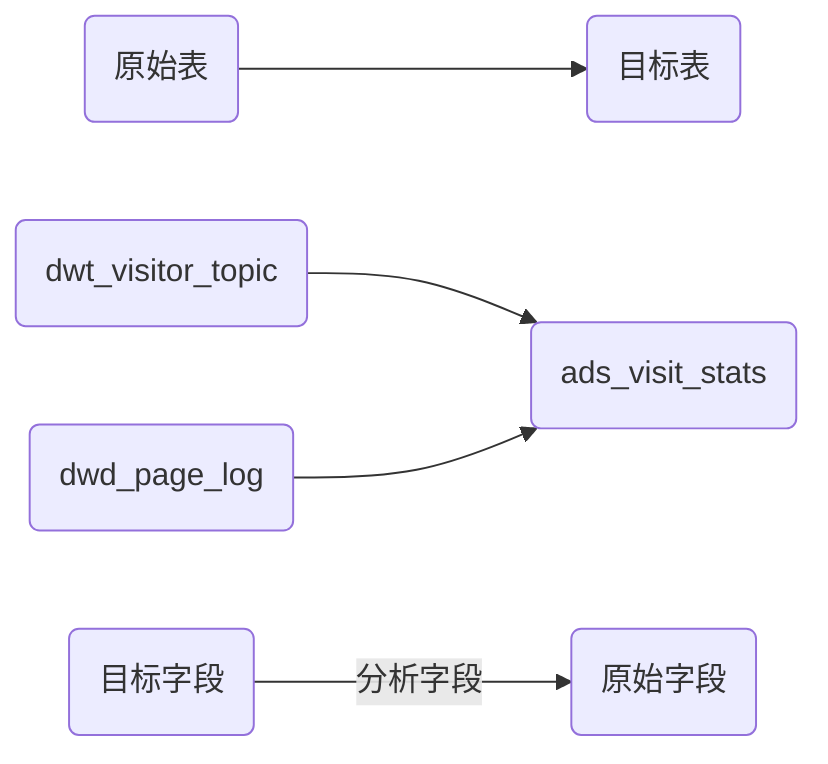

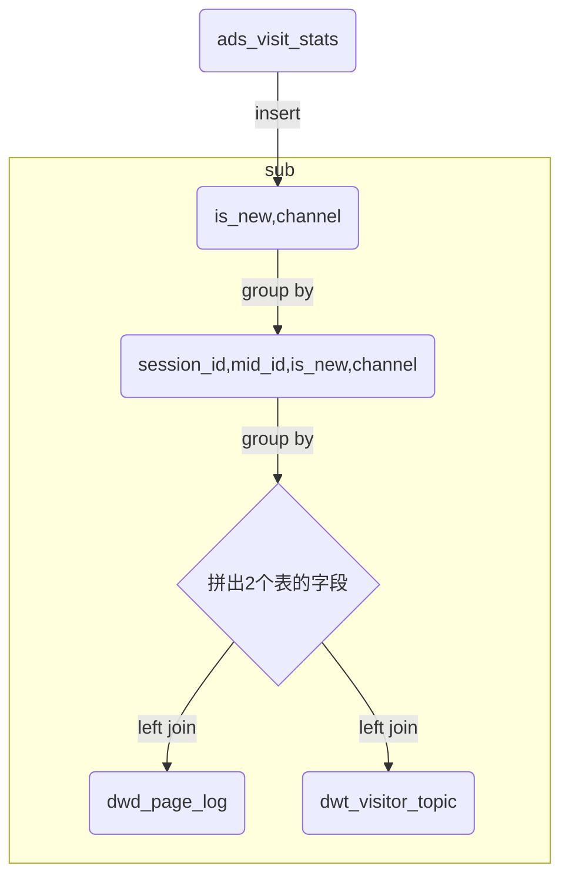

#### 1.访客统计

| 目标字段         | 原始字段                                                     |
| ---------------- | ------------------------------------------------------------ |
| is_new           | dwt_visitor_topic concat(mid_id,'-',last_value(if(last_page_id is null,ts,null),true) over(partition by mid_id order by ts)) |
| channel          | dwd_page_log                                                 |
| uv_count         | distanct(mid_id)                                             |
| duration_sec     | dwd_page_log                                                 |
| avg_duration_sec |                                                              |
| page_count       | group by(session id)  dwd_page_log.last_page_id->session id  |
| avg_page_count   |                                                              |
| sv_count         | count(*) 会话数                                              |
| bounce_count     | page_count                                                   |
| bounce_rate      | page_count=1,1,0))/count(*)                                  |
|                  | 通过2次group by把具体的数据抽象化，也就是从一个整体去用数据描述 |

* 建表

```
DROP TABLE IF EXISTS ads_visit_stats;
CREATE EXTERNAL TABLE ads_visit_stats (
  `dt` STRING COMMENT '统计日期',
  `is_new` STRING COMMENT '新老标识,1:新,0:老',
  `channel` STRING COMMENT '渠道',
  `uv_count` BIGINT COMMENT '日活(访问人数)',
  `duration_sec` BIGINT COMMENT '页面停留总时长',
  `avg_duration_sec` BIGINT COMMENT '一次会话，页面停留平均时长,单位为描述',
  `page_count` BIGINT COMMENT '页面总浏览数',
  `avg_page_count` BIGINT COMMENT '一次会话，页面平均浏览数',
  `sv_count` BIGINT COMMENT '会话次数',
  `bounce_count` BIGINT COMMENT '跳出数',
  `bounce_rate` DECIMAL(16,2) COMMENT '跳出率'
) COMMENT '访客统计'
ROW FORMAT DELIMITED FIELDS TERMINATED BY '\t'
LOCATION '/warehouse/gmall_test/ads/ads_visit_stats/';

```

* 插入数据

```sql
insert overwrite table ads_visit_stats
select * from ads_visit_stats
union
select
    '2021-06-14' dt,
    is_new,
    channel,
    count(distinct(mid_id)) uv_count,
    cast(sum(duration)/1000 as bigint) duration_sec,
    cast(avg(duration)/1000 as bigint) avg_duration_sec,
    sum(page_count) page_count,
    cast(avg(page_count) as bigint) avg_page_count,
    count(*) sv_count,
    sum(if(page_count=1,1,0)) bounce_count,
    cast(sum(if(page_count=1,1,0))/count(*)*100 as decimal(16,2)) bounce_rate
from
(
    select
        session_id,
        mid_id,
        is_new,
        channel,
        count(*) page_count,
        sum(during_time) duration
    from
    (
        select
            t1.mid_id,
            channel,
            is_new,
            last_page_id,
            page_id,
            during_time,
            concat(t1.mid_id,'-',last_value(if(last_page_id is null,ts,null),true) over (partition by t1.mid_id order by ts)) session_id
        from
        (
            select
                mid_id,
                channel,
                last_page_id,
                page_id,
                during_time,
                dt,
                ts
            from dwd_page_log
            where dt='2021-06-14'
        )t1
        left join
        (
            select
                mid_id,
                if(visit_date_first='2021-06-14','1','0') is_new
            from dwt_visitor_topic
            where dt='2021-06-14'
        )t2
        on t1.mid_id=t2.mid_id
    )t3
    group by session_id,mid_id,is_new,channel
)t6
group by is_new,channel;

```


#### 1.路径分析

* 建表

```sql
DROP TABLE IF EXISTS ads_page_path;
CREATE EXTERNAL TABLE ads_page_path
(
    `dt` STRING COMMENT '统计日期',
    `source` STRING COMMENT '跳转起始页面ID',
    `target` STRING COMMENT '跳转终到页面ID',
    `path_count` BIGINT COMMENT '跳转次数'
)  COMMENT '页面浏览路径'
ROW FORMAT DELIMITED FIELDS TERMINATED BY '\t'
LOCATION '/warehouse/gmall_test/ads/ads_page_path/';
```

* 要求统计用户的页面访问路径

```sql
select
  '2021-06-14' dt,
  source,
  target,
  count(*) number

from
    (
        select
            concat('step-',step,':',source) source,
            concat('step-',step+1,':',target) target
        from (
                 select
                     mid_id,
                     page_id source,
                     lead(page_id) over(partition by mid_id order by ts) target,
                     row_number() over (partition by mid_id order by ts) step
                 from
                     dwd_page_log
                 where
                         dt='2021-06-14'
             ) t1
        )t2
group by source, target;
```

