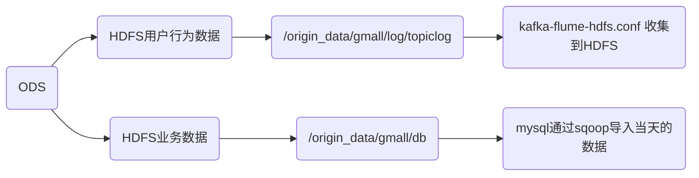
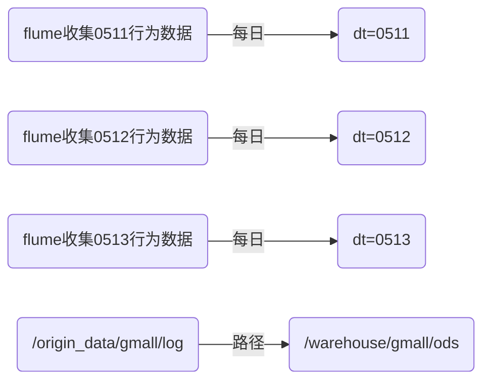
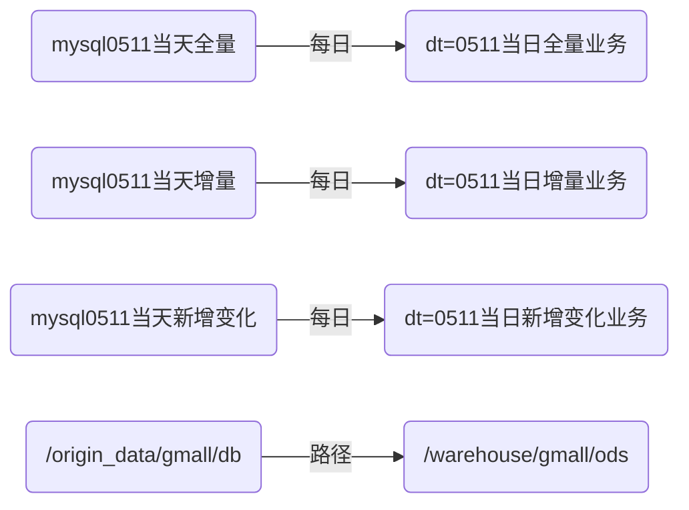
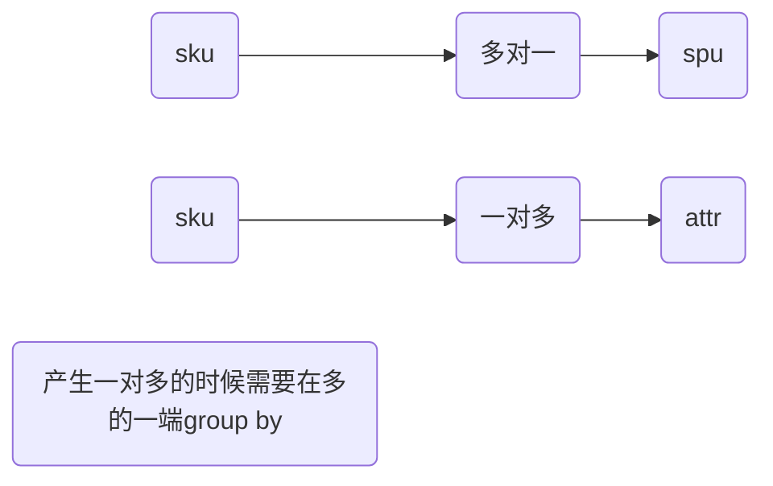
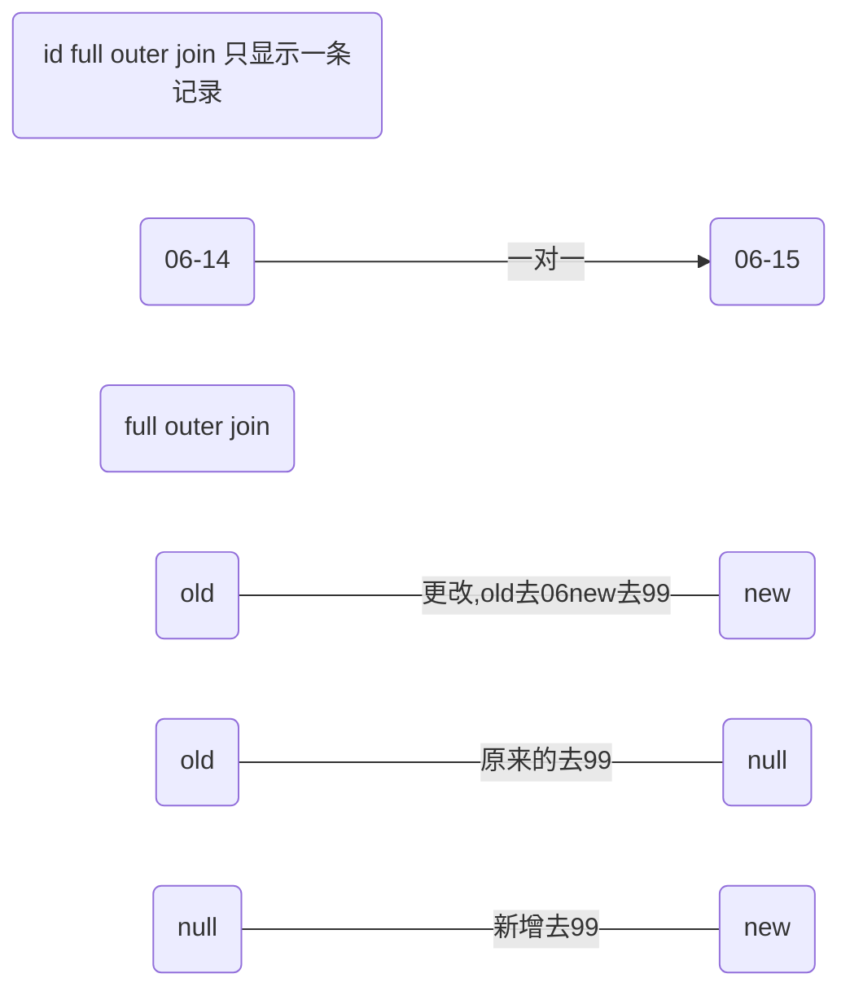

# Hive,Spark,Sqoop

|                                |                            |
| ------------------------------ | -------------------------- |
| 时间格式配置成YYYY-MM-DD格式， | 这是Hive默认支持的时间格式 |
|                                |                            |
|                                |                            |


## 一.数仓分层理论

### 1.分层

| 层                          | 作用                                                         |
| --------------------------- | ------------------------------------------------------------ |
| ODS(Operation Data Store)   | 原始数据层，存放原始数据                                     |
| DWD(Data Warehouse Detail)  | 对ods层进行数据清洗，保存业务真实性                          |
| DWS(Data Warehouse Service) | 按天进行轻度汇总，一行信息代表一个主题对象一天的汇总，一个用户一天订单次数 |
| DWT(Data Warehouse Topic)   | 数据进行累计汇总，一行信息代表一个主题对象的累积行为，一个用户从注册那天进行的订单次数 |
| ADS(Application Data Store) | 为各种统计报表提供数据                                       |
| DIM                         | 数据维度层，主要对业务员实施的描述                           |

### 2.命名规范

|        | ods_表名 |
| ------ | -------- |
| ODS层  | ods_表名 |
| DIM层  | dim_表名 |
| DWD层  | dwd_表名 |
| DWS层  | dws_表名 |
| DWT层  | dwt_表名 |
| ADS层  | ads_表名 |
| 临时表 | tmp_表名 |

### 3.表字段类型

| 类型                                                         |
| ------------------------------------------------------------ |
| Ø  金额类型为decimal(16, 2)，表示：16位有效数字，其中小数部分2位 |
| Ø  字符串(名字，描述信息等)类型为string                      |
| Ø  主键外键类型为string                                      |
| Ø  时间戳类型为bigint                                        |
| Ø  数量类型为bigint                                          |

## 二.数仓建模理论

### 1.范式理论

#### 1.函数依赖

##### 1.完全函数依赖

```
定义：设X,Y是关系R的两个属性集合，X’是X的真子集，存在X→Y，但对每一个X’都有X’!→Y，则称Y完全函数依赖于X。
理解：在一张表中，若 X → Y，且对于 X 的任何一个真子集（假如属性组 X 包含超过一个属性的话），X ' → Y 不成立，那么我们称 Y 对于 X 完全函数依赖。
举例：在成绩表SG中，成绩完全函数依赖于（学号，CID（课程号））
```

##### 2.部分函数依赖

```
定义：设X,Y是关系R的两个属性集合，存在X→Y，若X’是X的真子集，存在X’→Y，则称Y部分函数依赖于X。
说明：假如 Y 函数依赖于 X，但同时 Y 并不完全函数依赖于 X，那么我们就称 Y 部分函数依赖于 X
举例：学生表ST中（学号，姓名）->性别，但是存在学号->性别，所以称性别部分依赖于（学号，姓名）
```

##### 3.传递函数依赖

```
定义：设X,Y,Z是关系R中互不相同的属性集合，存在X→Y(Y !→X),Y→Z，则称Z传递函数依赖于X。
说明：假如 Z 函数依赖于 Y，且 Y 函数依赖于 X （严格来说还有一个X 不包含于Y，且 Y 不函数依赖于Z的前提条件），那么我们就称 Z 传递函数依赖于 X
举例：关系S1（学号，系名，系主任），学号 → 系名，系名 → 系主任，并且系名 ！→ 学号，所以学号 → 系主任为传递函数依赖。
```

#### 2.三范式

##### 1.一范式

```
定义：符合1NF的关系中的每个属性都不可再分
说明：在一列中不能插入两个及以上不同属性的值
举例：如果将教师表的姓名与性别放在同一列就不符合1NF，当然这在建表的时候就不会成功。
```

##### 2.二范式

```
定义：在1NF的基础上，非码属性必须完全依赖于候选码（在1NF基础上消除非主属性对主码的部分函数依赖）。
说明：第二范式（2NF）是在第一范式（1NF）的基础上建立起来的，即满足第二范式（2NF）必须先满足第一范式（1NF）。第二范式（2NF）要求数据库表中的每个实例或记录必须可以被唯一地区分。选取一个能区分每个实体的属性或属性组，作为实体的唯一标识。即要有主键

举例：如果在成绩表SG中添加一列姓名变成下面这样，SG表的主键是学号加CID(课程号)，（学号）->姓名，所以姓名部分函数依赖于（学号，CID(课程号)），不符合2NF
```

##### 3.三范式

```
定义：在1NF基础上，任何非主属性不依赖于其它非主属性（在2NF基础上消除传递依赖）
说明：第三范式（3NF）是第二范式（2NF）的一个子集，即满足第三范式（3NF）必须满足第二范式（2NF）。简而言之，第三范式（3NF）要求一个关系中不包含已在其它关系已包含的非主关键字信息。

举例：如果在课程表SC中添加一列老师姓名，变成如下，存在
CID(课程号)->TID(授课老师ID),TID(授课老师ID)->教师姓名，TID(授课老师ID)！->CID(课程号)，所以教师姓名传递函数依赖于CID(课程号)，不满足3NF，但是满足2NF,主键是CID
```

### 2.维度建模

#### 1.维度表

* 意义

```
一般是对事实的描述信息。每一张维表对应现实世界中的一个对象或者概念。 例如：用户、商品、日期、地区等
```

* 特征

```
维表的范围很宽（具有多个属性、列比较多）
跟事实表相比，行数相对较小：通常< 10万条
内容相对固定：编码表
```

#### 2.事实表

* 意义

```
事实表中的每行数据代表一个业务事件（下单、支付、退款、评价等）。“事实”这个术语表示的是业务事件的度量值（可统计次数、个数、金额等）
```

##### a.**事务型事实表**

```
以每个事务或事件为单位，例如一个销售订单记录，一笔支付记录等，作为事实表里的一行数据。一旦事务被提交，事实表数据被插入，数据就不再进行更改，其更新方式为增量更新。
```

##### b.**周期型快照事实表**

```
周期型快照事实表中不会保留所有数据，只保留固定时间间隔的数据，例如每天或者每月的销售额，或每月的账户余额等。
例如购物车，有加减商品，随时都有可能变化，但是我们更关心每天结束时这里面有多少商品，方便我们后期统计分析

```

##### c.**累积型快照事实表**

```
累计快照事实表用于跟踪业务事实的变化。例如，数据仓库中可能需要累积或者存储订单从下订单开始，到订单商品被打包、运输、和签收的各个业务阶段的时间点数据来跟踪订单声明周期的进展情况。当这个业务过程进行时，事实表的记录也要不断更新。
```

| **订单id** | **用户id** | **下单时间** | **打包时间** | **发货时间** | **签收时间** | **订单金额** |
| ---------- | ---------- | ------------ | ------------ | ------------ | ------------ | ------------ |
|            |            | 3-8          | 3-8          | 3-9          | 3-10         |              |

#### 3.建模模型

##### a.星型

```
标准的星型维度只有一层
```

##### b.雪花

```
比较类似关系型数据库的3NF建模，但又无法完全遵照
```

##### c.星座

```
星座区别于前面2个是事实表的数量。星座基于多个事实表
```

##### d.选择模型

```
星型还是雪花，取决于性能优先，还是灵活更优先。目前实际企业开发中，不会绝对选择一种，根据情况灵活组合，甚至并存（一层维度和多层维度都保存）。
但更倾向于维度更少的星型模型。尤其是Hadoop体系，减少Join就是减少Shuffle，性能差距很大。（关系型数据可以依靠强大的主键索引）
```

#### 4.ODS




##### 1.业务数据处理意义

```
（1）保持数据原貌不做任何修改，起到备份数据的作用。
（2）数据采用Snappy压缩，减少磁盘存储空间。
（3）创建外部表。在企业开发中，除了自己用的临时表，创建内部表外，绝大多数场景都是创建外部表。
（4）创建分区表，防止后续的全表扫描，在企业开发中大量使用分区表。
```

#### 5.DIM


##### 1.建模步骤

```
DIM层DWD层需构建维度模型，一般采用星型模型，呈现的状态一般为星座模型(由于多个事实表)。
维度建模一般按照以下四个步骤：
见上图
```

* 选择业务

```
挑选我们感兴趣的业务线，比如下单业务，支付业务，退款业务，物流业务，一条业务线对应一张事实表
```

* 声明粒度

```
定义：	
	定义事实表中的一行数据表示什么，应该尽可能选择最小粒度，以此来应各种各样的需求。
例如：
	典型的粒度声明如下：
	订单事实表中一行数据表示的是一个订单中的一个商品项。
	支付事实表中一行数据表示的是一个支付记录。

```

* 确认维度

```
定义：
	描述业务是事实，主要表示的是“谁，何处，何时”等信息。
确认原则：
	后续需求中是否要分析相关维度的指标。例如，需要统计，什么时间下的订单多，哪个地区下的订单多，哪个用户下的订单多。需要确定的维度就包括：时间维度、地区维度、用户维度
```

* 确认事实

```
定义：
	指的是业务中的度量值（次数、个数、件数、金额，可以进行累加），例如订单金额、下单次数等
```

#### 6.DWD

##### 1.宽表

```
宽表从字面意义上讲就是字段比较多的数据库表。 通常是指业务主题相关的指标、维度、属性关联在一起的一张数据库表
（１）需要建哪些宽表：以维度为基准。
（２）宽表里面的字段：是站在不同维度的角度去看事实表，重点关注事实表聚合后的度量值。

```

##### 2.事实表和维度表关联

```
DWD层，以业务过程为建模驱动，基于每个具体业务过程的特点，构建最细粒度的明细层事实表。事实表可做适当的宽表化处理
```

|                | **时间** | **用户** | **地区** | **商品** | **优惠券** | **活动** | **度量值**                      |
| -------------- | -------- | -------- | -------- | -------- | ---------- | -------- | ------------------------------- |
| **订单**       | √        | √        | √        |          |            |          | 运费/优惠金额/原始金额/最终金额 |
| **订单详情**   | √        | √        | √        | √        | √          | √        | 件数/优惠金额/原始金额/最终金额 |
| **支付**       | √        | √        | √        |          |            |          | 支付金额                        |
| **加购**       | √        | √        |          | √        |            |          | 件数/金额                       |
| **收藏**       | √        | √        |          | √        |            |          | 次数                            |
| **评价**       | √        | √        |          | √        |            |          | 次数                            |
| **退单**       | √        | √        | √        | √        |            |          | 件数/金额                       |
| **退款**       | √        | √        | √        | √        |            |          | 件数/金额                       |
| **优惠券领用** | √        | √        |          |          | √          |          | 次数                            |

#### 7.DWS&DWT

```
DWS层和DWT层统称宽表层
```

##### 1.如何避免重复计算

```
1）问题引出：
	两个需求，统计每个省份订单的个数、统计每个省份订单的总金额
2）避免(join group by)重复计算
	设计一张地区宽表，其主键为地区ID，字段包含为：下单次数、下单金额、支付次数、支付金额等。上述所有指标都统一进行计算，并将结果保存在该宽表中，这样就能有效避免数据的重复计算
```

##### 2.DWS&DWT区别

```
DWS和DWT层的区别：
	DWS层存放的所有主题对象当天的汇总行为，例如每个地区当天的下单次数，下单金额等，
	DWT层存放的是所有主题对象的累积行为，例如每个地区最近７天（１５天、３０天、６０天）的下单次数、下单金额等
```

## 三.数仓搭建

### 1.ODS

| 业务     | 日期           |
| -------- | -------------- |
| 行为数据 | 14，15，16     |
| 业务数据 | 14，15，16，17 |
|          |                |

#### 同步理论

```
数据同步策略的类型包括：全量同步、增量同步、新增及变化同步、特殊情况
全量表：存储完整的数据。
增量表：存储新增加的数据。
新增及变化表：存储新增加的数据和变化的数据。
特殊表：只需要存储一次。

```


#### 1.行为表ods_log



* 创建hive分区表

```sql
drop table if exists ods_log;
CREATE EXTERNAL TABLE ods_log (`line` string)
PARTITIONED BY (`dt` string) -- 按照时间创建分区
LOCATION '/warehouse/gmall/ods/ods_log'  -- 指定数据在hdfs上的存储位置

load data inpath '/origin_data/gmall/log/topic_log/2020-06-14' into table ods_log partition(dt='2020-06-14');
```

#### 2.业务表



* 建表语句参考目录文件 .sql

* 首次同步脚本，每日同步脚本,<mark>ODS都是全量的同步</mark>

```mermaid
graph LR
E(/origin_data/$APP/db/$1/$do_date)--写入-->B(hdfs)
C(查询所有)--target-->E
A(mysql)--sqoop首次全量-->C
D(mysql)--sqoop每日全量-->F(where.create_time,operate_time)
F--target-->G(/origin_data/$APP/db/$1/$do_date)
G-->B
H(HDFS)--首次全量,日期-->M(/origin_data/$APP/db/order_info/$do_date)
M--分区-->J(partition'dt='$do_date'')
J-->I(ods)
H--每日全量,日期--分区-->L(partition'dt='$do_date'')
L-->K(ods)
```


### 2.DIM

| 解释                                                         |
| ------------------------------------------------------------ |
| 1.每日全量表放在ods的分区中，所有分区的数据也就是mysql中全部数据 |
|                                                              |
|                                                              |


#### 1.商品维度表(全量)

* 建表语句

  ```sql
  .建表语句
  DROP TABLE IF EXISTS dim_sku_info;
  CREATE EXTERNAL TABLE dim_sku_info (
      `id` STRING COMMENT '商品id',
      `price` DECIMAL(16,2) COMMENT '商品价格',
      `sku_name` STRING COMMENT '商品名称',
      `sku_desc` STRING COMMENT '商品描述',
      `weight` DECIMAL(16,2) COMMENT '重量',
      `is_sale` BOOLEAN COMMENT '是否在售',
      `spu_id` STRING COMMENT 'spu编号',
      `spu_name` STRING COMMENT 'spu名称',
      `category3_id` STRING COMMENT '三级分类id',
      `category3_name` STRING COMMENT '三级分类名称',
      `category2_id` STRING COMMENT '二级分类id',
      `category2_name` STRING COMMENT '二级分类名称',
      `category1_id` STRING COMMENT '一级分类id',
      `category1_name` STRING COMMENT '一级分类名称',
      `tm_id` STRING COMMENT '品牌id',
      `tm_name` STRING COMMENT '品牌名称',
      `sku_attr_values` ARRAY<STRUCT<attr_id:STRING,value_id:STRING,attr_name:STRING,value_name:STRING>> COMMENT '平台属性',
      `sku_sale_attr_values` ARRAY<STRUCT<sale_attr_id:STRING,sale_attr_value_id:STRING,sale_attr_name:STRING,sale_attr_value_name:STRING>> COMMENT '销售属性',
      `create_time` STRING COMMENT '创建时间'
  ) COMMENT '商品维度表'
  PARTITIONED BY (`dt` STRING)
  STORED AS ORC
  LOCATION '/warehouse/gmall/dim/dim_sku_info/'
  TBLPROPERTIES ("orc.compress"="snappy");
  
  ```

* 首次导入数据

```sql
with
    sku as (
        select
       id,price,sku_name,sku_desc,weight,is_sale,spu_id,category3_id,tm_id,create_time
        from ods_sku_info
        where dt=='2021-06-14'

    ),
    spu as (
        select id, spu_name, category3_id, tm_id
        from ods_spu_info
        where dt=='2021-06-14'
    ),
    c3 as
        (
            select id,name,category2_id
            from ods_base_category3
            where dt='2021-06-14'
        ),
    c2 as
        (
            select id,name,category1_id
            from ods_base_category2
            where dt='2021-06-14'
        ),
    c1 as
        (
            select  id,name
            from ods_base_category1
            where dt='2021-06-14'
        ),
    tm as
        (
            select id,tm_name
            from ods_base_trademark
            where dt='2021-06-14'
        ),
    attr as (
        select sku_id,
               collect_list(named_struct('attr_id',attr_id,'value_id',value_id,'attr_name',attr_name,'value_name',value_name)) attrs
        from ods_sku_attr_value
        where dt='2021-06-14'
        group by sku_id
    ),
    sale_attr as (
        select  sku_id,
                collect_set(named_struct('sale_attr_id',sale_attr_id,'sale_attr_value_id',sale_attr_value_id,'sale_attr_name',sale_attr_name,'sale_attr_value_name',sale_attr_value_name)) sale_attrs
        from ods_sku_sale_attr_value
        where dt='2021-06-14'
        group by sku_id

    )
insert overwrite table dim_sku_info partition(dt='2021-06-14')
select     sku.id,sku.price,
           sku.sku_name,sku.sku_desc,
           sku.weight,sku.is_sale,
           sku.spu_id,spu.spu_name,
           sku.category3_id,c3.name,
           c3.category2_id,c2.name,
           c2.category1_id,
           c1.name,sku.tm_id,
           tm.tm_name,attr.attrs,
           sale_attr.sale_attrs,sku.create_time
from sku
         left join spu on sku.spu_id=spu.id
         left join c3 on sku.category3_id=c3.id
         left join c2 on c3.category2_id=c2.id
         left join c1 on c2.category1_id=c1.id
         left join tm on sku.tm_id=tm.id
         left join attr on sku.id=attr.sku_id
         left join sale_attr on sku.id=sale_attr.sku_id;

```

* array<struct>




* result

```
[{"sale_attr_id":"1","sale_attr_value_id":"1","sale_attr_name":"颜色","sale_attr_value_name":"陶瓷黑"},{"sale_attr_id":"2","sale_attr_value_id":"3","sale_attr_name":"版本","sale_attr_value_name":"8G+128G"}]
```

#### 2.优惠券维度表(全量)

* 建表语句

```sql
DROP TABLE IF EXISTS dim_coupon_info;
CREATE EXTERNAL TABLE dim_coupon_info(
                                         `id` STRING COMMENT '购物券编号',
                                         `coupon_name` STRING COMMENT '购物券名称',
                                         `coupon_type` STRING COMMENT '购物券类型 1 现金券 2 折扣券 3 满减券 4 满件打折券',
                                         `condition_amount` DECIMAL(16,2) COMMENT '满额数',
                                         `condition_num` BIGINT COMMENT '满件数',
                                         `activity_id` STRING COMMENT '活动编号',
                                         `benefit_amount` DECIMAL(16,2) COMMENT '减金额',
                                         `benefit_discount` DECIMAL(16,2) COMMENT '折扣',
                                         `create_time` STRING COMMENT '创建时间',
                                         `range_type` STRING COMMENT '范围类型 1、商品 2、品类 3、品牌',
                                         `limit_num` BIGINT COMMENT '最多领取次数',
                                         `taken_count` BIGINT COMMENT '已领取次数',
                                         `start_time` STRING COMMENT '可以领取的开始日期',
                                         `end_time` STRING COMMENT '可以领取的结束日期',
                                         `operate_time` STRING COMMENT '修改时间',
                                         `expire_time` STRING COMMENT '过期时间'
) COMMENT '优惠券维度表'
    PARTITIONED BY (`dt` STRING)
    STORED AS ORC
    LOCATION '/warehouse/gmall_test/dim/dim_coupon_info/'
    TBLPROPERTIES ("orc.compress"="snappy");

```

* 首次导入

```sql
insert overwrite table dim_coupon_info partition(dt='2021-06-14')
select
    id,coupon_name,coupon_type,condition_amount,
    condition_num,activity_id,benefit_amount,
    benefit_discount,create_time,range_type,
    limit_num,taken_count,start_time,
    end_time,operate_time,expire_time
from ods_coupon_info
where dt='2021-06-14';
```

#### 3.活动维度表(全量)

* 建表

```sql
DROP TABLE IF EXISTS dim_activity_rule_info;
CREATE EXTERNAL TABLE dim_activity_rule_info(
    `activity_rule_id` STRING COMMENT '活动规则ID',
    `activity_id` STRING COMMENT '活动ID',
    `activity_name` STRING  COMMENT '活动名称',
    `activity_type` STRING  COMMENT '活动类型',
    `start_time` STRING  COMMENT '开始时间',
    `end_time` STRING  COMMENT '结束时间',
    `create_time` STRING  COMMENT '创建时间',
    `condition_amount` DECIMAL(16,2) COMMENT '满减金额',
    `condition_num` BIGINT COMMENT '满减件数',
    `benefit_amount` DECIMAL(16,2) COMMENT '优惠金额',
    `benefit_discount` DECIMAL(16,2) COMMENT '优惠折扣',
    `benefit_level` STRING COMMENT '优惠级别'
) COMMENT '活动信息表'
PARTITIONED BY (`dt` STRING)
STORED AS ORC
LOCATION '/warehouse/gmall_test/dim/dim_activity_rule_info/'
TBLPROPERTIES ("orc.compress"="snappy");

```

* 首次导入

```sql
insert overwrite table dim_activity_rule_info partition(dt='2021-06-14')
select
    ar.id,ar.activity_id,ai.activity_name,
    ar.activity_type,ai.start_time,ai.end_time,
    ai.create_time,ar.condition_amount,ar.condition_num,
    ar.benefit_amount,ar.benefit_discount, ar.benefit_level
from
(
    select
        id,activity_id,activity_type,condition_amount,
        condition_num,benefit_amount,benefit_discount,benefit_level
    from ods_activity_rule
    where dt='2021-06-14'
)ar
left join
(
    select
        id,activity_name,start_time,end_time,create_time
    from ods_activity_info
    where dt='2021-06-14'
)ai
on ar.activity_id=ai.id;

```

#### 4.地区维度表(特殊)

* 创建表

```sql
DROP TABLE IF EXISTS dim_base_province;
CREATE EXTERNAL TABLE dim_base_province (
    `id` STRING COMMENT 'id',
    `province_name` STRING COMMENT '省市名称',
    `area_code` STRING COMMENT '地区编码',
    `iso_code` STRING COMMENT 'ISO-3166编码，供可视化使用',
    `iso_3166_2` STRING COMMENT 'IOS-3166-2编码，供可视化使用',
    `region_id` STRING COMMENT '地区id',
    `region_name` STRING COMMENT '地区名称'
) COMMENT '地区维度表'
STORED AS ORC
LOCATION '/warehouse/gmall_test/dim/dim_base_province/'
TBLPROPERTIES ("orc.compress"="snappy");

```

* 首次即每日

```sql
insert overwrite table dim_base_province
select
    bp.id,
    bp.name,
    bp.area_code,
    bp.iso_code,
    bp.iso_3166_2,
    bp.region_id,
    br.region_name
from ods_base_province bp
         join ods_base_region br on bp.region_id = br.id;
```

#### 5.时间维度表(特舒)

* 创建表

```
DROP TABLE IF EXISTS dim_date_info;
CREATE EXTERNAL TABLE dim_date_info(
    `date_id` STRING COMMENT '日',
    `week_id` STRING COMMENT '周ID',
    `week_day` STRING COMMENT '周几',
    `day` STRING COMMENT '每月的第几天',
    `month` STRING COMMENT '第几月',
    `quarter` STRING COMMENT '第几季度',
    `year` STRING COMMENT '年',
    `is_workday` STRING COMMENT '是否是工作日',
    `holiday_id` STRING COMMENT '节假日'
) COMMENT '时间维度表'
STORED AS ORC
LOCATION '/warehouse/gmall_test/dim/dim_date_info/'
TBLPROPERTIES ("orc.compress"="snappy");

```

* 创建临时表

```
DROP TABLE IF EXISTS tmp_dim_date_info;
CREATE EXTERNAL TABLE tmp_dim_date_info (
    `date_id` STRING COMMENT '日',
    `week_id` STRING COMMENT '周ID',
    `week_day` STRING COMMENT '周几',
    `day` STRING COMMENT '每月的第几天',
    `month` STRING COMMENT '第几月',
    `quarter` STRING COMMENT '第几季度',
    `year` STRING COMMENT '年',
    `is_workday` STRING COMMENT '是否是工作日',
    `holiday_id` STRING COMMENT '节假日'
) COMMENT '时间维度表'
ROW FORMAT DELIMITED FIELDS TERMINATED BY '\t'
LOCATION '/warehouse/gmall_test/tmp/tmp_dim_date_info/';

```

* data_info.txt上传到/warehouse/gmall_test/tmp/tmp_dim_date_info/
* 从临时表到正式表

```
insert overwrite table dim_date_info select * from tmp_dim_date_info;
```

#### 6.用户维度表(拉链表)

* 拉链表

```
记录每条信息的生命周期，一旦一条记录生命周期结束，就重新开始一条新的记录，并把当前日期放入生效开始日期；当前信息至今有效，在生效结束日期中放入极大值（9999-99-99）

```

* 使用拉链的场景

```
数据会发生变化，但是发生变化频率并不高的维度；比如用户表做每日全量效率低下
```

* 建表

```
DROP TABLE IF EXISTS dim_user_info;
CREATE EXTERNAL TABLE dim_user_info(
   `id` STRING COMMENT '用户id',`login_name` STRING COMMENT '用户名称',
   `nick_name` STRING COMMENT '用户昵称',`name` STRING COMMENT '用户姓名',
   `phone_num` STRING COMMENT '手机号码', `email` STRING COMMENT '邮箱',
   `user_level` STRING COMMENT '用户等级',`birthday` STRING COMMENT '生日',
   `gender` STRING COMMENT '性别',`create_time` STRING COMMENT '创建时间',
   `operate_time` STRING COMMENT '操作时间',`start_date` STRING COMMENT '开始日期',
   `end_date` STRING COMMENT '结束日期'
) COMMENT '用户表'
    PARTITIONED BY (`dt` STRING)
    STORED AS ORC
    LOCATION '/warehouse/gmall_test/dim/dim_user_info/'
    TBLPROPERTIES ("orc.compress"="snappy");

```

* 第一次初始化将截止到初始化当日的全部历史用户导入一次性导入到拉链表中。拉链表分区9999-99-99

```
insert overwrite table dim_user_info partition (dt = '9999-99-99')
select id,
       login_name,
       nick_name,
       md5(name),
       md5(phone_num),
       md5(email),
       user_level,
       birthday,
       gender,
       create_time,
       operate_time,
       '2021-06-14',
       '9999-99-99'
from ods_user_info
where dt = '2021-06-14';
```

* 每日




```
with
tmp as
(
    select
        old.id old_id,
        old.login_name old_login_name,
        old.nick_name old_nick_name,
        old.name old_name,
        old.phone_num old_phone_num,
        old.email old_email,
        old.user_level old_user_level,
        old.birthday old_birthday,
        old.gender old_gender,
        old.create_time old_create_time,
        old.operate_time old_operate_time,
        old.start_date old_start_date,
        old.end_date old_end_date,
        new.id new_id,
        new.login_name new_login_name,
        new.nick_name new_nick_name,
        new.name new_name,
        new.phone_num new_phone_num,
        new.email new_email,
        new.user_level new_user_level,
        new.birthday new_birthday,
        new.gender new_gender,
        new.create_time new_create_time,
        new.operate_time new_operate_time,
        new.start_date new_start_date,
        new.end_date new_end_date
    from
    (
        select
            id,
            login_name,
            nick_name,
            name,
            phone_num,
            email,
            user_level,
            birthday,
            gender,
            create_time,
            operate_time,
            start_date,
            end_date
        from dim_user_info
        where dt='9999-99-99'
    )old
    full outer join
    (
        select
            id,
            login_name,
            nick_name,
            md5(nick_name) nick_name,
            md5(name) name,
            md5(phone_num) phone_num,
            user_level,
            birthday,
            gender,
            create_time,
            operate_time,
            '2020-06-15' start_date,
            '9999-99-99' end_date
        from ods_user_info
        where dt='2021-06-15'
    )new
    on old.id=new.id
)
insert overwrite table dim_user_info partition(dt)
select
    nvl(new_id,old_id),
    nvl(new_login_name,old_login_name),
    nvl(new_nick_name,old_nick_name),
    nvl(new_name,old_name),
    nvl(new_phone_num,old_phone_num),
    nvl(new_email,old_email),
    nvl(new_user_level,old_user_level),
    nvl(new_birthday,old_birthday),
    nvl(new_gender,old_gender),
    nvl(new_create_time,old_create_time),
    nvl(new_operate_time,old_operate_time),
    nvl(new_start_date,old_start_date),
    nvl(new_end_date,old_end_date),
    nvl(new_end_date,old_end_date) dt
from tmp
union all
select
    old_id,
    old_login_name,
    old_nick_name,
    old_name,
    old_phone_num,
    old_email,
    old_user_level,
    old_birthday,
    old_gender,
    old_create_time,
    old_operate_time,
    old_start_date,
    cast(date_add('2021-06-15',-1) as string),
    cast(date_add('2021-06-15',-1) as string) dt
from tmp
where new_id is not null and old_id is not null;

```

### 3.DWD

```
1）对用户行为数据解析。
	页面埋点日志common,action,display,age,err,ts
	启动日志字段common,start,err
2）对业务数据采用维度模型重新建模。
```

##### 1.启动日志表

```
启动日志表中每行数据对应一个启动记录，一个启动记录应该包含日志中的公共信息和启动信息。先将所有包含start字段的日志过滤出来，然后使用get_json_object函数解析每个字段。
```

* 建表

```sql
DROP TABLE IF EXISTS dwd_start_log;
CREATE EXTERNAL TABLE dwd_start_log(
    `area_code` STRING COMMENT '地区编码',
    `brand` STRING COMMENT '手机品牌',
    `channel` STRING COMMENT '渠道',
    `is_new` STRING COMMENT '是否首次启动',
    `model` STRING COMMENT '手机型号',
    `mid_id` STRING COMMENT '设备id',
    `os` STRING COMMENT '操作系统',
    `user_id` STRING COMMENT '会员id',
    `version_code` STRING COMMENT 'app版本号',
    `entry` STRING COMMENT 'icon手机图标 notice 通知 install 安装后启动',
    `loading_time` BIGINT COMMENT '启动加载时间',
    `open_ad_id` STRING COMMENT '广告页ID ',
    `open_ad_ms` BIGINT COMMENT '广告总共播放时间',
    `open_ad_skip_ms` BIGINT COMMENT '用户跳过广告时点',
    `ts` BIGINT COMMENT '时间'
) COMMENT '启动日志表'
PARTITIONED BY (`dt` STRING)
STORED AS ORC
LOCATION '/warehouse/gmall_test/dwd/dwd_start_log'
TBLPROPERTIES ("orc.compress"="snappy");

```

* 插入数据

```
insert overwrite table dwd_start_log partition(dt='2021-06-14')
select
    get_json_object(line,'$.common.ar'),
    get_json_object(line,'$.common.ba'),
    get_json_object(line,'$.common.ch'),
    get_json_object(line,'$.common.is_new'),
    get_json_object(line,'$.common.md'),
    get_json_object(line,'$.common.mid'),
    get_json_object(line,'$.common.os'),
    get_json_object(line,'$.common.uid'),
    get_json_object(line,'$.common.vc'),
    get_json_object(line,'$.start.entry'),
    get_json_object(line,'$.start.loading_time'),
    get_json_object(line,'$.start.open_ad_id'),
    get_json_object(line,'$.start.open_ad_ms'),
    get_json_object(line,'$.start.open_ad_skip_ms'),
    get_json_object(line,'$.ts')
from ods_log
where dt='2021-06-14'
  and get_json_object(line,'$.start') is not null;

```

##### 2.页面日志表

```
页面日志表中每行数据对应一个页面访问记录，一个页面访问记录应该包含日志中的公共信息和页面信息。先将所有包含page字段的日志过滤出来
```

* 建表

```sql
DROP TABLE IF EXISTS dwd_page_log;
CREATE EXTERNAL TABLE dwd_page_log(
    `area_code` STRING COMMENT '地区编码',
    `brand` STRING COMMENT '手机品牌',
    `channel` STRING COMMENT '渠道',
    `is_new` STRING COMMENT '是否首次启动',
    `model` STRING COMMENT '手机型号',
    `mid_id` STRING COMMENT '设备id',
    `os` STRING COMMENT '操作系统',
    `user_id` STRING COMMENT '会员id',
    `version_code` STRING COMMENT 'app版本号',
    `during_time` BIGINT COMMENT '持续时间毫秒',
    `page_item` STRING COMMENT '目标id ',
    `page_item_type` STRING COMMENT '目标类型',
    `last_page_id` STRING COMMENT '上页类型',
    `page_id` STRING COMMENT '页面ID ',
    `source_type` STRING COMMENT '来源类型',
    `ts` bigint
) COMMENT '页面日志表'
PARTITIONED BY (`dt` STRING)
STORED AS ORC
LOCATION '/warehouse/gmall_test/dwd/dwd_page_log'
TBLPROPERTIES ("orc.compress"="snappy");

```

* 插入数据

```sql
insert overwrite table dwd_page_log partition(dt='2021-06-14')
select
    get_json_object(line,'$.common.ar'),
    get_json_object(line,'$.common.ba'),
    get_json_object(line,'$.common.ch'),
    get_json_object(line,'$.common.is_new'),
    get_json_object(line,'$.common.md'),
    get_json_object(line,'$.common.mid'),
    get_json_object(line,'$.common.os'),
    get_json_object(line,'$.common.uid'),
    get_json_object(line,'$.common.vc'),
    get_json_object(line,'$.page.during_time'),
    get_json_object(line,'$.page.item'),
    get_json_object(line,'$.page.item_type'),
    get_json_object(line,'$.page.last_page_id'),
    get_json_object(line,'$.page.page_id'),
    get_json_object(line,'$.page.source_type'),
    get_json_object(line,'$.ts')
from ods_log
where dt='2021-06-14'
and get_json_object(line,'$.page') is not null;

```

##### 3.动作日志表

```
动作日志表中每行数据对应用户的一个动作记录，一个动作记录应当包含公共信息、页面信息以及动作信息。先将包含action字段的日志过滤出来，然后通过UDTF函数，将action数组“炸开”（类似于explode函数的效果），然后使用get_json_object函数解析每个字段。
```

* 建表

```
DROP TABLE IF EXISTS dwd_action_log;
CREATE EXTERNAL TABLE dwd_action_log(
    `area_code` STRING COMMENT '地区编码',
    `brand` STRING COMMENT '手机品牌',
    `channel` STRING COMMENT '渠道',
    `is_new` STRING COMMENT '是否首次启动',
    `model` STRING COMMENT '手机型号',
    `mid_id` STRING COMMENT '设备id',
    `os` STRING COMMENT '操作系统',
    `user_id` STRING COMMENT '会员id',
    `version_code` STRING COMMENT 'app版本号',
    `during_time` BIGINT COMMENT '持续时间毫秒',
    `page_item` STRING COMMENT '目标id ',
    `page_item_type` STRING COMMENT '目标类型',
    `last_page_id` STRING COMMENT '上页类型',
    `page_id` STRING COMMENT '页面id ',
    `source_type` STRING COMMENT '来源类型',
    `action_id` STRING COMMENT '动作id',
    `item` STRING COMMENT '目标id ',
    `item_type` STRING COMMENT '目标类型',
    `ts` BIGINT COMMENT '时间'
) COMMENT '动作日志表'
PARTITIONED BY (`dt` STRING)
STORED AS ORC
LOCATION '/warehouse/gmall_test/dwd/dwd_action_log'
TBLPROPERTIES ("orc.compress"="snappy");

```

* 代码处理多个action

```java
<dependencies>
    <!--添加hive依赖-->
    <dependency>
        <groupId>org.apache.hive</groupId>
        <artifactId>hive-exec</artifactId>
        <version>3.1.2</version>
    </dependency>
</dependencies>
// 编码
package com.atguigu.hive.udtf;

import org.apache.hadoop.hive.ql.exec.UDFArgumentException;
import org.apache.hadoop.hive.ql.metadata.HiveException;
import org.apache.hadoop.hive.ql.udf.generic.GenericUDTF;
import org.apache.hadoop.hive.serde2.objectinspector.ObjectInspector;
import org.apache.hadoop.hive.serde2.objectinspector.ObjectInspectorFactory;
import org.apache.hadoop.hive.serde2.objectinspector.PrimitiveObjectInspector;
import org.apache.hadoop.hive.serde2.objectinspector.StructObjectInspector;
import org.apache.hadoop.hive.serde2.objectinspector.primitive.PrimitiveObjectInspectorFactory;
import org.json.JSONArray;

import java.util.ArrayList;
import java.util.List;

public class ExplodeJSONArray extends GenericUDTF {

    @Override
    public StructObjectInspector initialize(ObjectInspector[] argOIs) throws UDFArgumentException {

        // 1 参数合法性检查
        if (argOIs.length != 1) {
            throw new UDFArgumentException("explode_json_array 只需要一个参数");
        }

        // 2 第一个参数必须为string
        //判断参数是否为基础数据类型
        if (argOIs[0].getCategory() != ObjectInspector.Category.PRIMITIVE) {
            throw new UDFArgumentException("explode_json_array 只接受基础类型参数");
        }

        //将参数对象检查器强转为基础类型对象检查器
        PrimitiveObjectInspector argumentOI = (PrimitiveObjectInspector) argOIs[0];

        //判断参数是否为String类型
        if (argumentOI.getPrimitiveCategory() != PrimitiveObjectInspector.PrimitiveCategory.STRING) {
            throw new UDFArgumentException("explode_json_array 只接受string类型的参数");
        }

        // 3 定义返回值名称和类型
        List<String> fieldNames = new ArrayList<String>();
        List<ObjectInspector> fieldOIs = new ArrayList<ObjectInspector>();

        fieldNames.add("items");
        fieldOIs.add(PrimitiveObjectInspectorFactory.javaStringObjectInspector);

        return ObjectInspectorFactory.getStandardStructObjectInspector(fieldNames, fieldOIs);
    }

    public void process(Object[] objects) throws HiveException {

        // 1 获取传入的数据
        String jsonArray = objects[0].toString();

        // 2 将string转换为json数组
        JSONArray actions = new JSONArray(jsonArray);

        // 3 循环一次，取出数组中的一个json，并写出
        for (int i = 0; i < actions.length(); i++) {

            String[] result = new String[1];
            result[0] = actions.getString(i);
            forward(result);
        }
    }

    public void close() throws HiveException {

    }

}
```

* 上传

```
hadoop fs -mkdir -p /user/hive/jars
hadoop fs -put hivefunction-1.0-SNAPSHOT.jar /user/hive/jars

```

* 创建永久函数的并联

```
create function explode_json_array as 'HiveFunction' using jar 'hdfs://mycluster:8020/user/hive/jars/udtf-1.0-SNAPSHOT.jar';
```

* 插入数据

```
insert overwrite table dwd_action_log partition(dt='2021-06-14')
select
    get_json_object(line,'$.common.ar'),
    get_json_object(line,'$.common.ba'),
    get_json_object(line,'$.common.ch'),
    get_json_object(line,'$.common.is_new'),
    get_json_object(line,'$.common.md'),
    get_json_object(line,'$.common.mid'),
    get_json_object(line,'$.common.os'),
    get_json_object(line,'$.common.uid'),
    get_json_object(line,'$.common.vc'),
    get_json_object(line,'$.page.during_time'),
    get_json_object(line,'$.page.item'),
    get_json_object(line,'$.page.item_type'),
    get_json_object(line,'$.page.last_page_id'),
    get_json_object(line,'$.page.page_id'),
    get_json_object(line,'$.page.source_type'),
    get_json_object(action,'$.action_id'),
    get_json_object(action,'$.item'),
    get_json_object(action,'$.item_type'),
    get_json_object(action,'$.ts')
from ods_log lateral view explode_json_array(get_json_object(line,'$.actions')) tmp as action
where dt='2021-06-14'
  and get_json_object(line,'$.actions') is not null;
```

##### 4.曝光日志表

```
曝光日志表中每行数据对应一个曝光记录，一个曝光记录应当包含公共信息、页面信息以及曝光信息。先将包含display字段的日志过滤出来，然后通过UDTF函数，将display数组“炸开”（类似于explode函数的效果）
```

* 建表

```
DROP TABLE IF EXISTS dwd_display_log;
CREATE EXTERNAL TABLE dwd_display_log(
    `area_code` STRING COMMENT '地区编码',
    `brand` STRING COMMENT '手机品牌',
    `channel` STRING COMMENT '渠道',
    `is_new` STRING COMMENT '是否首次启动',
    `model` STRING COMMENT '手机型号',
    `mid_id` STRING COMMENT '设备id',
    `os` STRING COMMENT '操作系统',
    `user_id` STRING COMMENT '会员id',
    `version_code` STRING COMMENT 'app版本号',
    `during_time` BIGINT COMMENT 'app版本号',
    `page_item` STRING COMMENT '目标id ',
    `page_item_type` STRING COMMENT '目标类型',
    `last_page_id` STRING COMMENT '上页类型',
    `page_id` STRING COMMENT '页面ID ',
    `source_type` STRING COMMENT '来源类型',
    `ts` BIGINT COMMENT 'app版本号',
    `display_type` STRING COMMENT '曝光类型',
    `item` STRING COMMENT '曝光对象id ',
    `item_type` STRING COMMENT 'app版本号',
    `order` BIGINT COMMENT '曝光顺序',
    `pos_id` BIGINT COMMENT '曝光位置'
) COMMENT '曝光日志表'
PARTITIONED BY (`dt` STRING)
STORED AS ORC
LOCATION '/warehouse/gmall_test/dwd/dwd_display_log'
TBLPROPERTIES ("orc.compress"="snappy");

```

* 插入数据

```
insert overwrite table dwd_display_log partition(dt='2021-06-14')
select
    get_json_object(line,'$.common.ar'),
    get_json_object(line,'$.common.ba'),
    get_json_object(line,'$.common.ch'),
    get_json_object(line,'$.common.is_new'),
    get_json_object(line,'$.common.md'),
    get_json_object(line,'$.common.mid'),
    get_json_object(line,'$.common.os'),
    get_json_object(line,'$.common.uid'),
    get_json_object(line,'$.common.vc'),
    get_json_object(line,'$.page.during_time'),
    get_json_object(line,'$.page.item'),
    get_json_object(line,'$.page.item_type'),
    get_json_object(line,'$.page.last_page_id'),
    get_json_object(line,'$.page.page_id'),
    get_json_object(line,'$.page.source_type'),
    get_json_object(line,'$.ts'),
    get_json_object(display,'$.display_type'),
    get_json_object(display,'$.item'),
    get_json_object(display,'$.item_type'),
    get_json_object(display,'$.order'),
    get_json_object(display,'$.pos_id')
from ods_log lateral view explode_json_array(get_json_object(line,'$.displays')) tmp as display
where dt='2021-06-14'
and get_json_object(line,'$.displays') is not null;

```

##### 5.错误日志表

* 建表

```
DROP TABLE IF EXISTS dwd_error_log;
CREATE EXTERNAL TABLE dwd_error_log(
    `area_code` STRING COMMENT '地区编码',
    `brand` STRING COMMENT '手机品牌',
    `channel` STRING COMMENT '渠道',
    `is_new` STRING COMMENT '是否首次启动',
    `model` STRING COMMENT '手机型号',
    `mid_id` STRING COMMENT '设备id',
    `os` STRING COMMENT '操作系统',
    `user_id` STRING COMMENT '会员id',
    `version_code` STRING COMMENT 'app版本号',
    `page_item` STRING COMMENT '目标id ',
    `page_item_type` STRING COMMENT '目标类型',
    `last_page_id` STRING COMMENT '上页类型',
    `page_id` STRING COMMENT '页面ID ',
    `source_type` STRING COMMENT '来源类型',
    `entry` STRING COMMENT ' icon手机图标  notice 通知 install 安装后启动',
    `loading_time` STRING COMMENT '启动加载时间',
    `open_ad_id` STRING COMMENT '广告页ID ',
    `open_ad_ms` STRING COMMENT '广告总共播放时间',
    `open_ad_skip_ms` STRING COMMENT '用户跳过广告时点',
    `actions` STRING COMMENT '动作',
    `displays` STRING COMMENT '曝光',
    `ts` STRING COMMENT '时间',
    `error_code` STRING COMMENT '错误码',
    `msg` STRING COMMENT '错误信息'
) COMMENT '错误日志表'
PARTITIONED BY (`dt` STRING)
STORED AS ORC
LOCATION '/warehouse/gmall_test/dwd/dwd_error_log'
TBLPROPERTIES ("orc.compress"="snappy");

```

* 插入数据

```
insert overwrite table dwd_error_log partition(dt='2021-06-14')
select
    get_json_object(line,'$.common.ar'),
    get_json_object(line,'$.common.ba'),
    get_json_object(line,'$.common.ch'),
    get_json_object(line,'$.common.is_new'),
    get_json_object(line,'$.common.md'),
    get_json_object(line,'$.common.mid'),
    get_json_object(line,'$.common.os'),
    get_json_object(line,'$.common.uid'),
    get_json_object(line,'$.common.vc'),
    get_json_object(line,'$.page.item'),
    get_json_object(line,'$.page.item_type'),
    get_json_object(line,'$.page.last_page_id'),
    get_json_object(line,'$.page.page_id'),
    get_json_object(line,'$.page.source_type'),
    get_json_object(line,'$.start.entry'),
    get_json_object(line,'$.start.loading_time'),
    get_json_object(line,'$.start.open_ad_id'),
    get_json_object(line,'$.start.open_ad_ms'),
    get_json_object(line,'$.start.open_ad_skip_ms'),
    get_json_object(line,'$.actions'),
    get_json_object(line,'$.displays'),
    get_json_object(line,'$.ts'),
    get_json_object(line,'$.err.error_code'),
    get_json_object(line,'$.err.msg')
from ods_log
where dt='2021-06-14'
and get_json_object(line,'$.err') is not null;

```

##### a.评价事实表（事务型事实表）