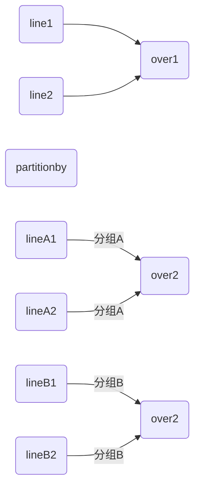

## Hive高级应用

### 1.常用内置函数

#### 1.nvl

* nvl

```
NVL：给值为NULL的数据赋值，它的格式是NVL( value，default_value)。它的功能是如果value为NULL，则NVL函数返回default_value的值，否则返回value的值，如果两个参数都为NULL ，则返回NULL。
```

#### 2.CASE WHEN THEN ELSE END

* 数据

| name        | dept_id | sex  |
| ----------- | ------- | ---- |
| kobe        | A       | f    |
| james       | A       | f    |
| harden      | B       | f    |
| curry       | A       | m    |
| tmac        | B       | m    |
| lamelo ball | B       | m    |

* 求出不同部门男女各多少人

```
select 
 dept_id,
 sum(CASE sex WHEN 'f' THEN 1 ELSE 0 END) as man,
 sum(CASE sex WHEN 'm' THEN 1 ELSE 0 END) as women
from 
 emp_sex 
group by 
 dept_id
```

#### 3.cast

```
cast(date_add('2021-06-15',-1) as string)
```


#### 4.get_json_object

```
select get_json_object('[{"name":"大郎","sex":"男","age":"25"},{"name":"西门庆","sex":"男","age":"47"}]','$[0]');
```

```
SELECT get_json_object('[{"name":"大郎","sex":"男","age":"25"},{"name":"西门庆","sex":"男","age":"47"}]',"$[0].age");
```

#### 5.coalesce

* 使用

```
COALESCE(T v1, T v2, ...)
Returns the first v that is not NULL, or NULL if all v's are NULL.
```

#### 6.date_format

* 使用

```
date_Format(date_param, 'yyyy-MM-dd')
```

#### 7.date_add

* 加减日期

```
hive (test)> select date_add('2021-06-14',-1);
2021-06-13
```

#### 8.next_day

* 取当前天的下一个周一

```
select next_day('2020-06-14','MO');
星期一到星期日的英文（Monday，Tuesday、Wednesday、Thursday、Friday、Saturday、Sunday）
```

* 取当前周的周一

```
select date_add(next_day('2020-06-14','MO'),-7);
2020-06-8
```

* 当月最后一天

```
select last_day('2020-06-14');
2020-06-30
```

#### 9.str_to_map

* Convert string to map
* str_to_map(text[, delimiter1, delimiter2])
* For delimiter1 the default separator is ',', for delimiter2 the default separator is '='.

```

```

#### 10.数据结构定义

```
1）map结构数据定义
map<string,string>
2）array结构数据定义
array<string>
3）struct结构数据定义
struct<id:int,name:string,age:int>
4）struct和array嵌套定义
array<struct<id:int,name:string,age:int>>
```

| func         | params                            | desc                                                         |
| ------------ | --------------------------------- | ------------------------------------------------------------ |
| named_struct | (name1, val1, name2, val2, ...)   | Creates a struct with the given field names and values. (As of Hive [0.8.0](https://issues.apache.org/jira/browse/HIVE-1360).) |
| struct       | (val1, val2, val3, ...)           | Creates a struct with the given field values. Struct field names will be col1, col2, .... |
| map          | (key1, value1, key2, value2, ...) | Creates a map with the given key/value pairs.                |
| array        | (val1, val2, ...)                 | Creates an array with the given elements.                    |

* reference

```
https://cwiki.apache.org/confluence/display/Hive/LanguageManual+UDF
```


#### 11.named_struct

* 定义

```
ARRAY<STRUCT<sale_attr_id:STRING,sale_attr_value_id:STRING,sale_attr_name:STRING,sale_attr_value_name:STRING>> COMMENT '销售属性'
```

* 使用

```
collect_list(named_struct('attr_id',attr_id,'value_id',value_id,'attr_name',attr_name,'value_name',value_name)) attrs
```

#### 12.array_contains

* 使用

| 返回值  | 参数                            | 描述                                      |
| ------- | ------------------------------- | ----------------------------------------- |
| boolean | array_contains(Array<T>, value) | Returns TRUE if the array contains value. |
|         |                                 |                                           |

#### 13.count & sum

* sum

```sql
将某列进行累加(如果某行的列的为null则忽略
sum(1)为1统计 ,sum(1)统计个数，功能和count（*）一样，但效率上count（*）高。所以尽量少用。
sum(0)为0不统计
sum(2)结果乘2
sum(id) 累加
```

* count

```sql
统计有效行(非null)
count(*)：所有行进行统计，包括NULL行
count(1)：所有行进行统计，包括NULL行
count(0)：所有行进行统计，包括NULL行
count(column)：对column中非Null进行统计


```

* 通用

```
count,sum都是统计汇总函数，相同点都是用来求和
```

* 不同点

```
count 一般用于统计行数，例如统计一天一共有多少人来逛街：
sum 一般用于统计某一列的总和，例如统计一天一共收入多少钱：

sum 一般用于统计某一列的总和，例如统计一天一共收入多少钱：
count + distinct (统计一个月内顾客的消费频率)
```

#### 14.last_value(Windowing function)

* last_value(field,false)

```
This takes at most two parameters. The first parameter is the column for which you want the last value, the second (optional) parameter must be a boolean which is false by default. If set to true it skips null values.
```

* 取分组内排序后，截止到当前行，最后一个值

```
first_value和last_value 见名知意,就是计算当前窗口截止当前行的第一个值和最后一个值(或者是排名的第一名个最后一名)
其实我们可以理解为取当前窗口截止当前行的最值(最大值和最小值)
这两个窗口函数其实用的不多，也没什么常见的场景
```

* 使用

```sql
-- 数据
1,销售,10000
2,销售,14000
3,销售,10000
4,后端,20000
5,后端,25000
6,后端,32000
7,AI,40000
8,AI,35000
9,AI,60000
10,数仓,20000
11,数仓,30000
12,数仓,32000
13,数仓,42000

select
    *,
    first_value(id) over(order by salary desc ) as high_id,
    last_value(id) over(order by salary desc ) as low_id
from
    ods_num_window
;
我们看到high_id一开始是9，一直到最后也是9，但是low_id呢一直在变化，这是因为我们是降序排列的，所以当只有前面第一行的时候，id 是9 的人既是工资最高的人，也是工资最低的人，但是当前面有两行的时候，工资最高的依然是第一样也是id 为9 的人，但是工资最低的却不是再是第一行了，而是第二行也就是id 为13 的人，其他的同理
https://juejin.cn/post/6916707407997435912
```

#### 15.repeat

* 使用

```
select repeat('Hive',2);
OK
HiveHive
```


#### 16.posexplode

#### 17.datediff

* 使用

```
语法: datediff(string enddate,string startdate)
返回值: int
```

#### 18.data_sub

* 语法

```
date_sub (string startdate, int days)
返回值: string
说明:返回开始日期startdate减少days天后的日期。
```

#### 19.unix_timestamp

* 英文解释
* * <mark>seconds</mark>

```
Convert time string with given pattern to Unix time stamp (in seconds) The result of this function is in seconds.
```

```
unix_timestamp() 得到当前时间戳
若无参数调用，则返回一个 Unix timestamp (‘1970-01-01 00:00:00’ GMT 之后的秒数) 作为无符号整数，得到当前时间戳

如果参数date满足yyyy-MM-dd HH:mm:ss形式，则可以直接unix_timestamp(string date) 得到参数对应的时间戳

如果参数date满足yyyy-MM-dd HH:mm:ss形式，则我们需要指定date的形式，在进行转换
unix_timestamp(‘2009-03-20’, ‘yyyy-MM-dd’)=1237532400
```


#### 20.from_unixtime

* 语法

```
from_unixtime(t1,’yyyy-MM-dd HH:mm:ss’)
其中t1是10位的时间戳值，即1970-1-1至今的秒，而13位的所谓毫秒的是不可以的。
需要截取，然后转换成bigint类型，因为from_unixtime类第一个参数只接受bigint类型
```

* 使用

```
select from_unixtime(cast(substring(tistmp,1,10) as bigint),’yyyy-MM-dd HH’) 
tim ,count(*) cn from
```

* 结合unix_timestamp

```
两个函数可以结合使用，通过from_unixtime(unix_timestamp(date_created),'yyyy-MM-dd HH:mm:ss')来规范时间的格式。
```


### 2.行转列

##### 1.concat

* concat

```sql
CONCAT(string A/col, string B/col…)：返回输入字符串连接后的结果，支持任意个输入字符串;
select concat(‘abc’,'def’,'gh’) from lxw_dual;
abcdefgh
```

##### 2.concat_ws

* concat_ws

```
CONCAT_WS(separator, str1, str2,...)：
CONCAT_WS must be "string or array<string>
```

##### 3.collect_set

*  collect_set（col）

```
COLLECT_SET(col)：函数只接受基本数据类型，它的主要作用是将某字段的值进行去重汇总，产生array类型字段
```

##### 4. collect_list //Todo

##### 5.实例

* 测试数据

| name        | constellation | blood_type |
| ----------- | ------------- | ---------- |
| kobe        | 白羊座        | A          |
| james       | 射手座        | A          |
| harden      | 白羊座        | B          |
| curry       | 白羊座        | A          |
| tmac        | 射手座        | A          |
| lamelo ball | 白羊座        | B          |

* 星座和血型一样的人归类到一起

```
select
t1.con_blood,
 concat_ws('|',collect_set(t1.name))
from 
 (select 
  name,concat_ws(',',constellation,blood_type) con_blood
 from 
  person_info)t1
group by
 t1.con_blood
```

### 4.列转行

##### 1.EXPLODE(col)

* EXPLODE

```
EXPLODE(col)：将hive一列中复杂的array或者map结构拆分成多行。
LATERAL VIEW
用法：LATERAL VIEW udtf(expression) tableAlias AS columnAlias
解释：用于和split, explode等UDTF一起使用，它能够将一列数据拆成多行数据，在此基础上可以对拆分后的数据进行聚合

```

###### 1.实例

* 数据

| movie         | category                 |
| ------------- | ------------------------ |
| 《疑犯追踪》  | 悬疑,动作,科幻,剧情      |
| 《Lie to me》 | 悬疑,警匪,动作,心理,剧情 |
| 《战狼2》     | 战争,动作,灾难           |

* 将电影分类中的数组数据展开

```
select 
 movie,
 catagory_name
from
 movie_info
lateral view
 explode(split(category,',')) movie_info_tmp as catagory_name;
```

##### 2.posexplode

* 英文解释
* 实现多列转多行

```
i am using posexplode to split single to multiple records in hive. Along with multiple records as output i need to generate sequence number for each row.

```

###### 1.实例

* 建表

```
create table if not exists test.a(
     id STRING,
     tim STRING
)
row format delimited fields terminated by '-' 
lines terminated by '\n';
load data local inpath 'opt/data/shijian.txt' into table test.a;
# 查询
hive> select * from test.a;                                           
OK
a.id	a.tim
a,b,c,d	2:00,3:00,4:00,5:00
f,b,c,d	1:10,2:20,3:30,4:40
```

* 因为该函数可以将index和数据都取出来，使用两次posexplode并令两次取到的index相等就行了。

```sql
select id,tim,single_id,single_tim from test.a 
lateral view posexplode(split(id,',')) t as single_id_index, single_id
lateral view posexplode(split(tim,',')) t as single_yim_index, single_tim
where single_id_index = single_yim_index;
# result
id		tim				single_id	single_tim
a,b,c,d	2:00,3:00,4:00,5:00		a	2:00
a,b,c,d	2:00,3:00,4:00,5:00		b	3:00
a,b,c,d	2:00,3:00,4:00,5:00		c	4:00
a,b,c,d	2:00,3:00,4:00,5:00		d	5:00
f,b,c,d	1:10,2:20,3:30,4:40		f	1:10
f,b,c,d	1:10,2:20,3:30,4:40		b	2:20
f,b,c,d	1:10,2:20,3:30,4:40		c	3:30
f,b,c,d	1:10,2:20,3:30,4:40		d	4:40
```

* 单次

```
select id,tim,single_id_index,single_id from test.a 
lateral view posexplode(split(id,',')) t as single_id_index, single_id;d;
# result
id	tim	single_id_index	single_id
a,b,c,d	2:00,3:00,4:00,5:00	0	a
a,b,c,d	2:00,3:00,4:00,5:00	1	b
a,b,c,d	2:00,3:00,4:00,5:00	2	c
a,b,c,d	2:00,3:00,4:00,5:00	3	d
f,b,c,d	1:10,2:20,3:30,4:40	0	f
f,b,c,d	1:10,2:20,3:30,4:40	1	b
f,b,c,d	1:10,2:20,3:30,4:40	2	c
f,b,c,d	1:10,2:20,3:30,4:40	3	d

```


### 5. over开窗

##### 1.over




* over

```
OVER()：指定分析函数工作的数据窗口大小，这个数据窗口大小可能会随着行的改变而变化。
CURRENT ROW：当前行
n PRECEDING：往前n行数据
n FOLLOWING：往后n行数据
UNBOUNDED：起点，
	UNBOUNDED PRECEDING 表示从前面的起点， 
    UNBOUNDED FOLLOWING表示到后面的终点
LAG(col,n,default_val)：往前第n行数据
LEAD(col,n, default_val)：往后第n行数据
NTILE(n)：把有序窗口的行分发到指定数据的组中，各个组有编号，编号从1开始，对于每一行，NTILE返回此行所属的组的编号。注意：n必须为int类型。

```

```
select name,orderdate,cost, 
sum(cost) over() as sample1,--所有行相加 
sum(cost) over(partition by name) as sample2,--按name分组，组内数据相加 
sum(cost) over(partition by name order by orderdate) as sample3,--按name分组，组内数据累加 
sum(cost) over(partition by name order by orderdate rows between UNBOUNDED PRECEDING and current row ) as sample4 ,--和sample3一样,由起点到当前行的聚合 
sum(cost) over(partition by name order by orderdate rows between 1 PRECEDING and current row) as sample5, --当前行和前面一行做聚合 
sum(cost) over(partition by name order by orderdate rows between 1 PRECEDING AND 1 FOLLOWING ) as sample6,--当前行和前边一行及后面一行 
sum(cost) over(partition by name order by orderdate rows between current row and UNBOUNDED FOLLOWING ) as sample7 --当前行及后面所有行 
from business;
```

* 数据准备

```
name,oderdate,cost
jack,2017-01-01,10
tony,2017-01-02,15
jack,2017-02-03,23
tony,2017-01-04,29
jack,2017-01-05,46
jack,2017-04-06,42
tony,2017-01-07,50
jack,2017-01-08,55
mart,2017-04-08,62
mart,2017-04-09,68
neil,2017-05-10,12
mart,2017-04-11,75
neil,2017-06-12,80
mart,2017-04-13,94
```

###### 1.实例(over)

* 查询在2017年4月份购买过的顾客及总人数

```
select 
 name,
 count(name) over()
from
 business
where
 substring(orderdate,0,7)=='2017-04';`
```

* * 由上一次进行分组聚合

```
select t1.name,count(t1.name)
from
(select *
from business
where substring(orderdate,0,7)=='2017-04')t1
group by t1.name
```

```
select name,count(name)
from business
where substring(orderdate,0,7)=='2017-04'
 group by name
```

* 查询顾客的购买明细及月购买总额

```
 select 
  name,
  cost ,
  orderdate,
  sum(cost) over(partition by month(orderdate) )
 from
  business
```

* 查询顾客的购买明细及每个顾客的月购买总额

```
//错误sql，不可在over函数之外做排序不然sum还是会计算整个1月份的总和，也就是over函数控制了sum的相加
 select name,orderdate,cost,
  sum(cost) over(partition by month(orderdate),name)
 from business
 order by name,orderdate;
```

```
 //分区
 select 
  name,orderdate,cost,
  sum(cost) over(partition by month(orderdate),name) 
 from
  business
 order by name,orderdate;
```

*  将每个顾客的cost按照日期进行累加

```
select 
 name,orderdate,cost,
 sum(cost) over(partition by name order by orderdate)
from
 business
```

* 查看顾客上次的购买时间

```
select
   name,
   cost, 
   orderdate c_orderdate,
   lag(orderdate ,1 ,'1970-01-01') over(partition by name  order by orderdate) p_orderdate,
   lead(orderdate ,1 ,'9999-01-01') over(partition by name  order by orderdate) p_orderdate
from 
  business
```

* 查询前20%时间的订单信息

```
select 
  t1.name, 
  t1.orderdate,
  t1.cost ,
  t1.gid
from 
(select
  name, 
  orderdate,
  cost, 
  ntile(5) over(order by orderdate ) gid
from 
  business) t1
where t1.gid = 1 ; 
```

* 总结

```
over(): 会为每条数据都开启一个窗口. 默认的窗口大小就是当前数据集的大小.
over(partition by ....) : 会按照指定的字段进行分区， 将分区字段的值相同的数据划分到相同的区。
                          每个区中的每条数据都会开启一个窗口.每条数据的窗口大小默认为当前分区数据集的大小.
over(order by ....) : 会在窗口中按照指定的字段对数据进行排序. 会为每条数据都开启一个窗口,默认的窗口大小为从数据集开始到当前行.  

over(partition by .... order by ....) :会按照指定的字段进行分区， 将分区字段的值相同的数据划分到相同的区,在每个区中会按照指定的字段进行排序. 会为每条数据都开启一个窗口,默认的窗口大小为当前分区中从数据集开始到当前行.                                             
over(partition by ... order by ... rows between ... and ....) : 指定每条数据的窗口大小.

```

##### 2.lead

##### 3.last_value

###  6. 关键字分类

* 分类

```
  order by :       全局排序 或者 窗口函数中排序.
  partition by :   窗口函数中分区

  distribute by :  分区 
  sort by :        区内排序
  cluster by :     分区排序
  
  partitioned by : 建表指定分区字段
  clustered by :   建表指定分桶字段
```

### 7.排名

#### 1.rank

* rank,排序相同时会重复，总数不会变

#### 2.dense_rank

* dense_rank:排序相同时会重复，总数会减少

#### 3.row_number

* row_number:会根据顺序计算

#### 4.案例

* 表结构

```
name	subject		score
```

* sql

```
select name,
subject,
score,
rank() over(partition by subject order by score desc) rp,
dense_rank() over(partition by subject order by score desc) drp,
row_number() over(partition by subject order by score desc) rmp
from score;

```

| name  | subject  | score  | rk  | drk  | rn  |
+-------+----------+--------+-----+------+-----+
| aa  | 数学       | 95     | 1   | 1    | 1   |
| cc    | 数学       | 86     | 2   | 2    | 2   |
|bb   | 数学       | 85     | 3   | 3    | 3   |
| dd    | 数学       | 56     | 4   | 4    | 4   |
| cc    | 英语       | 84     | 1   | 1    | 1   |
| dd    | 英语       | 84     | 1   | 1    | 2   |
| bb   | 英语       | 78     | 3   | 2    | 3   |
| aa  | 英语       | 68     | 4   | 3    | 4   |
| dd    | 语文       | 94     | 1   | 1    | 1   |
| aa  | 语文       | 87     | 2   | 2    | 2   |
| bb    | 语文       | 65     | 3   | 3    | 3   |
| cc    | 语文       | 64     | 4   | 4    | 4   |