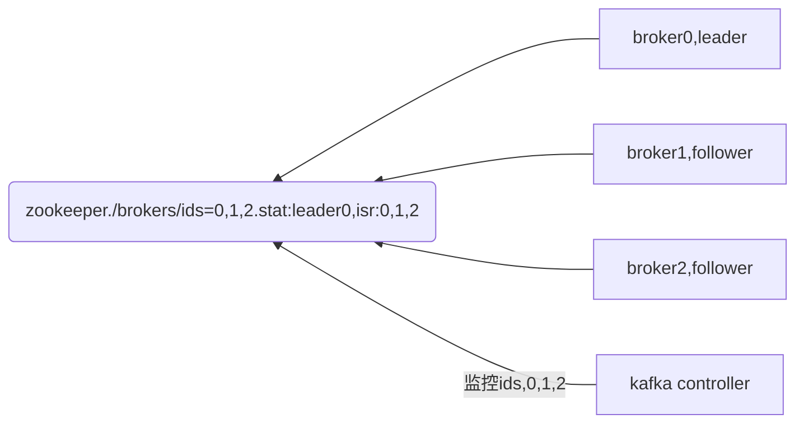
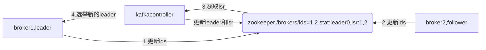

## kafka进阶

### 1.kafka架构

#### 1.topic & partition & broker

* topic

```
Kafka中消息是以topic进行分类的，生产者生产消息，消费者消费消息，都是面向topic的。
topic是逻辑上的概念，而partition是物理上的概念
```

* broker

```
每个 Broker 即一个 Kafka 服务实例，多个 Broker 构成一个 Kafka 集群
Broker集群中，会有一个leader（controller leader），负责管理整个集群中分区和副本的状态和选举partition leader
```

* partition

- ```
  每个partition都有相应的副本数，所以就有了 leader副本和follower副本的区别
  一个 Topic 可以分为多个 Partition，每个 Partition 是一个有序的队列，Partition 中的每条消息都存在一个有序的偏移量（Offest） ，同一个 Consumer Group 中，只有一个 Consumer 实例可消费某个 Partition 的消息。
  partion可以看作一个有序的队列，里面的数据是储存在硬盘中的，追加式的。partition的作用就是提供分布式的扩展，一个topic可以有许多partions，多个partition可以并行处理数据，所以可以处理相当量的数据。只有partition的leader才会进行读写操作，folower仅进行复制，客户端是感知不到的。
  ```


- ```
  每个partition对应于一个log文件，该log文件中存储的就是producer生产的数据。Producer生产的数据会被不断追加到该log文件末端，且每条数据都有自己的offset。消费者组中的每个消费者，都会实时记录自己消费到了哪个offset，以便出错恢复时，从上次的位置继续消费。
  ```


####  2.kafka文件系统机制

##### 1.架构图片


##### 2.segment介绍

* **原理描述**

```
生产的消息会不断追加到log文件末尾，为防止log文件过大导致数据定位效率低下，
Kafka采取了分片和索引机制，将每个partition分为多个segment。每个segment对应两个文件——“.index”文件和“.log”文件。
这些文件位于一个文件夹下，该目录的命名规则为：topic名称+分区序号。例如，first这个topic有三个分区，则其对应的目录为first-0,first-1,first-2。

```

* index文件

```
index以当前segment的第一条消息的offset命名
```

* timeindex

```
以时间做index分割
```

* log文件

```
log文件以当前segment的第一条消息的offset命名
索引文件中的元数据指向对应数据文件中message的物理偏移地址
由于一个文件太大会产生问题（产生多个segment）
```

##### 3.kafka高效读写

```
Kafka的producer生产数据，要写入到log文件中，写的过程是一直追加到文件末端，为顺序写。官网有数据表明，同样的磁盘，顺序写能到到600M/s，而随机写只有100k/s。这与磁盘的机械机构有关，顺序写之所以快，是因为其省去了大量磁头寻址的时间
```

##### 5.持久化

```
Kafka数据持久化是直接持久化到Pagecache中，这样会产生以下几个好处： 
	I/O Scheduler 会将连续的小块写组装成大块的物理写从而提高性能
	I/O Scheduler 会尝试将一些写操作重新按顺序排好，从而减少磁盘头的移动时间
	充分利用所有空闲内存（非 JVM 内存）。如果使用应用层 Cache（即 JVM 堆内存），会增加 GC 负担
	读操作可直接在 Page Cache 内进行。如果消费和生产速度相当，甚至不需要通过物理磁盘（直接通过 Page Cache）交换数据
	如果进程重启，JVM 内的 Cache 会失效，但 Page Cache 仍然可用
尽管持久化到Pagecache上可能会造成宕机丢失数据的情况，但这可以被Kafka的Replication机制解决。如果为了保证这种情况下数据不丢失而强制将 Page Cache 中的数据 Flush 到磁盘，反而会降低性能。

```

#### 3.Kafka Producer

##### 1.分区策略

* 分区原则

```
我们需要将producer发送的数据封装成一个ProducerRecord对象。
```

* partition参数

```
指明 partition 的情况下，直接将指明的值直接作为 partiton 值；
```

* key参数

```
没有指明 partition 值但有 key 的情况下，将 key 的 hash 值与 topic 的 partition 数进行取余得到 partition 值；（哈希尽可能让类似的key聚集到同一个分区）
```

* key,partition are both 空

```
既没有 partition 值又没有 key 值的情况下，采用粘性分区策略：首条消息随机分区，从第二条消息开始，看是否能和上一条消息构成batch，如果可以则采用上一条消息的分区，否则随机获得新的分区。（按batch进行随机分区）。
```

##### 2.leader选举机制，isr介绍

* 保证可靠性

```
topic的每个partition收到producer发送的数据后，都需要向producer发送ack（acknowledgement确认收到），如果producer收到ack，就会进行下一轮的发送，否则重新发送数据。
```

###### 1.副本数据同步策略 

| **方案**                        | **优点**                                           | **缺点**                                            |
| ------------------------------- | -------------------------------------------------- | --------------------------------------------------- |
| **半数以上完成同步，就发送ack** | 延迟低                                             | 选举新的leader时，容忍n台节点的故障，需要2n+1个副本 |
| **全部完成同步，才发送ack**     | 选举新的leader时，容忍n台节点的故障，需要n+1个副本 | 延迟高                                              |

```
Kafka选择了第二种方案，原因如下：
（1）同样为了容忍n台节点的故障，第一种方案需要2n+1个副本，而第二种方案只需要n+1个副本，而Kafka的每个分区都有大量的数据，第一种方案会造成大量数据的冗余。
（2）虽然第二种方案的网络延迟会比较高，但网络延迟对Kafka的影响较小。

```

* leader & follower

```
kafka每个分区都有一个单独的leader，0个或多个follower。副本的总数包括leader。所有的读取和写入到该分区的leader。通常，分区数比broker多，leader均匀分布在broker。follower的日志完全等同于leader的日志 — 相同的顺序相同的偏移量和消息（当然，在任何一个时间点上，leader比follower多几条消息，尚未同步到follower）
```

* lsr leader选举机制

```
Topic: first	PartitionCount: 4	ReplicationFactor: 3	Configs: 
	Topic: first	Partition: 1	Leader: 1	Replicas: 1,2,0	Isr: 1,2,0
# 关闭partition1(hadoop1)的kafka ，观察leader的变化，isr中顺序代替
# kafka-topics.sh --bootstrap-server hadoop0:9092 --describe --topic first
Topic: first	PartitionCount: 4	ReplicationFactor: 3	Configs: 
	Topic: first	Partition: 1	Leader: 2	Replicas: 1,2,0	Isr: 2,0
```

###### 2. Isr

* 问题分析

```
leader收到数据，所有follower都开始同步数据，但有一个follower，因为某种故障，迟迟不能与leader进行同步，那leader就要一直等下去，直到它完成同步，才能发送ack。这个问题怎么解决呢？
```

* 如何解决上述问题

```
Leader维护了一个动态的in-sync replica set (ISR)，意为和leader保持同步的follower集合。当ISR中的follower完成数据的同步之后，leader就会给producer发送ack。如果follower长时间未向leader同步数据，则该follower将被踢出ISR，该时间阈值由replica.lag.time.max.ms参数设定。Leader发生故障之后，就会从ISR中选举新的leader。
```

* leo,hw

```
Replica对象都有很多属性或字段，和本文相关的是LEO、remote LEO和HW
leo:每个副本最后一个offset
hw:所有副本最小的leo
hw=leo 故障机器才可以回归
```

* leader & follower故障问题处理

```
（1）follower故障
follower发生故障后会被临时踢出ISR，待该follower恢复后，follower会读取本地磁盘记录的上次的HW，并将log文件高于HW的部分截取掉，从HW开始向leader进行同步。等该follower的LEO大于等于该Partition的HW，即follower追上leader之后，就可以重新加入ISR了。
（2）leader故障
leader发生故障之后，会从ISR中选出一个新的leader，之后，为保证多个副本之间的数据一致性，其余的follower会先将各自的log文件高于HW的部分截掉，然后从新的leader同步数据。
注意：这只能保证副本之间的数据一致性，并不能保证数据不丢失或者不重复

```


###### 3.ack应答机制

* ack三种设置

```
acks：
0：producer不等待broker（分区在broker上）的ack，这一操作提供了一个最低的延迟，broker一接收到还没有写入磁盘就已经返回，当broker故障时有可能丢失数据；
1：producer等待broker的ack，partition的leader落盘成功后返回ack，如果在follower同步成功之前leader故障，那么将会丢失数据；
-1（all）：producer等待broker的ack，partition的leader和follower全部落盘成功后才返回ack。但是如果在follower同步完成后，broker发送ack之前，leader发生故障，那么会造成数据重复
```

###### 4. Exactly Once

* at least one

```
服务器的ACK级别设置为-1，可以保证Producer到Server之间不会丢失数据，即At Least Once语义
```

* 幂等性（做多次和做一次是相同的）

```
0.11版本的Kafka，引入了一项重大特性：幂等性。所谓的幂等性就是指Producer不论向Server发送多少次重复数据，Server端都只会持久化一条。幂等性结合At Least Once语义，就构成了Kafka的Exactly Once语义。即：
```

* exactly once

```
At Least Once + 幂等性 = Exactly Once
```

```
只需要将Producer的参数中enable.idompotence设置为true即可。Kafka的幂等性实现其实就是将原来下游需要做的去重放在了数据上游。开启幂等性的Producer在初始化的时候会被分配一个PID，发往同一Partition的消息会附带Sequence Number。而Broker端会对<PID, Partition, SeqNumber>做缓存，当具有相同主键的消息提交时，Broker只会持久化一条。
但是PID重启就会变化，同时不同的Partition也具有不同主键，所以幂等性无法保证跨分区跨会话的Exactly Once

```

#### 4.Kafka consumer

##### 1.获取数据模式

* pull模式

```
consumer采用pull（拉）模式从broker中读取数据，
pull模式则可以根据consumer的消费能力以适当的速率消费消息。
```

* pull缺点

```
如果kafka没有数据，消费者可能会陷入循环中，一直返回空数据。针对这一点，Kafka的消费者在消费数据时会传入一个时长参数timeout，如果当前没有数据可供消费，consumer会等待一段时间之后再返回，这段时长即为timeout
```

##### 2.分区分配策略

* 概况

```
Kafka有3种分配策略，一是roundrobin，一是range，一是sticky。
```

* 默认分配策略

```
Kafka 提供了消费者客户端参数 partition.assignment.strategy 用来设置消费者与订阅主题之间的分区分配策略。默认情况下，此参数的值为：org.apache.kafka.clients.consumer.RangeAssignor，即采用 RangeAssignor 分配策略
```

###### 1.range

* range

```
RangeAssignor 策略的原理是按照消费者总数和分区总数进行整除运算来获得一个跨度，然后将分区按照跨度进行平均分配，以保证分区尽可能均匀地分配给所有的消费者
```

```
消费者c0：t0p0、t0p1、t1p0、t1p1
消费者c1：t0p2、t1p2
容易出现数据倾斜，导致一个消费过多
```

###### 2. roundrobin

* roundrobin

```
RoundRobinAssignor 策略的原理是将消费组内所有消费者以及消费者所订阅的所有 Topic 的 Partition 按照字典序排序，然后通过轮询方式逐个将分区依次分配给每个消费者
```

* roundrbin缺点

```
如果新增加一个消费者，那么要进行大规模的数据移动
```

###### 3. sticky

* sticky

```
Sticky”这个单词可以翻译为“粘性的”，Kafka从0.11.x版本开始引入这种分配策略，它主要有两个目的：

分区的分配要尽可能的均匀。
分区的分配尽可能的与上次分配的保持相同。
```

* stick理论

```
StickyAssignor 策略如同其名称中的“sticky”一样，让分配策略具备一定的“粘性”，尽可能地让前后两次分配相同，进而减少系统资源的损耗以及其它异常情况的发生。
```

* sticky实验

我们举例来看一下 StickyAssignor 策略的实际效果。
假设消费组内有 3 个消费者：c0、c1 和 c2，它们都订阅了4个主题：t0、t1、t2、t3，并且每个主题有 2 个分区，也就是说整个消费组订阅了 t0p0、t0p1、t1p0、t1p1、t2p0、t2p1、t3p0、t3p1 这 8 个分区。最终的分配结果如下：

```
消费者c0：t0p0、t1p1、t3p0
消费者c1：t0p1、t2p0、t3p1
消费者c2：t1p0、t2p1
```

这样初看上去似乎与采用 RoundRobinAssignor 策略所分配的结果相同，但事实是否真的如此呢？再假设此时消费者 c1 脱离了消费组，那么消费组就会执行再平衡操作，进而消费分区会重新分配。如果采用 RoundRobinAssignor 策略，那么此时的分配结果如下：

```
消费者c0：t0p0、t1p0、t2p0、t3p0
消费者c2：t0p1、t1p1、t2p1、t3p1
```

如分配结果所示，RoundRobinAssignor 策略会按照消费者 c0和 c2 进行重新轮询分配。

而如果此时使用的是 StickyAssignor 策略，那么分配结果为：

```
消费者c0：t0p0、t1p1、t3p0、t2p0
消费者c2：t1p0、t2p1、t0p1、t3p1
```

可以看到分配结果中保留了上一次分配中对于消费者 c0 和 c2 的所有分配结果，并将原来消费者 c1 的“负担”分配给了剩余的两个消费者 c0 和 c2，最终 c0 和 c2 的分配还保持了均衡。

如果发生分区重分配，那么对于同一个分区而言有可能之前的消费者和新指派的消费者不是同一个，对于之前消费者进行到一半的处理还要在新指派的消费者中再次复现一遍，这显然很浪费系统资源。
StickyAssignor 策略如同其名称中的“sticky”一样，让分配策略具备一定的“粘性”，尽可能地让前后两次分配相同，进而减少系统资源的损耗以及其它异常情况的发生。

到目前为止所分析的都是消费者的订阅信息都是相同的情况，我们来看一下订阅信息不同的情况下的处理。

举例，同样消费组内有 3 个消费者：c0、c1 和 c2，集群中有3个主题：t0、t1 和 t2，这3个主题分别有 1、2、3 个分区，也就是说集群中有 t0p0、t1p0、t1p1、t2p0、t2p1、t2p2 这 6 个分区。消费者 c0 订阅了主题 t0，消费者 c1 订阅了主题 t0 和 t1，消费者 c2 订阅了主题 t0、t1 和 t2。
如果此时采用 RoundRobinAssignor 策略，那么最终的分配结果如下所示（和讲述RoundRobinAssignor策略时的一样，这样不妨赘述一下）：

```
消费者c0：t0p0
消费者c1：t1p0
消费者c2：t1p1、t2p0、t2p1、t2p2
```

如果此时采用的是 StickyAssignor 策略，那么最终的分配结果为：

```
消费者C0：t0p0
消费者C1：t1p0、t1p1
消费者C2：t2p0、t2p1、t2p2
```

可以看到这是一个最优解（消费者 c0 没有订阅主题 t1 和t2，所以不能分配主题 t1 和 t2 中的任何分区给它，对于消费者 c1 也可同理推断）。

假如此时消费者c0脱离了消费组，那么RoundRobinAssignor策略的分配结果为：

```
消费者c1：t0p0、t1p1
消费者c2：t1p0、t2p0、t2p1、t2p2
```

可以看到 RoundRobinAssignor 策略保留了消费者 c1 和 c2 中原有的 3 个分区的分配：t2p0、t2p1 和 t2p2（针对结果集1）。

而如果采用的是StickyAssignor策略，那么分配结果为：

```
消费者C1：t1p0、t1p1、t0p0
消费者C2：t2p0、t2p1、t2p2
```

可以看到 StickyAssignor 策略保留了消费者 c1 和 c2 中原有的 5 个分区的分配：t1p0、t1p1、t2p0、t2p1、t2p2。
从结果上看 StickyAssignor 策略比另外两者分配策略而言显得更加的优异，这个策略的代码实现也是异常复杂。

##### 3.offset维护

```
consumer在消费过程中可能会出现断电宕机等故障，consumer恢复后，需要从故障前的位置的继续消费，所以consumer需要实时记录自己消费到了哪个offset，以便故障恢复后继续消费。
Kafka 0.9版本之前，consumer默认将offset保存在Zookeeper中，从0.9版本开始，consumer默认将offset保存在Kafka一个内置的topic中，该topic为__consumer_offsets。
```

###### 1.auto.offset.reset默认是latest。

* 含义

```
一，latest和earliest区别

1，earliest 当各分区下有已提交的offset时，从提交的offset开始消费；无提交的offset时，从头开始消费

2，latest 当各分区下有已提交的offset时，从提交的offset开始消费；无提交的offset时，消费新产生的该分区下的数据
```

###### 2.offset详解

* Offset从语义上来看拥有两种：Current Offset和Committed Offset

```
总结一下，Current Offset是针对Consumer的poll过程的，它可以保证每次poll都返回不重复的消息；而Committed Offset是用于Consumer Rebalance过程的，它能够保证新的Consumer能够从正确的位置开始消费一个partition，从而避免重复消费。
```

* current offset

```
Current Offset保存在Consumer客户端中，它表示Consumer希望收到的下一条消息的序号。它仅仅在poll()方法中使用。例如，Consumer第一次调用poll()方法后收到了20条消息，那么Current Offset就被设置为20。这样Consumer下一次调用poll()方法时，Kafka就知道应该从序号为21的消息开始读取。这样就能够保证每次Consumer poll消息时，都能够收到不重复的消息
```

* committed offset

```
Committed Offset保存在Broker上，它表示Consumer已经确认消费过的消息的序号。主要通过commitSync和commitAsync
API来操作。举个例子，Consumer通过poll() 方法收到20条消息后，此时Current Offset就是20，经过一系列的逻辑处理后，并没有调用consumer.commitAsync()或consumer.commitSync()来提交Committed Offset，那么此时Committed Offset依旧是0。

Committed Offset主要用于Consumer Rebalance。在Consumer Rebalance的过程中，一个partition被分配给了一个Consumer，那么这个Consumer该从什么位置开始消费消息呢？答案就是Committed Offset。另外，如果一个Consumer消费了5条消息（poll并且成功commitSync）之后宕机了，重新启动之后它仍然能够从第6条消息开始消费，因为Committed Offset已经被Kafka记录为5。
```

* 摘自博客https://www.jianshu.com/p/449074d97daf

### 2. zookeeper

#### 1.zk作用

##### 1.controller

* zk选举controller

```
Kafka集群中有一个broker会被选举为Controller，负责管理集群broker的上下线
```

* zk选举leader

```
controller负责所有topic的分区副本分配和leader选举等工作。
Controller的管理工作都是依赖于Zookeeper的。
```

##### 2.选举过程

* partition选举过程


* 当broker0机器宕机，选举过程




### 总结

```
producer--data--topic-->partition-->leader partition--->follower副本-->返回ack-->pagecache-->落地磁盘
```

### mmap

```
后期整理
```

### sendfile

```
后期整理
```

