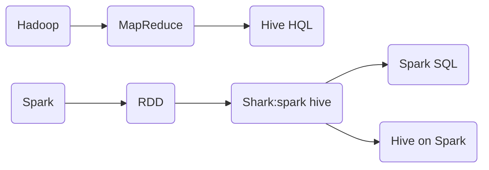

# sparksql

## 前言

* spark sql 原理

```
spark sql提供2个数据抽象。DataFrame,DataSet
DataFrame:只关心数据结构，不关心数据类型
DataSet:面向对象访问
```

* spark sql

```
是用于数据化结构处理的spark模块
1）半结构化数据（日志，json）
2）结构化数据(数据库数据)
```


## 一.理论基础

* hive on spark  && spark on hive



* hive on spark

```
Hive既作为存储元数据又负责sql的解析优化，语法是Hql

```

* spark on hive

```
Hive只作为存储元数据，spark负责sql解析，语法是spark Sql,spark负责采用RDD执行
```

* catalyist

```
spark sql  -->catalyst
```


### 1.DataFrame

#### 1.DF概述

```
在Spark中，DataFrame是一种以RDD为基础的分布式数据集，类似于传统数据库中的二维表格。DataFrame与RDD的主要区别在于，前者带有schema元信息，即DataFrame所表示的二维表数据集的每一列都带有名称和类型。这使得Spark SQL得以洞察更多的结构信息，从而对藏于DataFrame背后的数据源以及作用于DataFrame之上的变换进行了针对性的优化，最终达到大幅提升运行时效率的目标。反观RDD，由于无从得知所存数据元素的具体内部结构，Spark Core只能在stage层面进行简单、通用的流水线优化。
同时，与Hive类似，DataFrame也支持嵌套数据类型（struct、array和map）。从 API 易用性的角度上看，DataFrame API提供的是一套高层的关系操作，比函数式的RDD API 要更加友好，门槛更低。
```

#### 2.DF diff RDD

* RDD[Person]  diff  DF[name: String,age:Int,height:Double]

```
RDD[Person]虽然以Person为类型参数，但Spark框架本身不了解Person类的内部结构。而右侧的DataFrame却提供了详细的结构信息，使得 Spark SQL 可以清楚地知道该数据集中包含哪些列，每列的名称和类型各是什么。
DataFrame是为数据提供了Schema的视图。可以把它当做数据库中的一张表来对待
DataFrame也是懒执行的，但性能上比RDD要高，主要原因：优化的执行计划，即查询计划通过Spark catalyst optimiser进行优化。比如下面一个例子:
```

* RDD diff DF 效率（user2.join(user1).filiter）

```
  为了说明查询优化构造了两个DataFrame，将它们join之后又做了一次filter操作。如果原封不动地执行这个执行计划，最终的执行效率是不高的。因为join是一个代价较大的操作，也可能会产生一个较大的数据集。如果我们能将filter下推到 join下方，先对DataFrame进行过滤，再join过滤后的较小的结果集，便可以有效缩短执行时间。而Spark SQL的查询优化器正是这样做的。简而言之，逻辑查询计划优化就是一个利用基于关系代数的等价变换，将高成本的操作替换为低成本操作的过程。
```

### 2.DataSet

#### 1.DS概述

```
DataSet是分布式数据集合。DataSet是Spark 1.6中添加的一个新抽象，是DataFrame的一个扩展。它提供了RDD的优势（强类型，使用强大的lambda函数的能力）以及Spark SQL优化执行引擎的优点。DataSet也可以使用功能性的转换（操作map，flatMap，filter等等）。
	DataSet是DataFrame API的一个扩展，是SparkSQL最新的数据抽象
	用户友好的API风格，既具有类型安全检查也具有DataFrame的查询优化特性；
	用样例类来对DataSet中定义数据的结构信息，样例类中每个属性的名称直接映射到DataSet中的字段名称；
	DataSet是强类型的。比如可以有DataSet[Car]，DataSet[Person]。
	DataFrame是DataSet的特列，DataFrame=DataSet[Row] ，所以可以通过as方法将DataFrame转换为DataSet。Row是一个类型，跟Car、Person这些的类型一样，所有的表结构信息都用Row来表示。获取数据时需要指定顺序

```

## 二.sprak sql  code

### 1.spark Session

```
SparkSession是Spark最新的SQL查询起始点，实质上是SQLContext和HiveContext的组合，所以在SQLContex和HiveContext上可用的API在SparkSession上同样是可以使用的。

SparkSession内部封装了SparkContext，所以计算实际上是由sparkContext完成的。当我们使用 spark-shell 的时候, spark框架会自动的创建一个名称叫做spark的SparkSession对象, 就像我们以前可以自动获取到一个sc来表示SparkContext对象一样
```

```
SparkSession是创建DataFrame和执行SQL的入口

```

### 2.DataFrame

#### 1.DF create

##### a. Spark的数据源创建

* spark支持创建文件的数据源格式

```scala
scala>spark.read.
    csv   format   jdbc   json   load   option   options   orc   parquet   schema   table   text   textFile
```

* json读取(如果存在)，创建DataFrame

```
scala> val df = spark.read.json("data/user.json")
	DataFrame = [age: bigint， username: string]
```

```
如果从内存中获取数据，spark可以知道数据类型具体是什么。如果是数字，默认作为Int处理；但是从文件中读取的数字，不能确定是什么类型，所以用bigint接收，可以和Long类型转换，但是和Int不能进行转换
```

##### b. 从存在的RDD转换；

* idea引包(spark-shell自动引入)

```
// spark是创建的SparkSession对象的变量名称
import spark.implicits._
```

* 文件RDD to DF

```scala
scala> val idRDD = sc.textFile("data/id.txt")
scala> idRDD.toDF("id").show
+---+
| id|
+---+
|  1|
```

* 样例类将RDD转换为DataFrame

```scala
scala> case class User(name:String, age:Int)
defined class User
scala> sc.makeRDD(List(("zhangsan",30), ("lisi",40))).map(t=>User(t._1, t._2)).toDF.show
+--------+---+
|     name|age|
+--------+---+

//DF转换RDD,此时得到的RDD存储类型为Row
scala>df.rdd
```

##### c. 从Hive Table查询返回 //TODO

#### 2.DF Sql

##### 1.sql语法风格

```
这种风格的查询必须要有临时视图或者全局视图来辅助
```

##### 2.view

```
对特定表的数据的查询结果重复使用。View只能查询，不能修改和插入
```

* 普通临时表

```scala
scala> val df = spark.read.json("data/user.json")
scala> df.createOrReplaceTempView("people")
scala> val sqlDF = spark.sql("SELECT * FROM people")
	sqlDF: org.apache.spark.sql.DataFrame = [age: bigint， name: string]
scala> sqlDF.show
```

```
普通临时表是Session范围内的，如果想应用范围内有效，可以使用全局临时表。使用全局临时表时需要全路径访问，如：global_temp.people
```


### 3.DataSet

* 查询

```
sql
dls
rdd算子
```

#### 1.DataSet create

##### a. 样例类创建DS

```scala
scala> case class Person(name: String, age: Long)
scala> val caseClassDS = Seq(Person("zhangsan",2)).toDS()
	caseClassDS: org.apache.spark.sql.Dataset[Person] = [name: string, age: Long]
scala> caseClassDS.show
+---------+---+
|     name|age|
+---------+---+
| zhangsan|  2|
+---------+---+
```

##### b. 基本类型序列创建DS

* 很少用到把序列转换成DataSet，更多的是通过RDD来得到DataSet

```scala
scala> val ds = Seq(1,2,3,4,5).toDS
	ds: org.apache.spark.sql.Dataset[Int] = [value: int]
scala> ds.show
+-----+
|value|
+-----+
|    1|
...
+-----+

```

##### c. RDD转换DS

* SparkSQL能够自动将包含有case类的RDD转换成DataSet

```scala
scala> case class User(name:String, age:Int)
scala> sc.makeRDD(List(("zhangsan",30), ("lisi",49))).map(t=>User(t._1, t._2)).toDS
res11: org.apache.spark.sql.Dataset[User] = [name: string, age: int]

//DS转换RDD
scala>res11.rdd
```

### 4.DS & DF 相互转换

* DataFrame转换为DataSet

```scala
scala> case class User(name:String, age:Int)
defined class User

scala> val df = sc.makeRDD(List(("zhangsan",30), ("lisi",49))).toDF("name","age")
df: org.apache.spark.sql.DataFrame = [name: string, age: int]

scala> val ds = df.as[User]
ds: org.apache.spark.sql.Dataset[User] = [name: string, age: int]
```

* DataSet转换为DataFrame

```scala
scala> val ds = df.as[User]
ds: org.apache.spark.sql.Dataset[User] = [name: string, age: int]

scala> val df = ds.toDF
df: org.apache.spark.sql.DataFrame = [name: string, age: int]
```

### 5.udf

* example

```scala
//{"username":"tmac","age":"43"}
// 创建
    val df = spark.read.json("data/sql.json")
// 注册
    val addName = spark.udf.register("addName",(x:String,y:String)=> x+y)
// 创建临时表
    df.createOrReplaceTempView("userInfo")
// 应用
    val frame = spark.sql("select addName(age,username) as new_Column from userInfo")
    frame.show()
```

### 6.udaf

#### 1.累加器的应用

* 平均年龄

```scala
val res = sc.makeRDD(List(("zhangsan", 20), ("lisi", 30), ("wangw", 40)))
    val acc = new MyAC()
    sc.register(acc, "testkobe")
    res.map(
      elem => {
        elem._2
      }
    ).foreach(
      word => {
        // TODO 将单词放入到累加器中
        acc.add(word)
      }
    )
    println(acc.value)
  }
  class MyAC extends AccumulatorV2[Int,Int]{
    var sum = 0
    var count = 0
    override def isZero: Boolean = {
      sum==0 && count ==0
    }
    override def copy(): AccumulatorV2[Int, Int] = {
      val c = new MyAC
      c.sum = this.sum
      c.count = this.count
      c
    }
    override def reset(): Unit = {
      sum = 0
      count = 0
    }
    override def add(v: Int): Unit = {
      sum+=v
      count+=1
    }
    override def merge(other: AccumulatorV2[Int, Int]): Unit = {
      other match {
        case o:MyAC=>{
          sum+=o.sum
          count+=o.count
        }
      }
    }
    override def value: Int = sum/count
  }
```

#### 2.RDD应用

* 平均年龄

```scala
val res: (Int, Int) = sc.makeRDD(List(("zhangsan", 20), ("lisi", 30), ("wangw", 40))).map {
  case (name, age) => {
    (age, 1)
  }
}.reduce {
  (t1, t2) => {
    (t1._1 + t2._1, t1._2 + t2._2)
  }
}
println(res._1/res._2)

```

#### 3.Aggregator

* 应用
* import org.apache.spark.sql.expressions.Aggregator 

```scala
	val sparkSession: SparkSession = SparkSession.builder()
      .master("local[2]")
      .appName("SparkSQL")
      .getOrCreate()
    import sparkSession.implicits._
    val df: DataFrame = sparkSession.read.json("data/sql.json")
    val ds: Dataset[User01] = df.as[User01]
    var myAgeUdaf1 = new MyAveragUDAF1
    val col = myAgeUdaf1.toColumn
    ds.select(col).show()
    sparkSession.close()
  }
}
case class User01(username:String,age:Long)
//缓存类型
case class AgeBuffer(var sum:Long,var count:Long)


class MyAveragUDAF1 extends Aggregator[User01,AgeBuffer,Double]{
  override def zero: AgeBuffer = {
    AgeBuffer(0L,0L)
  }

  override def reduce(b: AgeBuffer, a: User01): AgeBuffer = {
    b.sum = b.sum + a.age
    b.count = b.count + 1
    b
  }

  override def merge(b1: AgeBuffer, b2: AgeBuffer): AgeBuffer = {
    b1.sum = b1.sum + b2.sum
    b1.count = b1.count + b2.count
    b1
  }

  override def finish(buff: AgeBuffer): Double = {
    buff.sum.toDouble/buff.count
  }
  //DataSet默认额编解码器，用于序列化，固定写法
  //自定义类型就是product自带类型根据类型选择
  override def bufferEncoder: Encoder[AgeBuffer] = {
    Encoders.product
  }

  override def outputEncoder: Encoder[Double] = {
    Encoders.scalaDouble
  }
}
```

## 三.加载和保存

* 默认格式

```
SparkSQL默认读取和保存的文件格式为parquet
```

### 1.加载数据

#### a. spark.read.load

* spark.read.load 是加载数据到DF通用方法

```scala
scala> spark.read.format("…")[.option("…")].load("…")
	format("…")：指定加载数据类型，包括"csv"、"jdbc"、"json"、"orc"、"parquet"和"textFile"。
	load("…")：在"csv"、"jdbc"、"json"、"orc"、"parquet"和"textFile"格式下需要传入加载数据的路径。
	option("…")：在"jdbc"格式下需要传入JDBC相应参数，url、user、password和dbtable
```

* 直接文件查询

```scala
scala>spark.sql("select * from json.`/opt/module/data/user.json`").show
```


### 2.保存数据

#### b. df.write.save 

* 是保存数据的通用方法

```scala
scala>df.write.format("…")[.option("…")].save("…")
	format("…")：指定保存的数据类型，包括"csv"、"jdbc"、"json"、"orc"、"parquet"和"textFile"。
	save ("…")：在"csv"、"orc"、"parquet"和"textFile"格式下需要传入保存数据的路径。
	option("…")：在"jdbc"格式下需要传入JDBC相应参数，url、user、password和dbtable
```

* saveMode

```scala
// 保存操作可以使用 SaveMode, 用来指明如何处理数据，使用mode()方法来设置。这些 SaveMode 都是没有加锁的, 也不是原子操作
df.write.mode("append").json("/opt/module/data/output")
```

| Scala/Java                      | Any Language     | Meaning                    |
| ------------------------------- | ---------------- | -------------------------- |
| SaveMode.ErrorIfExists(default) | "error"(default) | 如果文件已经存在则抛出异常 |
| SaveMode.Append                 | "append"         | 如果文件已经存在则追加     |
| SaveMode.Overwrite              | "overwrite"      | 如果文件已经存在则覆盖     |
| SaveMode.Ignore                 | "ignore"         | 如果文件已经存在则忽略     |

### 3.mysql

* 读取和写入

```scala
	//读取JDBC数据库
    val frame: DataFrame = sparkSession.read
      .format("jdbc")
      .options(Map(
        "url" -> "jdbc:mysql://hadoop105:3306/test",
        "user" -> "root",
        "useSSL" -> "false",
        "charset" -> "utf8",
        "password" -> "000000",
        "dbtable" -> "user",
        "driver" -> "com.mysql.jdbc.Driver"
      ))
      .load()

    frame.createTempView("user")
    val frame2: DataFrame = sparkSession.sql("select name, age+10 as age from user")
    //如果想向MySQL数据库中插入数据
    frame2.write
      .format("jdbc")
      .options(
        Map(
          "url" -> "jdbc:mysql://hadoop105:3306/test",
          "user" -> "root",
          "useSSL" -> "false",
          "charset" -> "utf8",
          "password" -> "000000",
          "dbtable" -> "user",
          "driver" -> "com.mysql.jdbc.Driver"
        )
      )
      .mode(SaveMode.Append)
      .save()
```

### 4.hive

* 理论

```
Apache Hive 是 Hadoop 上的 SQL 引擎，Spark SQL编译时可以包含 Hive 支持，也可以不包含。包含 Hive 支持的 Spark SQL 可以支持 Hive 表访问、UDF (用户自定义函数)以及 Hive 查询语言(HiveQL/HQL)等，hive内嵌在spark中，但是实际使用中，几乎没有人用内置的hive
```

#### a. 外部hive

* 以下步骤

```
	Spark要接管Hive需要把hive-site.xml拷贝到conf/目录下
	把Mysql的驱动copy到jars/目录下
	如果访问不到hdfs，则需要把core-site.xml和hdfs-site.xml拷贝到conf/目录下
	重启spark-shell
```

#### b. 代码操作hive

* 导入依赖

```
<dependency>
    <groupId>org.apache.spark</groupId>
    <artifactId>spark-hive_2.12</artifactId>
    <version>3.0.0</version>
</dependency>

<dependency>
    <groupId>org.apache.hive</groupId>
    <artifactId>hive-exec</artifactId>
    <version>1.2.1</version>
</dependency>
<dependency>
    <groupId>mysql</groupId>
    <artifactId>mysql-connector-java</artifactId>
    <version>5.1.27</version>
</dependency>

```

* hive-site.xml文件拷贝到项目的resources目录中，代码实现

```
//创建SparkSession
val spark: SparkSession = SparkSession
  .builder()
  .enableHiveSupport()
	  .config("spark.hadoop.dfs.nameservices","mycluster")
      .config("spark.hadoop.dfs.ha.namenodes.mycluster","nn1,nn2")
      .config("spark.hadoop.dfs.namenode.rpc-address.mycluster.nn1","hadoop102:8020")
      .config("spark.hadoop.dfs.namenode.rpc-address.mycluster.nn2","hadoop103:8020")
         		.config("spark.hadoop.dfs.client.failover.proxy.provider.mycluster","org.apache.hadoop.hdfs.server.namenode.ha.ConfiguredFailoverProxyProvider")
   .master("local[*]")
  .appName("sql")
  .getOrCreate()				     
```

## 四.案例

```scala
package com.rocky.sparksql

import org.apache.spark.SparkConf
import org.apache.spark.sql.expressions.Aggregator
import org.apache.spark.rdd.RDD
import org.apache.spark.sql.{DataFrame, Dataset, Encoder, Encoders, Row, SparkSession, functions}

import scala.collection.mutable

object tmac {
  {
    System.setProperty("HADOOP_USER_NAME","hadoop")
  }
  def main(args: Array[String]): Unit = {
    val sparkSession: SparkSession = SparkSession.builder()
      .master("local[2]")
      .enableHiveSupport()
      .config("spark.hadoop.dfs.nameservices","mycluster")
      .config("spark.hadoop.dfs.ha.namenodes.mycluster","nn1,nn2")
      .config("spark.hadoop.dfs.namenode.rpc-address.mycluster.nn1","hadoop0:8020")
      .config("spark.hadoop.dfs.namenode.rpc-address.mycluster.nn2","hadoop1:8020")
      .config("spark.hadoop.dfs.namenode.rpc-address.mycluster.nn3","hadoop2:8020")

      .config("spark.hadoop.dfs.client.failover.proxy.provider.mycluster","org.apache.hadoop.hdfs.server.namenode.ha.ConfiguredFailoverProxyProvider")

      .appName("SparkSQL")
      .getOrCreate()
    import sparkSession.implicits._
    //读取Hive数据,各区域热门商品top3
/*    +-------+---------+----+
    |city_id|city_name|area|
    +-------+---------+----+
    |      1|     北京|华北|
      +----------+-------+--------------------+-------+-------------------+--------------+-----------------+----------------+------------------+-----------------+----------------+---------------+-------+
    |      date|user_id|          session_id|page_id|        action_time|search_keyword|click_category_id|click_product_id|order_category_ids|order_product_ids|pay_category_ids|pay_product_ids|city_id|
    +----------+-------+--------------------+-------+-------------------+--------------+-----------------+----------------+------------------+-----------------+----------------+---------------+-------+
    |2019-07-17|     95|26070e87-1ad7-49a...|     37|2019-07-17 00:00:02|          手机|               -1|              -1|              null|             null|            null|           null|      3|
      +----------+------------+-----------+
    |product_id|product_name|extend_info|
    +----------+------------+-----------+
    |         1|      商品_1|       自营|*/

/*    sparkSession.sql("use  school")
    sparkSession.sql("select * from school.city_info").show()
    sparkSession.sql("select * from school.user_visit_action").show()
    sparkSession.sql("select * from school.product_info").show()
    sparkSession.sql("use  school")*/
    sparkSession.udf.register("city_mark", functions.udaf(new CityAggr))

    sparkSession.sql(
    """
      |select
      | area,
      | product_name,
      | count(1) click_count,
      | city_mark(city_name) as city_mark
      |from
      | school.user_visit_action user
      | join school.city_info city on user.city_id == city.city_id
      | join school.product_info product on user.click_product_id == product.product_id where click_product_id !=-1
      |group by
      | area, product_name
      |""".stripMargin).createOrReplaceTempView("t1")
/*    +----+------------+-----------+-------------------------+
    |华东|     商品_53|        345| 杭州 17.0%,上海 14.0%...|
    |华东|     商品_72|        311| 青岛 18.0%,上海 16.0%...|*/
    sparkSession.sql(
      """
        |select
        | area,
        | product_name,
        | click_count,
        | rank() over(partition by area order by click_count desc) as sr,
        | city_mark
        |from
        | t1
        |
        |""".stripMargin).createOrReplaceTempView("t2")

    sparkSession.sql(
      """
        |select
        | area,product_name,click_count,city_mark,sr
        |from
        | t2
        |where
        | sr<4
        |
        |""".stripMargin).createOrReplaceTempView("t3")
    sparkSession.sql(
      """
        |create table school.resulttop3 select * from t3
        |""".stripMargin).show()

    /*
        sparkSession.sql(
          """
            |CREATE TABLE `user_visit_action`(
            |  `date` string,
            |  `user_id` bigint,
            |  `session_id` string,
            |  `page_id` bigint,
            |  `action_time` string,
            |  `search_keyword` string,
            |  `click_category_id` bigint,
            |  `click_product_id` bigint,
            |  `order_category_ids` string,
            |  `order_product_ids` string,
            |  `pay_category_ids` string,
            |  `pay_product_ids` string,
            |  `city_id` bigint)
            |row format delimited fields terminated by '\t'
          """.stripMargin)*/

/*    sparkSession.sql("load data local inpath 'data/user_visit_action.txt' into table user_visit_action")


    sparkSession.sql(
      """
        |CREATE TABLE `product_info`(
        |  `product_id` bigint,
        |  `product_name` string,
        |  `extend_info` string)
        |row format delimited fields terminated by '\t'
      """.stripMargin)
    sparkSession.sql("load data local inpath 'data/product_info.txt' into table product_info")
    
    sparkSession.sql(
      """
        |CREATE TABLE `city_info`(
        |  `city_id` bigint,
        |  `city_name` string,
        |  `area` string)
        |row format delimited fields terminated by '\t'
      """.stripMargin)

    sparkSession.sql("load data local inpath 'data/city_info.txt' into table city_info")*/
    sparkSession.close()
  }
}
case class CityBuf(var totalCount: Long, var cityMap: mutable.Map[String, Long])
/*+----+------------+-----------+
|华东|     商品_72|        311|
（total:xxxxx,{"bj":xxxx}） bj= xxxx/xxxxx*/
class CityAggr extends Aggregator[String, CityBuf, String] {
  override def zero: CityBuf = CityBuf(0L, mutable.Map.empty[String, Long])

  override def reduce(b: CityBuf, a: String): CityBuf = {
    b.totalCount+=1
    b.cityMap(a) = b.cityMap.getOrElse(a,0L)+1
    b
  }

  override def merge(b1: CityBuf, b2: CityBuf): CityBuf = {
    b1.totalCount += b2.totalCount
    b2.cityMap.foreach{
      case(city,number)=>{
        b1.cityMap(city) = b1.cityMap.getOrElse(city,0L)+number
      }
    }
    b1
  }

  override def finish(reduction: CityBuf): String = {
    //去除citymap前2个
    val list = reduction.cityMap.toList.sortBy(elem=>elem._2)(Ordering.Long.reverse)
    val total = reduction.totalCount
    //（city,number）
    if(list.size<=2){
      list.map{
        case (city,number)=>{
          city + " " + (number * 100 / total).toDouble  + "%"
        }
      }.mkString(",")
    } else {
      // take2:List + "其他"：80%
      val take2: List[(String, Long)] = list.take(2)
      // (take2:List[(String,Long)],("other",number))
      val tmp:List[(String,Long)]= take2 :+ ("other",total-take2.map(_._2).sum)
      tmp.map{
        case (city,number)=>{
          city + " " + (number * 100 / total).toDouble  + "%"
        }
      }.mkString(",")

    }
    //if判断是不是小于等于2个
  }
  override def bufferEncoder: Encoder[CityBuf] = Encoders.product
  override def outputEncoder: Encoder[String] = Encoders.STRING
}

```

