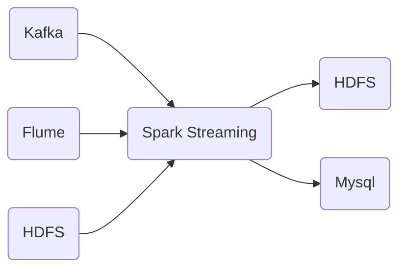
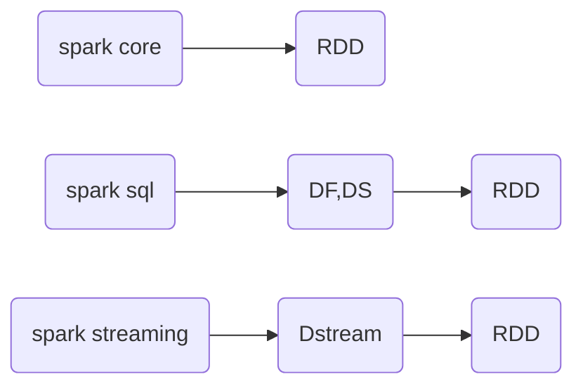

# SparkStreaming(流批处理)

## 一.前言



* Dstream

```
Dstream称为离散化序列，随着时间推移而收到的序列，就是对RDD在实实场景的一种封装
t1		   t2		   t3	
|-----------|-----------|
|harden tmac|kobe curry | 
|-----------|-----------|
|t1,t2封装RDD|t2,t3封装RDD|
```



